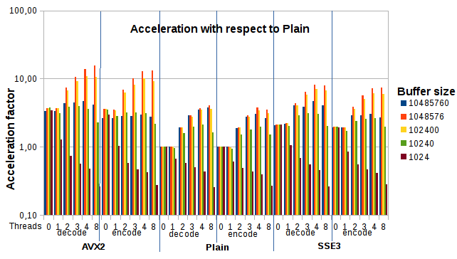

# Fast Base64 stream encoder/decoder

[](https://github.com/aklomp/base64/actions/workflows/test.yml)

This is an implementation of a base64 stream encoding/decoding library in C99
with SIMD (AVX2, AVX512, NEON, AArch64/NEON, SSSE3, SSE4.1, SSE4.2, AVX) and
[OpenMP](http://www.openmp.org) acceleration. It also contains wrapper functions
to encode/decode simple length-delimited strings. This library aims to be:

- FAST;
- easy to use;
- elegant.

On x86, the library does runtime feature detection. The first time it's called,
the library will determine the appropriate encoding/decoding routines for the
machine. It then remembers them for the lifetime of the program. If your
processor supports AVX2, SSSE3, SSE4.1, SSE4.2 or AVX instructions, the library
will pick an optimized codec that lets it encode/decode 12 or 24 bytes at a
time, which gives a speedup of four or more times compared to the "plain"
bytewise codec.

AVX512 support is only for encoding at present, utilizing the AVX512 VL and VBMI
instructions. Decoding part reused AVX2 implementations. For CPUs later than
Cannonlake (manufactured in 2018) supports these instructions.

NEON support is hardcoded to on or off at compile time, because portable
runtime feature detection is unavailable on ARM.

Even if your processor does not support SIMD instructions, this is a very fast
library. The fallback routine can process 32 or 64 bits of input in one round,
depending on your processor's word width, which still makes it significantly
faster than naive bytewise implementations. On some 64-bit machines, the 64-bit
routines even outperform the SSSE3 ones.

To the author's knowledge, at the time of original release, this was the only
Base64 library to offer SIMD acceleration. The author wrote
[an article](http://www.alfredklomp.com/programming/sse-base64) explaining one
possible SIMD approach to encoding/decoding Base64. The article can help figure
out what the code is doing, and why.

Notable features:

- Really fast on x86 and ARM systems by using SIMD vector processing;
- Can use [OpenMP](http://www.openmp.org) for even more parallel speedups;
- Really fast on other 32 or 64-bit platforms through optimized routines;
- Reads/writes blocks of streaming data;
- Does not dynamically allocate memory;
- Valid C99 that compiles with pedantic options on;
- Re-entrant and threadsafe;
- Unit tested;
- Uses Duff's Device.

## Acknowledgements

The original AVX2, NEON and Aarch64/NEON codecs were generously contributed by
[Inkymail](https://github.com/inkymail/base64), who, in their fork, also
implemented some additional features. Their work is slowly being backported
into this project.

The SSSE3 and AVX2 codecs were substantially improved by using some very clever
optimizations described by Wojciech Muła in a
[series](http://0x80.pl/notesen/2016-01-12-sse-base64-encoding.html) of
[articles](http://0x80.pl/notesen/2016-01-17-sse-base64-decoding.html).
His own code is [here](https://github.com/WojciechMula/toys/tree/master/base64).

The AVX512 encoder is based on code from Wojciech Muła's
[base64simd](https://github.com/WojciechMula/base64simd) library.

The OpenMP implementation was added by Ferry Toth (@htot) from [Exalon Delft](http://www.exalondelft.nl).

## Building

The `lib` directory contains the code for the actual library.
Typing `make` in the toplevel directory will build `lib/libbase64.o` and `bin/base64`.
The first is a single, self-contained object file that you can link into your own project.
The second is a standalone test binary that works similarly to the `base64` system utility.

The matching header file needed to use this library is in `include/libbase64.h`.

To compile just the "plain" library without SIMD codecs, type:

```sh
make lib/libbase64.o
```

Optional SIMD codecs can be included by specifying the `AVX2_CFLAGS`, `AVX512_CFLAGS`,
`NEON32_CFLAGS`, `NEON64_CFLAGS`, `SSSE3_CFLAGS`, `SSE41_CFLAGS`, `SSE42_CFLAGS` and/or `AVX_CFLAGS` environment variables.
A typical build invocation on x86 looks like this:

```sh
AVX2_CFLAGS=-mavx2 SSSE3_CFLAGS=-mssse3 SSE41_CFLAGS=-msse4.1 SSE42_CFLAGS=-msse4.2 AVX_CFLAGS=-mavx make lib/libbase64.o
```

### AVX2

To build and include the AVX2 codec, set the `AVX2_CFLAGS` environment variable to a value that will turn on AVX2 support in your compiler, typically `-mavx2`.
Example:

```sh
AVX2_CFLAGS=-mavx2 make
```

### AVX512

To build and include the AVX512 codec, set the `AVX512_CFLAGS` environment variable to a value that will turn on AVX512 support in your compiler, typically `-mavx512vl -mavx512vbmi`.
Example:

```sh
AVX512_CFLAGS="-mavx512vl -mavx512vbmi" make
```

The codec will only be used if runtime feature detection shows that the target machine supports AVX2.

### SSSE3

To build and include the SSSE3 codec, set the `SSSE3_CFLAGS` environment variable to a value that will turn on SSSE3 support in your compiler, typically `-mssse3`.
Example:

```sh
SSSE3_CFLAGS=-mssse3 make
```

The codec will only be used if runtime feature detection shows that the target machine supports SSSE3.

### NEON

This library includes two NEON codecs: one for regular 32-bit ARM and one for the 64-bit AArch64 with NEON, which has double the amount of SIMD registers and can do full 64-byte table lookups.
These codecs encode in 48-byte chunks and decode in massive 64-byte chunks, so they had to be augmented with an uint32/64 codec to stay fast on smaller inputs!

Use LLVM/Clang for compiling the NEON codecs.
The code generation of at least GCC 4.6 (the version shipped with Raspbian and used for testing) contains a bug when compiling `vstq4_u8()`, and the generated assembly code is of low quality.
NEON intrinsics are a known weak area of GCC.
Clang does a better job.

NEON support can unfortunately not be portably detected at runtime from userland (the `mrc` instruction is privileged), so the default value for using the NEON codec is determined at compile-time.
But you can do your own runtime detection.
You can include the NEON codec and make it the default, then do a runtime check if the CPU has NEON support, and if not, force a downgrade to non-NEON with `BASE64_FORCE_PLAIN`.

These are your options:

1. Don't include NEON support;
2. build NEON support and make it the default, but build all other code without NEON flags so that you can override the default at runtime with `BASE64_FORCE_PLAIN`;
3. build everything with NEON support and make it the default;
4. build everything with NEON support, but don't make it the default (which makes no sense).

For option 1, simply don't specify any NEON-specific compiler flags at all, like so:

```sh
CC=clang CFLAGS="-march=armv6" make
```

For option 2, keep your `CFLAGS` plain, but set the `NEON32_CFLAGS` environment variable to a value that will build NEON support.
The line below, for instance, will build all the code at ARMv6 level, except for the NEON codec, which is built at ARMv7.
It will also make the NEON codec the default.
For ARMv6 platforms, override that default at runtime with the `BASE64_FORCE_PLAIN` flag.
No ARMv7/NEON code will then be touched.

```sh
CC=clang CFLAGS="-march=armv6" NEON32_CFLAGS="-march=armv7 -mfpu=neon" make
```

For option 3, put everything in your `CFLAGS` and use a stub, but non-empty, `NEON32_CFLAGS`.
This example works for the Raspberry Pi 2B V1.1, which has NEON support:

```sh
CC=clang CFLAGS="-march=armv7 -mtune=cortex-a7" NEON32_CFLAGS="-mfpu=neon" make
```

To build and include the NEON64 codec, use `CFLAGS` as usual to define the platform and set `NEON64_CFLAGS` to a nonempty stub.
(The AArch64 target has mandatory NEON64 support.)
Example:

```sh
CC=clang CFLAGS="--target=aarch64-linux-gnu -march=armv8-a" NEON64_CFLAGS=" " make
```

### OpenMP

To enable OpenMP on GCC you need to build with `-fopenmp`. This can be by setting the the `OPENMP` environment variable to `1`.

Example:

```sh
OPENMP=1 make
```

This will let the compiler define `_OPENMP`, which in turn will include the OpenMP optimized `lib_openmp.c` into `lib.c`.

By default the number of parallel threads will be equal to the number of cores of the processor.
On a quad core with hyperthreading eight cores will be detected, but hyperthreading will not increase the performance.

To get verbose information about OpenMP start the program with `OMP_DISPLAY_ENV=VERBOSE`, for instance

```sh
OMP_DISPLAY_ENV=VERBOSE test/benchmark
```

To put a limit on the number of threads, start the program with `OMP_THREAD_LIMIT=n`, for instance

```sh
OMP_THREAD_LIMIT=2 test/benchmark
```

An example of running a benchmark with OpenMP, SSSE3 and AVX2 enabled:

```sh
make clean && OPENMP=1 SSSE3_CFLAGS=-mssse3 AVX2_CFLAGS=-mavx2 make && OPENMP=1 make -C test
```

## API reference

Strings are represented as a pointer and a length; they are not
zero-terminated. This was a conscious design decision. In the decoding step,
relying on zero-termination would make no sense since the output could contain
legitimate zero bytes. In the encoding step, returning the length saves the
overhead of calling `strlen()` on the output. If you insist on the trailing
zero, you can easily add it yourself at the given offset.

### Flags

Some API calls take a `flags` argument.
That argument can be used to force the use of a specific codec, even if that codec is a no-op in the current build.
Mainly there for testing purposes, this is also useful on ARM where the only way to do runtime NEON detection is to ask the OS if it's available.
The following constants can be used:

- `BASE64_FORCE_AVX2`
- `BASE64_FORCE_AVX512`
- `BASE64_FORCE_NEON32`
- `BASE64_FORCE_NEON64`
- `BASE64_FORCE_PLAIN`
- `BASE64_FORCE_SSSE3`
- `BASE64_FORCE_SSE41`
- `BASE64_FORCE_SSE42`
- `BASE64_FORCE_AVX`

Set `flags` to `0` for the default behavior, which is runtime feature detection on x86, a compile-time fixed codec on ARM, and the plain codec on other platforms.

### Encoding

#### base64_encode

```c
void base64_encode
    ( const char  *src
    , size_t       srclen
    , char        *out
    , size_t      *outlen
    , int          flags
    ) ;
```

Wrapper function to encode a plain string of given length.
Output is written to `out` without trailing zero.
Output length in bytes is written to `outlen`.
The buffer in `out` has been allocated by the caller and is at least 4/3 the size of the input.

#### base64_stream_encode_init

```c
void base64_stream_encode_init
    ( struct base64_state  *state
    , int                   flags
    ) ;
```

Call this before calling `base64_stream_encode()` to init the state.

#### base64_stream_encode

```c
void base64_stream_encode
    ( struct base64_state  *state
    , const char           *src
    , size_t                srclen
    , char                 *out
    , size_t               *outlen
    ) ;
```

Encodes the block of data of given length at `src`, into the buffer at `out`.
Caller is responsible for allocating a large enough out-buffer; it must be at least 4/3 the size of the in-buffer, but take some margin.
Places the number of new bytes written into `outlen` (which is set to zero when the function starts).
Does not zero-terminate or finalize the output.

#### base64_stream_encode_final

```c
void base64_stream_encode_final
    ( struct base64_state  *state
    , char                 *out
    , size_t               *outlen
    ) ;
```

Finalizes the output begun by previous calls to `base64_stream_encode()`.
Adds the required end-of-stream markers if appropriate.
`outlen` is modified and will contain the number of new bytes written at `out` (which will quite often be zero).

### Decoding

#### base64_decode

```c
int base64_decode
    ( const char  *src
    , size_t       srclen
    , char        *out
    , size_t      *outlen
    , int          flags
    ) ;
```

Wrapper function to decode a plain string of given length.
Output is written to `out` without trailing zero. Output length in bytes is written to `outlen`.
The buffer in `out` has been allocated by the caller and is at least 3/4 the size of the input.
Returns `1` for success, and `0` when a decode error has occured due to invalid input.
Returns `-1` if the chosen codec is not included in the current build.

#### base64_stream_decode_init

```c
void base64_stream_decode_init
    ( struct base64_state  *state
    , int                   flags
    ) ;
```

Call this before calling `base64_stream_decode()` to init the state.

#### base64_stream_decode

```c
int base64_stream_decode
    ( struct base64_state  *state
    , const char           *src
    , size_t                srclen
    , char                 *out
    , size_t               *outlen
    ) ;
```

Decodes the block of data of given length at `src`, into the buffer at `out`.
Caller is responsible for allocating a large enough out-buffer; it must be at least 3/4 the size of the in-buffer, but take some margin.
Places the number of new bytes written into `outlen` (which is set to zero when the function starts).
Does not zero-terminate the output.
Returns 1 if all is well, and 0 if a decoding error was found, such as an invalid character.
Returns -1 if the chosen codec is not included in the current build.
Used by the test harness to check whether a codec is available for testing.

## Examples

A simple example of encoding a static string to base64 and printing the output
to stdout:

```c
#include <stdio.h>	/* fwrite */
#include "libbase64.h"

int main ()
{
	char src[] = "hello world";
	char out[20];
	size_t srclen = sizeof(src) - 1;
	size_t outlen;

	base64_encode(src, srclen, out, &outlen, 0);

	fwrite(out, outlen, 1, stdout);

	return 0;
}
```

A simple example (no error checking, etc) of stream encoding standard input to
standard output:

```c
#include <stdio.h>
#include "libbase64.h"

int main ()
{
	size_t nread, nout;
	char buf[12000], out[16000];
	struct base64_state state;

	// Initialize stream encoder:
	base64_stream_encode_init(&state, 0);

	// Read contents of stdin into buffer:
	while ((nread = fread(buf, 1, sizeof(buf), stdin)) > 0) {

		// Encode buffer:
		base64_stream_encode(&state, buf, nread, out, &nout);

		// If there's output, print it to stdout:
		if (nout) {
			fwrite(out, nout, 1, stdout);
		}

		// If an error occurred, exit the loop:
		if (feof(stdin)) {
			break;
		}
	}

	// Finalize encoding:
	base64_stream_encode_final(&state, out, &nout);

	// If the finalizing resulted in extra output bytes, print them:
	if (nout) {
		fwrite(out, nout, 1, stdout);
	}

	return 0;
}
```

Also see `bin/base64.c` for a simple re-implementation of the `base64` utility.
A file or standard input is fed through the encoder/decoder, and the output is
written to standard output.

## Tests

See `tests/` for a small test suite. Testing is automated with
[GitHub Actions](https://github.com/aklomp/base64/actions), which builds and
tests the code across various architectures.

## Benchmarks

Benchmarks can be run with the built-in benchmark program as follows:

```sh
make -C test benchmark <buildflags> && test/benchmark
```

It will run an encoding and decoding benchmark for all of the compiled-in codecs.

The tables below contain some results on random machines. All numbers measured with a 10MB buffer in MB/sec, rounded to the nearest integer.

\*: Update needed

x86 processors

| Processor                                 | Plain enc | Plain dec | SSSE3 enc | SSSE3 dec | AVX enc | AVX dec | AVX2 enc | AVX2 dec |
|-------------------------------------------|----------:|----------:|----------:|----------:|--------:|--------:|---------:|---------:|
| i7-4771 @ 3.5 GHz                         | 833\*     | 1111\*    | 3333\*    | 4444\*    | TBD     | TBD     | 4999\*   | 6666\*   |
| i7-4770 @ 3.4 GHz DDR1600                 | 1790\*    | 3038\*    | 4899\*    | 4043\*    | 4796\*  | 5709\*  | 4681\*   | 6386\*   |
| i7-4770 @ 3.4 GHz DDR1600 OPENMP 1 thread | 1784\*    | 3041\*    | 4945\*    | 4035\*    | 4776\*  | 5719\*  | 4661\*   | 6294\*   |
| i7-4770 @ 3.4 GHz DDR1600 OPENMP 2 thread | 3401\*    | 5729\*    | 5489\*    | 7444\*    | 5003\*  | 8624\*  | 5105\*   | 8558\*   |
| i7-4770 @ 3.4 GHz DDR1600 OPENMP 4 thread | 4884\*    | 7099\*    | 4917\*    | 7057\*    | 4799\*  | 7143\*  | 4902\*   | 7219\*   |
| i7-4770 @ 3.4 GHz DDR1600 OPENMP 8 thread | 5212\*    | 8849\*    | 5284\*    | 9099\*    | 5289\*  | 9220\*  | 4849\*   | 9200\*   |
| i7-4870HQ @ 2.5 GHz                       | 1471\*    | 3066\*    | 6721\*    | 6962\*    | 7015\*  | 8267\*  | 8328\*   | 11576\*  |
| i5-4590S @ 3.0 GHz                        | 3356      | 3197      | 4363      | 6104      | 4243\*  | 6233    | 4160\*   | 6344     |
| Xeon X5570 @ 2.93 GHz                     | 2161      | 1508      | 3160      | 3915      | -       | -       | -        | -        |
| Pentium4 @ 3.4 GHz                        | 896       | 740       | -         | -         | -       | -       | -        | -        |
| Atom N270                                 | 243       | 266       | 508       | 387       | -       | -       | -        | -        |
| AMD E-450                                 | 645       | 564       | 625       | 634       | -       | -       | -        | -        |
| Intel Edison @ 500 MHz                    | 79\*      | 92\*      | 152\*     | 172\*     | -       | -       | -        | -        |
| Intel Edison @ 500 MHz OPENMP 2 thread    | 158\*     | 184\*     | 300\*     | 343\*     | -       | -       | -        | -        |
| Intel Edison @ 500 MHz (x86-64)           | 162       | 119       | 209       | 164       | -       | -       | -        | -        |
| Intel Edison @ 500 MHz (x86-64) 2 thread  | 319       | 237       | 412       | 329       | -       | -       | -        | -        |

ARM processors

| Processor                                 | Plain enc | Plain dec | NEON32 enc | NEON32 dec | NEON64 enc | NEON64 dec |
|-------------------------------------------|----------:|----------:|-----------:|-----------:|-----------:|-----------:|
| Raspberry PI B+ V1.2                      | 46\*      | 40\*      | -          | -          | -          | -          |
| Raspberry PI 2 B V1.1                     | 85        | 141       | 300        | 225        | -          | -          |
| Apple iPhone SE armv7                     | 1056\*    | 895\*     | 2943\*     | 2618\*     | -          | -          |
| Apple iPhone SE arm64                     | 1061\*    | 1239\*    | -          | -          | 4098\*     | 3983\*     |

PowerPC processors

| Processor                                 | Plain enc | Plain dec |
|-------------------------------------------|----------:|----------:|
| PowerPC E6500 @ 1.8GHz                    | 270\*     | 265\*     |


Benchmarks on i7-4770 @ 3.4 GHz DDR1600 with varrying buffer sizes:


Note: optimal buffer size to take advantage of the cache is in the range of 100 kB to 1 MB, leading to 12x faster AVX encoding/decoding compared to Plain, or a throughput of 24/27GB/sec.
Also note the performance degradation when the buffer size is less than 10 kB due to thread creation overhead.
To prevent this from happening `lib_openmp.c` defines `OMP_THRESHOLD 20000`, requiring at least a 20000 byte buffer to enable multithreading.

## License

This repository is licensed under the
[BSD 2-clause License](http://opensource.org/licenses/BSD-2-Clause). See the
LICENSE file.
