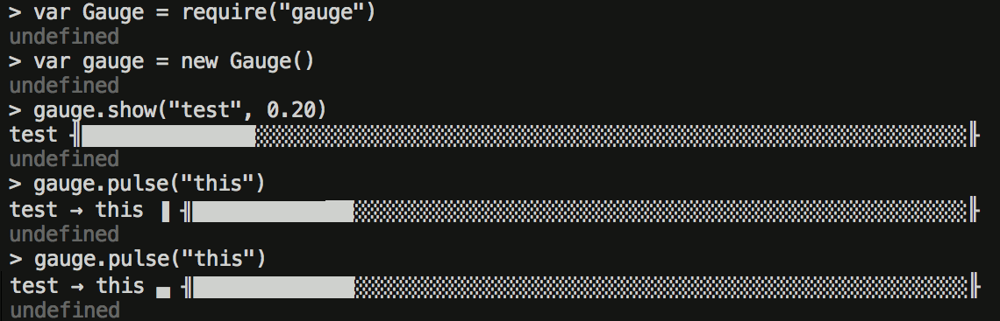

gauge
=====

A nearly stateless terminal based horizontal guage / progress bar.

```javascript
var Gauge = require("gauge")

var gauge = new Gauge()

gauge.show("test", 0.20)

gauge.pulse("this")

gauge.hide()
```




### `var gauge = new Gauge([options], [ansiStream])`

* **options** – *(optional)* An option object. (See [below] for details.)
* **ansiStream** – *(optional)* A stream that's been blessed by the [ansi]
  module to include various commands for controlling the cursor in a terminal.

[ansi]: https://www.npmjs.com/package/ansi
[below]: #theme-objects

Constructs a new gauge. Gauges are drawn on a single line, and are not drawn
if the current terminal isn't a tty.

The **options** object can have the following properties, all of which are
optional:

* maxUpdateFrequency: defaults to 50 msec, the gauge will not be drawn more
  than once in this period of time. This applies to `show` and `pulse`
  calls, but if you `hide` and then `show` the gauge it will draw it
  regardless of time since last draw.
* theme: defaults to Gauge.unicode` if the terminal supports
  unicode according to [has-unicode], otherwise it defaults to `Gauge.ascii`.
  Details on the [theme object](#theme-objects) are documented elsewhere.
* template: see [documentation elsewhere](#template-objects) for
  defaults and details.

[has-unicode]: https://www.npmjs.com/package/has-unicode

If **ansiStream** isn't passed in, then one will be constructed from stderr
with `ansi(process.stderr)`.

### `gauge.show([name, [completed]])`

* **name** – *(optional)* The name of the current thing contributing to progress. Defaults to the last value used, or "".
* **completed** – *(optional)* The portion completed as a value between 0 and 1. Defaults to the last value used, or 0.

If `process.stdout.isTTY` is false then this does nothing. If completed is 0
and `gauge.pulse` has never been called, then similarly nothing will be printed.

If `maxUpdateFrequency` msec haven't passed since the last call to `show` or
`pulse` then similarly, nothing will be printed.  (Actually, the update is
deferred until `maxUpdateFrequency` msec have passed and if nothing else has
happened, the gauge update will happen.)

### `gauge.hide()`

Removes the gauge from the terminal.

### `gauge.pulse([name])`

* **name** – *(optional)* The specific thing that triggered this pulse

Spins the spinner in the gauge to show output. If **name** is included then
it will be combined with the last name passed to `gauge.show` using the
subsection property of the theme (typically a right facing arrow).

### `gauge.disable()`

Hides the gauge and ignores further calls to `show` or `pulse`.

### `gauge.enable()`

Shows the gauge and resumes updating when `show` or `pulse` is called.

### `gauge.setTheme(theme)`

Change the active theme, will be displayed with the next show or pulse

### `gauge.setTemplate(template)`

Change the active template, will be displayed with the next show or pulse

### Theme Objects

There are two theme objects available as a part of the module, `Gauge.unicode` and `Gauge.ascii`.
Theme objects have the follow properties:

| Property   | Unicode | ASCII |
| ---------- | ------- | ----- |
| startgroup | ╢       | \|    |
| endgroup   | ╟       | \|    |
| complete   | █       | #     |
| incomplete | ░       | -     |
| spinner    | ▀▐▄▌    | -\\\|/ |
| subsection | →       | ->    |

*startgroup*, *endgroup* and *subsection* can be as many characters as you want.

*complete* and *incomplete* should be a single character width each.

*spinner* is a list of characters to use in turn when displaying an activity
spinner.  The Gauge will spin as many characters as you give here.

### Template Objects

A template is an array of objects and strings that, after being evaluated,
will be turned into the gauge line.  The default template is:

```javascript
[
    {type: "name", separated: true, maxLength: 25, minWidth: 25, align: "left"},
    {type: "spinner", separated: true},
    {type: "startgroup"},
    {type: "completionbar"},
    {type: "endgroup"}
]
```

The various template elements can either be **plain strings**, in which case they will
be be included verbatum in the output.

If the template element is an object, it can have the following keys:

* *type* can be:
  * `name` – The most recent name passed to `show`; if this is in response to a 
    `pulse` then the name passed to `pulse` will be appended along with the
    subsection property from the theme.
  * `spinner` – If you've ever called `pulse` this will be one of the characters
    from the spinner property of the theme.
  * `startgroup` – The `startgroup` property from the theme.
  * `completionbar` – This progress bar itself
  * `endgroup` – The `endgroup` property from the theme.
* *separated* – If true, the element will be separated with spaces from things on
  either side (and margins count as space, so it won't be indented), but only
  if its included.
* *maxLength* – The maximum length for this element. If its value is longer it
  will be truncated.
* *minLength* – The minimum length for this element. If its value is shorter it
  will be padded according to the *align* value.
* *align* – (Default: left) Possible values "left", "right" and "center". Works
  as you'd expect from word processors.
* *length* – Provides a single value for both *minLength* and *maxLength*. If both 
  *length* and *minLength or *maxLength* are specifed then the latter take precedence.

### Tracking Completion

If you have more than one thing going on that you want to track completion
of, you may find the related [are-we-there-yet] helpful.  It's `change`
event can be wired up to the `show` method to get a more traditional
progress bar interface.

[are-we-there-yet]: https://www.npmjs.com/package/are-we-there-yet
