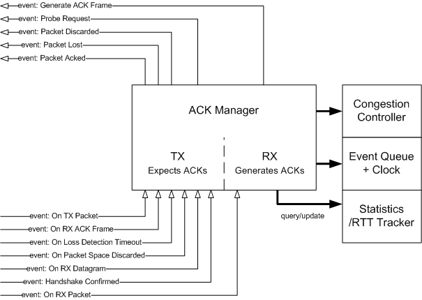

QUIC ACK Manager
================



The QUIC ACK manager is responsible for, on the TX side:

  - Handling received ACK frames
  - Generating notifications that a packet we sent was delivered successfully
  - Generating notifications that a packet we sent was lost
  - Generating requests for probe transmission
  - Providing information on the largest unacked packet number so that packet
    numbers in packet headers can be encoded and decoded correctly

On the RX side, it is responsible for:

  - Generating ACK frames for later transmission in response to packets we
    received
  - Providing information on whether a given RX packet number is potentially
    duplicate and should not be processed

In order to allow it to perform these tasks, the ACK manager must:

  - be notified of all transmitted packets
  - be notified of all received datagrams
  - be notified of all received packets
  - be notified of all received ACK frames
  - be notified when a packet number space is discarded
  - be notified when its loss detection deadline arrives

The ACK manager consumes:

  - an arbitrary function which returns the current time;
  - a RTT statistics tracker;
  - a congestion controller.

The ACK manager provides the following outputs:

  - It indicates the current deadline by which the loss detection
    event should be invoked.

  - It indicates when probes should be generated.

  - It indicates what ACK frames should be generated.

  - It indicates the current deadline by which new ACK frames
    will be generated, if any.

  - It indicates the largest unacknowledged packet number
    for a given packet number space.

  - It calls a callback for each transmitted packet it is notified
    of, specifying whether the packet was successfully acknowledged by the peer,
    lost or discarded.

  - It may communicate with a congestion controller, causing the
    congestion controller to update its state.

  - It may communicate with a RTT statistics tracker, causing it
    to update its state.

In this document, “the caller” refers to the system which makes use of the ACK
manager.

Utility Definitions
-------------------

There are three QUIC packet number spaces: Initial, Handshake and Application
Data.

```c
/* QUIC packet number spaces. */
#define QUIC_PN_SPACE_INITIAL       0
#define QUIC_PN_SPACE_HANDSHAKE     1
#define QUIC_PN_SPACE_APP           2
#define QUIC_PN_SPACE_NUM           3
```

Packet numbers are 62-bit values represented herein by `QUIC_PN`.
`QUIC_PN_INFINITE` evaluates to an invalid QUIC packet number value.

```c
/* QUIC packet number representation. */
typedef uint64_t QUIC_PN;
#define QUIC_PN_INFINITE            UINT64_MAX
```

Instantiation
-------------

The QUIC ACK manager is instantiated as follows:

```c
typedef struct ossl_ackm_st OSSL_ACKM;

OSSL_ACKM *ossl_ackm_new(OSSL_TIME (*now)(void *arg),
                         void *now_arg,
                         QUIC_STATM *statm,
                         OSSL_CC_METHOD *cc_method,
                         OSSL_CC_DATA *cc_data);

void ossl_ackm_free(OSSL_ACKM *ackm);
```

The function pointer `now` is invoked by the ACK manager to obtain the current
time. `now_arg` is passed as the argument. The congestion controller method and
instance passed are used by the ACK manager instance. `statm` points to a
[Statistics Manager tracker instance](quic-statm.md).

Events
------

The ACK manager state is evolved in response to events provided to the ACK
manager by the caller.

### On TX Packet

This must be called when a packet is transmitted. It does not provide the
payload of the packet, but provides metadata about the packet which is relevant
to the loss detection and acknowledgement process.

The caller is responsible for the allocation of the structure and the structure
must remain allocated until one of the callbacks is called or the ACK manager is
freed. It is expected this structure will usually be freed (or returned to a
pool) in the implementation of either callback passed by the caller.

Only exactly one of the callbacks in the structure will be called over the
lifetime of a `OSSL_ACKM_TX_PKT`, and only once.

Returns 1 on success.

```c
typedef struct ossl_ackm_tx_pkt_st {
    /* The packet number of the transmitted packet. */
    QUIC_PN pkt_num;

    /* The number of bytes in the packet which was sent. */
    size_t num_bytes;

    /* The time at which the packet was sent. */
    OSSL_TIME time;

    /*
     * If the packet being described by this structure contains an ACK frame,
     * this must be set to the largest PN ACK'd by that frame.
     *
     * Otherwise, it should be set to QUIC_PN_INVALID.
     *
     * This is necessary to bound the number of PNs we have to keep track of on
     * the RX side (RFC 9000 s. 13.2.4). It allows older PN tracking information
     * on the RX side to be discarded.
     */
    QUIC_PN largest_acked;

    /*
     * One of the QUIC_PN_SPACE_* values. This qualifies the pkt_num field
     * into a packet number space.
     */
    unsigned int pkt_space :2;

    /* 1 if the packet is in flight. */
    unsigned int is_inflight :1;

    /* 1 if the packet has one or more ACK-eliciting frames. */
    unsigned int is_ack_eliciting :1;

    /* 1 if the packet is a PTO probe. */
    unsigned int is_pto_probe :1;

    /* 1 if the packet is an MTU probe. */
    unsigned int is_mtu_probe :1;

    /* Callback called if frames in this packet are lost. arg is cb_arg. */
    void (*on_lost)(void *arg);

    /* Callback called if frames in this packet are acked. arg is cb_arg. */
    void (*on_acked)(void *arg);

    /*
     * Callback called if frames in this packet are neither acked nor lost. arg
     * is cb_arg.
     */
    void (*on_discarded)(void *arg);
    void  *cb_arg;

    /* (Internal use fields are appended here and must be zero-initialized.) */
} OSSL_ACKM_TX_PKT;

int ossl_ackm_on_tx_packet(OSSL_ACKM *ackm, const OSSL_ACKM_TX_PKT *pkt);
```

### On RX Datagram

This must be called whenever a datagram is received. A datagram may contain
multiple packets, and this function should be called before the calls to
`ossl_ackm_on_rx_packet`.

The primary use of this function is to inform the ACK manager of new credit to
the anti-amplification budget. Packet and ACK-frame related logic are handled
separately in the subsequent calls to `ossl_ackm_on_rx_packet` and
`ossl_ackm_on_rx_ack_frame`, respectively.

Returns 1 on success.

```c
int ossl_ackm_on_rx_datagram(OSSL_ACKM *ackm, size_t num_bytes);
```

### On RX Packet

This must be called whenever a packet is received. It should be called after
`ossl_ackm_on_rx_datagram` was called for the datagram containing the packet.

Returns 1 on success.

```c
#define OSSL_ACKM_ECN_NONE      0
#define OSSL_ACKM_ECN_ECT1      1
#define OSSL_ACKM_ECN_ECT0      2
#define OSSL_ACKM_ECN_ECNCE     3

typedef struct ossl_ackm_rx_pkt_st {
    /* The packet number of the received packet. */
    QUIC_PN pkt_num;

    /* The time at which the packet was received. */
    OSSL_TIME time;

    /*
     * One of the QUIC_PN_SPACE_* values. This qualifies the pkt_num field
     * into a packet number space.
     */
    unsigned int pkt_space :2;

    /* 1 if the packet has one or more ACK-eliciting frames. */
    unsigned int is_ack_eliciting :1;

    /*
     * One of the OSSL_ACKM_ECN_* values. This is the ECN labelling applied
     * to the received packet. If unknown, use OSSL_ACKM_ECN_NONE.
     */
    unsigned int ecn :2;
} OSSL_ACKM_RX_PKT;

int ossl_ackm_on_rx_packet(OSSL_ACKM *ackm, const OSSL_ACKM_RX_PKT *pkt);
```

### On RX ACK Frame

This must be called whenever an ACK frame is received. It should be called
after any call to `ossl_ackm_on_rx_packet`.

The ranges of packet numbers being acknowledged are passed as an argument.
`pkt_space` is one of the `QUIC_PN_SPACE_*` values, specifying the packet number
space of the containing packet. `rx_time` is the time the frame was
received.

This function causes `on_acked` callbacks to be invoked on applicable packets.

Returns 1 on success.

```c
typedef struct ossl_ackm_ack_range_st {
    /*
     * Represents an inclusive range of packet numbers [start, end].
     * start must be <= end.
     */
    QUIC_PN start, end;
} OSSL_ACKM_ACK_RANGE;

typedef struct ossl_ackm_ack {
    /*
     * A sequence of packet number ranges [[start, end]...].
     *
     * The ranges must be sorted in descending order, for example:
     *      [ 95, 100]
     *      [ 90,  92]
     *      etc.
     *
     * As such, ack_ranges[0].end is always the highest packet number
     * being acknowledged and ack_ranges[num_ack_ranges-1].start is
     * always the lowest packet number being acknowledged.
     *
     * num_ack_ranges must be greater than zero, as an ACK frame must
     * acknowledge at least one packet number.
     */
    const OSSL_ACKM_ACK_RANGE  *ack_ranges;
    size_t                      num_ack_ranges;

    OSSL_TIME                   delay_time;
    uint64_t                    ect0, ect1, ecnce;
    /* 1 if the ect0, ect1 and ecnce fields are valid */
    char                        ecn_present;
} OSSL_ACKM_ACK;

int ossl_ackm_on_rx_ack_frame(OSSL_ACKM *ackm, const OSSL_ACKM_ACK *ack,
                              int pkt_space, OSSL_TIME rx_time);
```

### On Packet Space Discarded

This must be called whenever a packet number space is discarded. ACK-tracking
information for the number space is thrown away. Any previously provided
`OSSL_ACKM_TX_PKT` structures have their `on_discarded` callback invoked,
providing an opportunity for them to be freed.

Returns 1 on success.

```c
int ossl_ackm_on_pkt_space_discarded(OSSL_ACKM *ackm, int pkt_space);
```

### On Handshake Confirmed

This should be called by the caller when the QUIC handshake is confirmed. The
Probe Timeout (PTO) algorithm behaves differently depending on whether the QUIC
handshake is confirmed yet.

Returns 1 on success.

```c
int ossl_ackm_on_handshake_confirmed(OSSL_ACKM *ackm);
```

### On Timeout

This must be called whenever the loss detection deadline expires.

```c
int ossl_ackm_on_timeout(OSSL_ACKM *ackm);
```

Queries
-------

These functions allow information about the status of the ACK manager to be
obtained.

### Get Loss Detection Deadline

This returns a deadline after which `ossl_ackm_on_timeout` should be called.

If it is `OSSL_TIME_INFINITY`, no timeout is currently active.

The value returned by this function may change after any call to any of the
event functions above is made.

```c
OSSL_TIME ossl_ackm_get_loss_detection_deadline(OSSL_ACKM *ackm);
```

### Get ACK Frame

This returns a pointer to a `OSSL_ACKM_ACK` structure representing the
information which should be packed into an ACK frame and transmitted.

This generates an ACK frame regardless of whether the ACK manager thinks one
should currently be sent. To determine if the ACK manager thinks an ACK frame
should be sent, use `ossl_ackm_is_ack_desired`, discussed below.

If no new ACK frame is currently needed, returns NULL. After calling this
function, calling the function immediately again will return NULL.

The structure pointed to by the returned pointer, and the referenced ACK range
structures, are guaranteed to remain valid until the next call to any
`OSSL_ACKM` function. After such a call is made, all fields become undefined.

This function is used to provide ACK frames for acknowledging packets which have
been received and notified to the ACK manager via `ossl_ackm_on_rx_packet`.

Calling this function clears the flag returned by `ossl_ackm_is_ack_desired` and
the deadline returned by `ossl_ackm_get_ack_deadline`.

```c
const OSSL_ACKM_ACK *ossl_ackm_get_ack_frame(OSSL_ACKM *ackm, int pkt_space);
```

### Is ACK Desired

This returns 1 if the ACK manager thinks an ACK frame ought to be generated and
sent at this time. `ossl_ackm_get_ack_frame` will always provide an ACK frame
whether or not this returns 1, so it is suggested that you call this function
first to determine whether you need to generate an ACK frame.

The return value of this function can change based on calls to
`ossl_ackm_on_rx_packet` and based on the passage of time (see
`ossl_ackm_get_ack_deadline`).

```c
int ossl_ackm_is_ack_desired(OSSL_ACKM *ackm, int pkt_space);
```

### Get ACK Deadline

The ACK manager may defer generation of ACK frames to optimize performance. For
example, after a packet requiring acknowledgement is received, it may decide to
wait until a few more packets are received before generating an ACK frame, so
that a single ACK frame can acknowledge all of them. However, if further
packets do not arrive, an ACK frame must be generated anyway within a certain
amount of time.

This function returns the deadline at which the return value of
`ossl_ackm_is_ack_desired` will change to 1, or `OSSL_TIME_INFINITY`, which
means that no deadline is currently applicable. If the deadline has already
passed, it may either return that deadline or `OSSL_TIME_ZERO`.

```c
OSSL_TIME ossl_ackm_get_ack_deadline(OSSL_ACKM *ackm, int pkt_space);
```

### Is RX PN Processable

Returns 1 if the given RX packet number is “processable”. A processable PN is
one that is not either

  - duplicate, meaning that we have already been passed such a PN in a call
    to `ossl_ackm_on_rx_packet`; or

  - written off, meaning that the PN is so old that we have stopped tracking
    state for it (meaning we cannot tell whether it is a duplicate and cannot
    process it safely).

This should be called for a packet before attempting to process its contents.
Failure to do so may may result in processing a duplicated packet in violation
of the RFC.

The returrn value of this function transitions from 1 to 0 for a given PN once
that PN is passed to ossl_ackm_on_rx_packet, thus this function must be used
before calling `ossl_ackm_on_rx_packet`.

```c
int ossl_ackm_is_rx_pn_processable(OSSL_ACKM *ackm, QUIC_PN pn, int pkt_space);
```

### Get Probe Packet

This determines if the ACK manager is requesting any probe packets to be
transmitted.

The user calls `ossl_ackm_get_probe_request`. The structure pointed
to by `info` is filled and the function returns 1 on success.

The fields of `OSSL_ACKM_PROBE_INFO` record the number of probe requests
of each type which are outstanding. In short:

  - `handshake` designates the number of ACK-eliciting Handshake
    packets being requested. This is equivalent to
    `SendOneAckElicitingHandshakePacket()` in RFC 9002.

  - `padded_initial` designates the number of ACK-eliciting
    padded Initial packets being requested. This is equivalent to
    `SendOneAckElicitingPaddedInitialPacket()` in RFC 9002.

  - `pto` designates the number of ACK-eliciting outstanding probe events
    corresponding to each packet number space. This is equivalent to
    `SendOneOrTwoAckElicitingPackets(pn_space)` in RFC 9002.

Once the caller has processed these requests, the caller must clear these
outstanding requests by calling `ossl_ackm_get_probe_request` with `clear` set
to 1. If `clear` is non-zero, the current values are returned and then zeroed,
so that the next call to `ossl_ackm_get_probe_request` (if made immediately)
will return zero values for all fields.

```c
typedef struct ossl_ackm_probe_info_st {
    uint32_t handshake;
    uint32_t padded_initial;
    uint32_t pto[QUIC_PN_SPACE_NUM];
} OSSL_ACKM_PROBE_INFO;

int ossl_ackm_get_probe_request(OSSL_ACKM *ackm, int clear,
                                OSSL_ACKM_PROBE_INFO *info);
```

### Get Largest Unacked Packet Number

This gets the largest unacknowledged packet number in the given packet number
space. The packet number is written to `*pn`. Returns 1 on success.

This is needed so that packet encoders can determine with what length to encode
the abridged packet number in the packet header.

```c
int ossl_ackm_get_largest_unacked(OSSL_ACKM *ackm, int pkt_space, QUIC_PN *pn);
```

Callback Functionality
----------------------

The ACK manager supports optional callback functionality when its deadlines
are updated. By default, the callback functionality is not enabled. To use
the callback functionality, call either or both of the following functions
with a non-NULL function pointer:

```c
void ossl_ackm_set_loss_detection_deadline_callback(OSSL_ACKM *ackm,
                                                    void (*fn)(OSSL_TIME deadline,
                                                               void *arg),
                                                    void *arg);

void ossl_ackm_set_ack_deadline_callback(OSSL_ACKM *ackm,
                                         void (*fn)(OSSL_TIME deadline,
                                                    int pkt_space,
                                                    void *arg),
                                         void *arg);
```

Callbacks can be subsequently disabled by calling these functions with a NULL
function pointer. The callbacks are not called at the time that they are set,
therefore it is recommended to call them immediately after the call to
`ossl_ackm_new`.

The loss detection deadline callback is called whenever the value returned
by `ossl_ackm_get_loss_detection_deadline` changes.

The ACK deadline callback is called whenever the value returned by
`ossl_ackm_get_ack_deadline` changes for a given packet space.

The `deadline` argument reflects the value which will be newly returned by the
corresponding function. If the configured callback calls either of these
functions, the returned value will reflect the new deadline.
