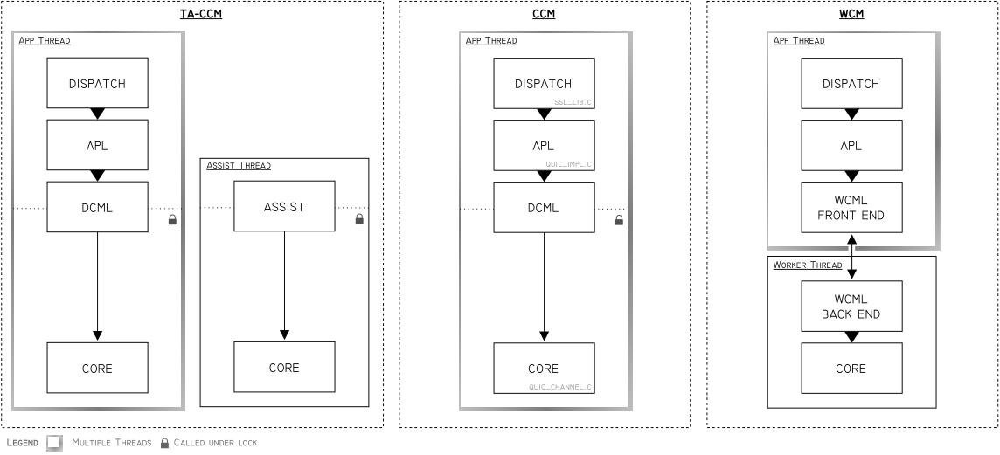

QUIC Concurrency Architecture
=============================

Introduction
------------

Most QUIC implementations in C are offered as a simple state machine without any
included I/O solution. Applications must do significant integration work to
provide the necessary infrastructure for a QUIC implementation to integrate
with. Moreover, blocking I/O at an application level may not be supported.

OpenSSL QUIC seeks to offer a QUIC solution which can serve multiple use cases:

- Firstly, it seeks to offer the simple state machine model and a fully
  customisable network path (via a BIO) for those who want it;

- Secondly, it seeks to offer a turnkey solution with an in-the-box I/O
  and polling solution which can support blocking API calls in a Berkeley
  sockets-like way.

These usage modes are somewhat diametrically opposed. One involves libssl
consuming no resources but those it is given, with an application responsible
for synchronisation and a potentially custom network I/O path. This usage model
is not “smart”. Network traffic is connected to the state machine and state is
input and output from the state machine as needed by an application on a purely
non-blocking basis. Determining *when* to do anything is largely the
application's responsibility.

The other diametrically opposed usage mode involves libssl managing more things
internally to provide an easier to use solution. For example, it may involve
spinning up background threads to ensure connections are serviced regularly (as
in our existing client-side thread assisted mode).

In order to provide for these different use cases, the concept of concurrency
models is introduced. A concurrency model defines how “cleverly” the QUIC engine
will operate and how many background resources (e.g. threads, other OS
resources) will be established to support operation.

Concurrency Models
------------------

- **Unsynchronised Concurrency Model (UCM):** In the Unsynchronised Concurrency
  Model, calls to SSL objects are not synchronised. There is no locking on any
  APL call (the omission of which is purely an optimisation). The application is
  either single-threaded or is otherwise responsible for doing synchronisation
  itself.

  Blocking API calls are not supported under this model. This model is intended
  primarily for single-threaded use as a simple state machine by advanced
  applications, and many applications will be likely to disable autoticking.

- **Contentive Concurrency Model (CCM):** In the
  Contentive Concurrency Model, calls to SSL objects are wrapped in locks and
  multi-threaded usage of a QUIC connection (for example, parallel writes to
  different QUIC stream SSL objects belonging to the same QUIC connection) is
  synchronised by a mutex.

  This is contentive in the sense that if a large number of threads are trying
  to write to different streams on the same connection, a large amount of lock
  contention will occur. As such, this concurrency model will not scale and
  provide good performance, at least within the context of concurrent use
  of a single connection.

  Under this model, APL calls by the application result in lock-wrapped
  mutations of QUIC core objects (`QUIC_CHANNEL`, `QUIC_STREAM`, etc.) on the
  same thread.

  This model may be used either in a variant which does not support blocking
  (NB-CCM) or which does support blocking (B-CCM). The blocking variant must
  spin up additional OS resources to correctly support blocking semantics.

- **Thread Assisted Contentive Concurrency Model (TA-CCM):** This is currently
  implemented by our thread assisted mode for client-side QUIC usage. It does
  not realise the full state separation or performance of the Worker Concurrency
  Model (WCM) below. Instead, it simply spawns a background thread which ensures
  QUIC timer events are handled as needed. It makes use of the Contentive
  Concurrency Model for performing that handling, in that it obtains a lock when
  ticking a QUIC connection just as any call by an application would.

  This mode is likely to be deprecated in favour of the full Worker Concurrency
  Model (WCM), which it will naturally be subsumed by.

- **Worker Concurrency Model (WCM):** In the Worker Concurrency Model,
  a background worker thread is spawned to manage connection processing. All
  interaction with a SSL object goes through this thread in some way.
  Interactions with SSL objects are essentially translated into commands and
  handled by the worker thread. To optimise performance and minimise lock
  contention, there is an emphasis on message passing over locking.
  Internal dataflow for application data can be managed in a zero-copy way to
  minimise the costs of this message passing.

  Under this model, QUIC core objects (`QUIC_CHANNEL`, `QUIC_STREAM`, etc.) will
  live solely on the worker thread and access to these objects by an application
  thread will be entirely forbidden.

  Blocking API calls are supported under this model.

These concurrency models are summarised as follows:

| Model  | Sophistication | Concurrency           | Blocking Supported | OS Resources              | Timer Events    | RX Steering | Core State Affinity  |
|--------|----------------|-----------------------|--------------------|---------------------------|-----------------|-------------|----------------------|
| UCM    | Lowest         | ST only               | No                 | None                      | App Responsible | None        | App Thread           |
| CCM    |                | MT (Contentive)       | Optional           | Mutex, (Notifier)         | App Responsible | TBD         | App Threads          |
| TA-CCM† |                | MT (Contentive)       | Optional           | Mutex, Thread, (Notifier) | Managed         | TBD         | App & Assist Threads |
| WCM    | Highest        | MT (High Performance) | Yes                | Mutex, Thread, Notifier   | Managed         | Futureproof | Worker Thread        |

† To eventually be deprecated in favour of WCM.

Legend:

- **Blocking Supported:** Whether blocking calls to e.g. `SSL_read` can be
  supported. If this is listed as “optional”, extra resources are required to
  support this under the listed model and these resources could be omitted if an
  application indicates it does not need this functionality at initialisation
  time.

- **OS Resources:** “Mutex” refers to mutex and condition variable resources.
  “Notifier” refers to a kind of OS resource needed to allow one thread to wake
  another thread which is currently blocking in an OS socket polling call such
  as poll(2) (e.g. an eventfd or socketpair). Resources listed in parentheses in
  the table above are required only if blocking support is desired.

- **Timer Events:** Is an application responsible for ensuring QUIC timeout
  events are handled in a timely manner?

- **RX Steering:** The matter of RX steering will be discussed in detail in a
  future document. Broadly speaking, RX steering concerns whether incoming
  traffic for multiple different QUIC connections on the same local port (e.g.
  for a server) can be vectored *by the OS* to different threads or whether the
  demuxing of incoming traffic for different connections has to be done manually
  on an in-process basis.

  The WCM model most readily supports RX steering and is futureproof in this
  regard. The feasibility of having the UCM and CCM models support RX steering
  is left for future analysis.

- **Core State Affinity:** Which threads are allowed to touch the QUIC core
  objects (`QUIC_CHANNEL`, `QUIC_STREAM`, etc.)

Architecture
------------

To recap, the API Personality Layer (APL) refers to the code in `quic_impl.c`
which implements the libssl API personality (`SSL_write`, etc.). The APL is
cleanly separated from the QUIC core implementation (`QUIC_CHANNEL`, etc.).

Since UCM is basically a slight optimisation of CCM in which unnecessary locking
is elided, discussion from hereon in will focus on CCM and WCM except where
there are specific differences between CCM and UCM.

Supporting both CCM and WCM creates significant architectural challenges. Under
CCM, QUIC core objects have their state mutated under lock by arbitrary
application threads and these mutations happen during APL calls. By contrast, a
performant WCM architecture requires that APL calls be recorded and serviced in
an asynchronous fashion involving message passing to a worker thread. This
threatens to require highly divergent dispatch architectures for the two
concurrency models.

As such, the concept of a **Concurrency Management Layer (CML)** is introduced.
The CML lives between the APL and the QUIC core code. It is responsible for
dispatching in-thread mutations of QUIC core objects when operating under CCM,
and for dispatching messages to a worker thread under WCM.



There are two different CMLs:

- **Direct CML (DCML)**, in which core objects are worked on in the same thread
  which made an APL call, under lock;

- **Worker CML (WCML)**, in which core objects are managed by a worker thread
  with communication via message passing. This CML is split into a front end
  (WCML-FE) and back end (WCML-BE).

The legacy thread assisted mode uses a bespoke method which is similar to the
approach used by the DCML.

CML Design
----------

The CML is designed to have as small an API surface area as possible to enable
unified handling of as many kinds of (APL) API operations as possible. The idea
is that complex APL calls are translated into simple operations on the CML.

At its core, the CML exposes some number of *pipes*. The number of pipes which
can be accessed via the CML varies as connections and streams are created and
destroyed. A pipe is a *unidirectional* transport for byte streams. Zero-copy
optimisations are expected to be implemented in future but are deferred.

The CML (`QUIC_CML`) allows the caller to refer to a pipe by providing an opaque
pipe handle (`QUIC_CML_PIPE`). If the pipe is a sending pipe, the caller can use
`ossl_cml_write` to try and add bytes to it. Conversely, if it is a receiving
pipe, the caller can use `ossl_cml_read` to try and read bytes from it.

The method `ossl_cml_block_until` allows the caller to block until at least one
of the provided pipe handles is ready. Ready means that at least one byte can be
written (for a sending pipe) or at least one byte can be read (for a receiving
pipe).

Note that there is only expected to be one `QUIC_CML` instance per QUIC event
processing domain (i.e., per `QUIC_DOMAIN` / `QUIC_ENGINE` instance). The CML
fully abstracts the QUIC core objects such as `QUIC_ENGINE` or `QUIC_CHANNEL` so
that the APL never sees them.

The caller retrieves a pipe handle using `ossl_cml_get_pipe`. This function
retrieves a pipe based on two values:

  - a CML pipe class;
  - a CML *selector*.

The CML selector is a tagged union structure which specifies what pipe is to be
retrieved. Abstractly, examples of selectors include:

```text
    Domain      ()
    Listener    (listener_id: uint)
    Conn        (conn_id:     uint)
    Stream      (conn_id:     uint, stream_id: u64)
```

In other words, the CML selector selects the “object” to retrieve a pipe from.

The CML pipe class is one of the following values:

- Request
- Notification
- App Send
- App Recv

The pipe classes available for a given selector vary. For example, the “App
Send” and “App Recv” pipes only exist on a stream, so it is invalid to request
such a pipe in conjunction with a different type of selector.

The “Request” and “App Send” classes expose send-only streams, and the
“Notification” and “App Recv” classes expose receive-only streams.

For any given CML selector, the Request pipe is used to send serialized commands
for asynchronous processing in relation to the entity selected by that selector.
Conversely, the Notification pipe returns asynchronous notifications. These
could be in relation to a previous Command (e.g. indicating whether a command
succeeded), or unprompted notifications about other events.

The underlying pattern here is that there is a bidirectional channel for control
messages, and a bidirectional channel for application data, both comprised of
two unidirectional pipes in turn.

Pipe handles are stable for as long as the pipe they reference exists, so an APL
object can cache a pipe handle if desired.

All CML methods are thread safe. The CML implementation handles any necessary
locking (if any) internally.

The `ossl_cml_write_available` and `ossl_cml_read_available` calls determine the
number of bytes which can currently be written to a send-only pipe, or read from
a receive-only pipe, respectively.

**Race conditions.** Because these are separate calls to `ossl_cml_write` and
`ossl_cml_read`, the values returned by these functions may become out of date
before the caller has a chance to read `ossl_cml_write` or `ossl_cml_read`.
However, such changes are guaranteed to be monotonically in favour of the
caller; for example, the value returned by `ossl_cml_write_available` will only
ever increase asynchronously (and only decrease as a result of an
`ossl_cml_write` call). Conversely, the value returned by
`ossl_cml_read_available` will only ever increase asynchronously (and only
decrease as a result of an `ossl_cml_read` call). Assuming that only one thread
makes calls to CML functions at a given time *for a given pipe*, this therefore
poses no issue for callers.

Concurrent use of `ossl_cml_write` or `ossl_cml_read` for a given pipe is not
intended (and would not make sense in any case). The caller is responsible for
synchronising such calls.

**Examples of pipe usage.** The application data pipes are used to serialize the
actual application data sent or received on a QUIC stream. The usage of the
request/notification pipes is more varied and used for control activity. There
is therefore a “control/data” separation here. The request and notification
pipes transport tagged unions. Abstractly, commands and notifications might
include:

- Request: Reset Stream (error code: u64)
- Notification: Connection Terminated by Peer

**Example implementation of `SSL_write`.** An `SSL_write`-like API might be
implemented in the APL like this:

```c
int do_write(QUIC_CML *cml,
             QUIC_CML_PIPE notification_pipe,
             QUIC_CML_PIPE app_send_pipe,
             const void *buf, size_t buf_len)
{
    size_t bytes_written = 0;

    for (;;) {
        /* e.g. connection termination */
        process_any_notifications(notification_pipe);

        /* state checks, etc. */
        if (...->conn_terminated)
            return 0;

        if (buf_len == 0)
            return 1;

        if (!ossl_cml_write(cml, app_send_pipe, buf, buf_len, &bytes_written))
            return 0;

        if (bytes_written == 0) {
            if (!should_block())
                break;

            ossl_cml_block_until(cml, {notification_pipe, app_send_pipe});
            continue; /* try again */
        }

        buf     += bytes_written;
        buf_len -= bytes_written;
    }

    return 1;
}
```

```c
/*
 * Creates a new CML using the Direct CML (DCML) implementation. need_locking
 * may be 0 to elide mutex usage if the application is guaranteed to synchronise
 * access or is purely single-threaded.
 */
QUIC_CML *ossl_cml_new_direct(int need_locking);

/* Creates a new CML using the Worker CML (WCML) implementation. */
QUIC_CML *ossl_cml_new_worker(size_t num_worker_threads);

/*
 * Starts the CML operating. Idempotent after it returns successfully. For the
 * WCML this might e.g. start background threads; for the DCML it is likely to
 * be a no-op (but must still be called).
 */
int ossl_cml_start(QUIC_CML *cml);

/*
 * Begins the CML shutdown process. Returns 1 once shutdown is complete; may
 * need to be called multiple times until shutdown is done.
 */
int ossl_cml_shutdown(QUIC_CML *cml);

/*
 * Immediate free of the CML. This is always safe but may cause handling
 * of a connection to be aborted abruptly as it is an immediate teardown
 * of all state.
 */
void ossl_cml_free(QUIC_CML *cml);

/*
 * Retrieves a pipe for a logical CML object described by selector. The pipe
 * handle, which is stable over the life of the logical CML object, is written
 * to *pipe_handle. class_ is a QUIC_CML_CLASS value.
 */
enum {
    QUIC_CML_CLASS_REQUEST,         /* control; send */
    QUIC_CML_CLASS_NOTIFICATION,    /* control; recv */
    QUIC_CML_CLASS_APP_SEND,        /* data; send */
    QUIC_CML_CLASS_APP_RECV         /* data; recv */
};

int ossl_cml_get_pipe(QUIC_CML                  *cml,
                      int                       class_,
                      const QUIC_CML_SELECTOR   *selector,
                      QUIC_CML_PIPE             *pipe_handle);

/*
 * Returns the number of bytes a sending pipe can currently accept. The returned
 * value may increase over time asynchronously but will only decrease in
 * response to an ossl_cml_write call.
 */
size_t ossl_cml_write_available(QUIC_CML *cml, QUIC_CML_PIPE pipe_handle);

/*
 * Appends bytes into a sending pipe by copying them. The buffer can be freed
 * as soon as this call returns.
 */
int ossl_cml_write(QUIC_CML *cml, QUIC_CML_PIPE pipe_handle,
                   const void *buf, size_t buf_len);

/*
 * Returns the number of bytes a receiving pipe currently has waiting to be
 * read. The returned value may increase over time asynchronously but will only
 * decreate in response to an ossl_cml_read call.
 */
size_t ossl_cml_read_available(QUIC_CML *cml, QUIC_CML_PIPE pipe_handle);

/*
 * Reads bytes from a receiving pipe by copying them.
 */
int ossl_cml_read(QUIC_CML *cml, QUIC_CML_PIPE pipe_handle,
                  void *buf, size_t buf_len);

/*
 * Blocks until at least one of the pipes in the array specified by
 * pipe_handles is ready, or until the deadline given is reached.
 *
 * A pipe is ready if:
 *
 *   - it is a sending pipe and one or more bytes can now be written;
 *   - it is a receiving pipe and one or more bytes can now be read.
 */
int ossl_cml_block_until(QUIC_CML *cml,
                         const QUIC_CML_PIPE *pipe_handles,
                         size_t num_pipe_handles,
                         OSSL_TIME deadline);
```
