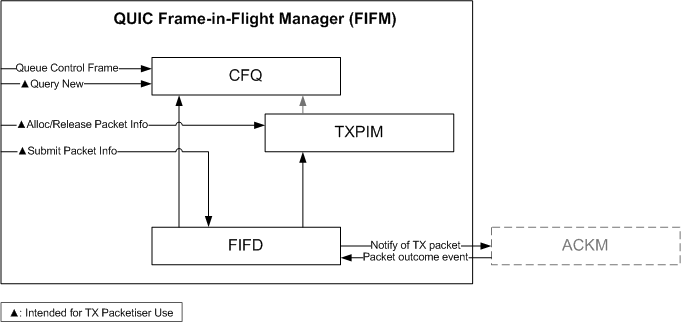
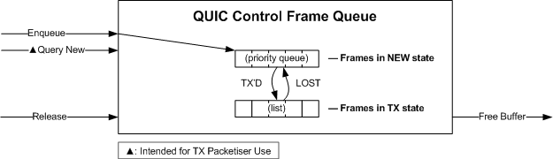
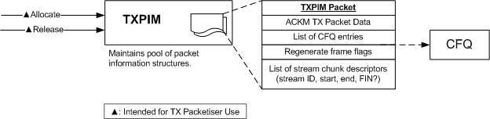

QUIC Frame-in-Flight Management
===============================

The QUIC frame-in-flight manager is responsible for tracking frames which were
sent which need to be regenerated if the packets they were placed into are
designated as lost by the ACK manager. The ACK manager works on the level of
packets, whereas the QUIC frame-in-flight manager (FIFM) works on the level of
frames.

The FIFM comprises three components, collectively known as the FIFM:

  - the Control Frame Queue (CFQ);
  - the Transmitted Packet Information Manager (TXPIM); and
  - the Frame-in-Flight Dispatcher (FIFD).



These are introduced in turn below, but first we discuss the various QUIC frame
types to establish the need for each component.

Analysis of QUIC Frame Retransmission Requirements
--------------------------------------------------

### Frame Types

Standard QUIC uses the following frame types:

```plain
HANDSHAKE_DONE          GCR / REGEN
MAX_DATA                      REGEN
DATA_BLOCKED                  REGEN
MAX_STREAMS                   REGEN
STREAMS_BLOCKED               REGEN
NEW_CONNECTION_ID             GCR
RETIRE_CONNECTION_ID          GCR
PATH_CHALLENGE                  -
PATH_RESPONSE                   -
ACK                             -        (non-ACK-eliciting)
CONNECTION_CLOSE              special    (non-ACK-eliciting)
NEW_TOKEN                     GCR
CRYPTO                        GCR or special
RESET_STREAM                  REGEN
STOP_SENDING                  REGEN
MAX_STREAM_DATA               REGEN
STREAM_DATA_BLOCKED           REGEN
STREAM                        special
PING                           -
PADDING                        -         (non-ACK-eliciting)
```

The different frame types require various different ways of handling
retransmission in the event of loss:

  - **GCR** (Generic Control Frame Retransmission): The raw bytes of
    the encoded frame can simply be sent again. This retransmission system does
    not need to understand the specific frame type. A simple queue can be used,
    with each queue entry being an octet string representing an encoded frame.
    This queue can also be used for initial transmission of **GCR** frames, not
    just retransmissions.

  - **REGEN** (Regenerate): These frames can be marked for dynamic regeneration
    when a packet containing them is lost. This has the advantage of using
    up-to-date data at the time of transmission, so is preferred over `GCR` when
    possible.

  - Special — `STREAM`, `CRYPTO`: `STREAM` frame handling is handled as a
    special case by the QUIC Send Stream Manager. `CRYPTO` frame retransmission
    can also be handled using a QUIC Send Stream manager. (`CRYPTO` frames could
    also be handled via GCR, though suboptimally. We choose to use proper send
    stream management, just as for application data streams.)

  - Some frame types do not need to be retransmitted even if lost (`PING`,
    `PADDING`, `PATH_CHALLENGE`, `PATH_RESPONSE`).

  - Special — `CONNECTION_CLOSE`: This frame is a special case and is not
    retransmitted per se.

### Requirements

The following requirements are identified:

- Need for a generic control queue which can store encoded control frames.
  This control queue will handle both initial transmission and retransmission of
  most control frames which do not have special requirements.

- The ability to determine, when the ACK Manager determines that a packet has
  been acknowledged, lost or discarded:

  - What stream IDs were sent in a packet, and the logical ranges of application
    data bytes for each (which may not be one contiguous range).

    This is needed so that the QUIC Send Stream Manager for a given stream
    can be informed of lost or acked ranges in the stream.

  - The logical ranges of the CRYPTO stream which were sent in the packet
    (which may not be one contiguous range), for similar reasons.

  - Which stream IDs had a FIN bit set in the packet.

    This is needed so that the QUIC Send Stream Manager can be informed for a
    given stream whether a FIN was lost or acked.

  - What control frames using the **GCR** strategy were sent in the packet
    so that they can be requeued (if lost) or released (if acked or discarded).

  - For each type of frame using the **REGEN** strategy, a flag as to whether
    that frame type was contained in the packet (so that the flag can be set
    again if the packet was lost).

The Control Frame Queue (CFQ)
-----------------------------



The CFQ (`QUIC_CFQ`) stores encoded frames which can be blindly retransmitted in
the event that they are lost. It facilitates the GCR retransmission strategy.
One logical CFQ instance will be needed per PN space per connection. As an
optimisation, these three CFQ instances per connection are all modelled by a
single `QUIC_CFQ` instance.

Each frame in the CFQ is a simple opaque byte buffer, which has the following
metadata associated with it:

- An integral priority value, used to maintain priority ordering.

- The frame type, which is provided by the caller along with the buffer.
  This can be determined from the encoded frame buffer, but this saves the
  CFQ's users from needing to decode it. The CFQ itself does not use this
  value.

- A state, which is either `NEW` or `TX`. Frames added to the CFQ have
  the `NEW` state initially. When the frame is transmitted, it is transitioned
  to the `TX` state. If the packet it was sent in is subsequently lost,
  it is transitioned back to the `NEW` state.

Frames in the `NEW` state participate in a priority queue (the NEW queue)
according to their priority and the CFQ's NEW queue can be iterated in priority
order by callers.

When a packet containing a CFQ item is acknowledged, the CFQ is informed and the
CFQ item is released. A free callback provided when the buffer was added to the
CFQ is called, providing an opportunity to free or reuse the buffer. Buffers
provided to the CFQ as part of a CFQ item must remain allocated for the duration
of their membership of the CFQ. The CFQ maintains memory allocation of CFQ items
themselves internally.

### API

```c
/*
 * QUIC Control Frame Queue Item
 * =============================
 *
 * The CFQ item structure has a public and a private part. This structure
 * documents the public part.
 */
typedef struct quic_cfq_item_st QUIC_CFQ_ITEM;

struct quic_cfq_item_st {
    /*
     * These fields are not used by the CFQ, but are a convenience to assist the
     * TXPIM in keeping a list of GCR control frames which were sent in a
     * packet. They may be used for any purpose.
     */
    QUIC_CFQ_ITEM  *pkt_prev, *pkt_next;

    /* All other fields are private; use ossl_quic_cfq_item_* accessors. */
};

#define QUIC_CFQ_STATE_NEW      0
#define QUIC_CFQ_STATE_TX       1

/* Returns the frame type of a CFQ item. */
uint64_t ossl_quic_cfq_item_get_frame_type(QUIC_CFQ_ITEM *item);

/* Returns a pointer to the encoded buffer of a CFQ item. */
const unsigned char *ossl_quic_cfq_item_get_encoded(QUIC_CFQ_ITEM *item);

/* Returns the length of the encoded buffer in bytes. */
size_t ossl_quic_cfq_item_get_encoded_len(QUIC_CFQ_ITEM *item);

/* Returns the CFQ item state, a QUIC_CFQ_STATE_* value. */
int ossl_quic_cfg_item_get_state(QUIC_CFQ_ITEM *item);

/* Returns the PN space for the CFQ item. */
int ossl_quic_cfg_item_get_pn_space(QUIC_CFQ_ITEM *item);

/*
 * QUIC Control Frame Queue
 * ========================
 */
typedef struct quic_cfq_st QUIC_CFQ;

QUIC_CFQ *ossl_quic_cfq_new(void);
void ossl_quic_cfq_free(QUIC_CFQ *cfq);

/*
 * Input Side
 * ----------
 */

/*
 * Enqueue a frame to the CFQ. encoded points to the opaque encoded frame.
 *
 * free_cb is called by the CFQ when the buffer is no longer needed;
 * free_cb_arg is an opaque value passed to free_cb.
 *
 * priority determines the relative ordering of control frames in a packet.
 * Higher numerical values for priority mean that a frame should come earlier in
 * a packet. pn_space is a QUIC_PN_SPACE_* value.
 *
 * On success, returns a QUIC_CFQ_ITEM pointer which acts as a handle to
 * the queued frame. On failure, returns NULL.
 *
 * The frame is initially in the TX state, so there is no need to call
 * ossl_quic_cfq_mark_tx() immediately after calling this function.
 *
 * The frame type is duplicated as the frame_type argument here, even though it
 * is also encoded into the buffer. This allows the caller to determine the
 * frame type if desired without having to decode the frame.
 */
typedef void (cfq_free_cb)(unsigned char *buf, size_t buf_len, void *arg);

QUIC_CFQ_ITEM *ossl_quic_cfq_add_frame(QUIC_CFQ            *cfq,
                                       uint32_t             priority,
                                       uint32_t             pn_space,
                                       uint64_t             frame_type,
                                       const unsigned char *encoded,
                                       size_t               encoded_len,
                                       cfq_free_cb         *free_cb,
                                       void                *free_cb_arg);

/*
 * Effects an immediate transition of the given CFQ item to the TX state.
 */
void ossl_quic_cfq_mark_tx(QUIC_CFQ *cfq, QUIC_CFQ_ITEM *item);

/*
 * Effects an immediate transition of the given CFQ item to the NEW state,
 * allowing the frame to be retransmitted. If priority is not UINT32_MAX,
 * the priority is changed to the given value.
 */
void ossl_quic_cfq_mark_lost(QUIC_CFQ *cfq, QUIC_CFQ_ITEM *item,
                             uint32_t priority);

/*
 * Releases a CFQ item. The item may be in either state (NEW or TX) prior to the
 * call. The QUIC_CFQ_ITEM pointer must not be used following this call.
 */
void ossl_quic_cfq_release(QUIC_CFQ *cfq, QUIC_CFQ_ITEM *item);

/*
 * Output Side
 * -----------
 */

/*
 * Gets the highest priority CFQ item in the given PN space awaiting
 * transmission. If there are none, returns NULL.
 */
QUIC_CFQ_ITEM *ossl_quic_cfq_get_priority_head(QUIC_CFQ *cfq, uint32_t pn_space);

/*
 * Given a CFQ item, gets the next CFQ item awaiting transmission in priority
 * order in the given PN space. In other words, given the return value of
 * ossl_quic_cfq_get_priority_head(), returns the next-lower priority item.
 * Returns NULL if the given item is the last item in priority order.
 */
QUIC_CFQ_ITEM *ossl_quic_cfq_item_get_priority_next(QUIC_CFQ_ITEM *item,
                                                    uint32_t pn_space);
```

The Transmitted Packet Information Manager (TXPIM)
--------------------------------------------------



The Transmitted Packet Information Manager (`QUIC_TXPIM`) is responsible for
allocating and keeping bookkeeping structures for packets which have been
transmitted, but not yet acknowledged, deemed lost or discarded. It is a
self-contained memory pool handing out `QUIC_TXPIM_PKT` structures. Each
`QUIC_TXPIM_PKT` is a self-contained data structure intended for consumption by
the FIFM.

The `QUIC_TXPIM_PKT` structure can be used for:

  - Keeping track of all GCR control frames which were transmitted
    in each packet, via a linked list of `QUIC_CFQ_ITEM`s.

  - Keeping track of all REGEN-strategy control frame types, via a flag
    for each frame type indicating whether the packet contained
    such a frame.

  - Keeping track of all stream IDs sent in a given packet, and
    what ranges of the logical stream were sent, and whether
    a FIN was sent.

  - Keeping track of what logical ranges of the CRYPTO stream were sent.

In order to avoid unnecessary allocations, the FIFM also incorporates the ACK
Manager's `QUIC_ACKM_TX_PKT` structure into its per-packet bookkeeping
structure. The intention is for the `QUIC_TXPIM_PKT` to be the principal
allocation made per transmitted packet. The TX packetiser will obtain
a `QUIC_TXPIM_PKT` structure from the TXPIM, fill in the structure including
the ACK Manager data, and submit it via the FIFD which we introduce below.

The TXPIM does do not anything with the `QUIC_TXPIM_PKT` structure itself other
than managing its allocation and manipulation. Constructive use of the data kept
in the TXPIM is made by the FIFD.

### API

```c
/*
 * QUIC Transmitted Packet Information Manager
 * ===========================================
 */
typedef struct quic_txpim_st QUIC_TXPIM;

typedef struct quic_txpim_pkt_st {
    /* ACKM-specific data. Caller should fill this. */
    QUIC_ACKM_TX_PKT    ackm_pkt;

    /* Linked list of CFQ items in this packet. */
    QUIC_CFQ_ITEM      *retx_head;

    /* Reserved for FIFD use. */
    QUIC_FIFD          *fifd;

    /* Regenerate-strategy frames. */
    unsigned int        had_handshake_done          : 1;
    unsigned int        had_max_data_frame          : 1;
    unsigned int        had_max_streams_bidi_frame  : 1;
    unsigned int        had_max_streams_uni_frame   : 1;
    unsigned int        had_ack_frame               : 1;

    /* Private data follows. */
} QUIC_TXPIM_PKT;

/* Represents a range of bytes in an application or CRYPTO stream. */
typedef struct quic_txpim_chunk_st {
    /* The stream ID, or UINT64_MAX for the CRYPTO stream. */
    uint64_t        stream_id;
    /*
     * The inclusive range of bytes in the stream. Exceptionally, if end <
     * start, designates a frame of zero length (used for FIN-only frames).
     */
    uint64_t        start, end;
    /*
     * Whether a FIN was sent for this stream in the packet. Not valid for
     * CRYPTO stream.
     */
    unsigned int    has_fin : 1;
} QUIC_TXPIM_CHUNK;

QUIC_TXPIM *ossl_quic_txpim_new(void);
void ossl_quic_txpim_free(QUIC_TXPIM *txpim);

/*
 * Allocates a new QUIC_TXPIM_PKT structure from the pool. Returns NULL on
 * failure. The returned structure is cleared of all data and is in a fresh
 * initial state.
 */
QUIC_TXPIM_PKT *ossl_quic_txpim_pkt_alloc(QUIC_TXPIM *txpim);

/*
 * Releases the TXPIM packet, returning it to the pool.
 */
void ossl_quic_txpim_pkt_release(QUIC_TXPIM *txpim, QUIC_TXPIM_PKT *fpkt);

/* Clears the chunk list of the packet, removing all entries. */
void ossl_quic_txpim_pkt_clear_chunks(QUIC_TXPIM_PKT *fpkt);

/* Appends a chunk to the packet. The structure is copied. */
int ossl_quic_txpim_pkt_append_chunk(QUIC_TXPIM_PKT *fpkt,
                                    const QUIC_TXPIM_CHUNK *chunk);

/* Adds a CFQ item to the packet by prepending it to the retx_head list. */
void ossl_quic_txpim_pkt_add_cfq_item(QUIC_TXPIM_PKT *fpkt,
                                      QUIC_CFQ_ITEM *item);

/*
 * Returns a pointer to an array of stream chunk information structures for the
 * given packet. The caller must call ossl_quic_txpim_pkt_get_num_chunks() to
 * determine the length of this array.
 *
 * The chunks are sorted by (stream_id, start) in ascending order.
 */
const QUIC_TXPIM_CHUNK *ossl_quic_txpim_pkt_get_chunks(QUIC_TXPIM_PKT *fpkt);

/*
 * Returns the number of entries in the array returned by
 * ossl_quic_txpim_pkt_get_chunks().
 */
size_t ossl_quic_txpim_pkt_get_num_chunks(QUIC_TXPIM_PKT *fpkt);

/*
 * Returns the number of QUIC_TXPIM_PKTs allocated by the given TXPIM that have
 * yet to be returned to the TXPIM.
 */
size_t ossl_quic_txpim_get_in_use(QUIC_TXPIM *txpim);
```

The Frame-in-Flight Dispatcher (FIFD)
-------------------------------------

Finally, the CFQ, TXPIM and some interfaces to the ACKM are tied together via
the FIFD (`QUIC_FIFD`). The FIFD is completely stateless and provides reasonable
implementations for the on-loss, on-acked and on-discarded callbacks issued by
the ACK Manager.

The FIFD is used by obtaining a packet structure from the TXPIM, filling it in,
and then calling `ossl_quic_fifd_pkt_commit()`. The FIFD submits the packet to
the ACK Manager as a transmitted packet and provides its own callback
implementations to the ACK Manager for the packet. Note that the
`QUIC_TXPIM_PKT` is returned to the free pool once any of these callbacks occur;
once a packet's fate is known (acked, lost or discarded), use is immediately
made of the information in the `QUIC_TXPIM_PKT` and the `QUIC_TXPIM_PKT` is
immediately released. CFQ items may be freed (on ACK or discard) or transitioned
back to the NEW state (on loss).

The FIFD consumes various dependencies so that it can inform the appropriate
subsystems in the event of a packet being acked, lost or discarded. In
particular:

- It references a CFQ used to manage CFQ items;
- It references an ACK manager which it informs of transmitted packets;
- It references a TXPIM which manages each `QUIC_TXPIM_PKT`;
- It is provided with a callback to obtain a QUIC Send Stream based on a stream
  ID. Thus the caller of the FIFD may implement whatever strategy it likes
  to map stream IDs to QUIC Send Stream instances.
- It is provided with a callback which is called when it thinks a frame
  should be regenerated using the REGEN strategy. Some of these are specific
  to a given stream, in which case a stream ID is specified.

All of the state is in the dependencies referenced by the FIFD. The FIFD itself
simply glues all of these parts together.

### API

```c
typedef struct quic_fifd_st {
  /* (internals) */
} QUIC_FIFD;

int ossl_quic_fifd_init(QUIC_FIFD *fifd,
                        QUIC_CFQ *cfq,
                        QUIC_ACKM *ackm,
                        QUIC_TXPIM *txpim,
                        /* stream_id is UINT64_MAX for the crypto stream */
                        OSSL_QSS *(*get_qss_by_id)(uint64_t stream_id,
                                                   void *arg),
                        void *get_qss_by_id_arg,
                        /* stream_id is UINT64_MAX if not applicable */
                        void (*regen_frame)(uint64_t frame_type,
                                            uint64_t stream_id,
                                            void *arg),
                        void *regen_frame_arg);
void ossl_quic_fifd_cleanup(QUIC_FIFD *fifd); /* (no-op) */

int ossl_quic_fifd_pkt_commit(QUIC_FIFD *fifd, QUIC_TXPIM_PKT *pkt);
```

Typical Intended TX Packetiser Usage
------------------------------------

- TX Packetiser maintains flags for each REGEN-strategy frame type.
  It sets this flag when the regenerate callback is issued by the FIFD
  and clears it when transmitting a packet containing such a frame.

- TX Packetiser obtains a `QUIC_TXPIM_PKT` structure by calling
  `ossl_quic_txpim_pkt_alloc()`.

- TX Packetiser fills in the ACKM part of the `QUIC_TXPIM_PKT`
  (`QUIC_ACKM_TX_PKT`), except for the callback fields, which are handled by the
  FIFD.

- TX Packetiser queries the ACK Manager to determine if an ACK frame
  is desired, and if so adds it to the packet.

- TX Packetiser queries the CFQ to determine what control frames it places
  in a packet. It does this before adding STREAM or CRYPTO frames (i.e.,
  all CFQ frames are considered of higher priority). For each such frame
  it places in a packet, it:

  - calls `ossl_quic_txpim_pkt_add_cfq_item()` on the TXPIM to log the CFQ item
    as having been transmitted in the given packet, so that the CFQ item can be
    released or requeued depending on the ultimate fate of the packet.

- For each STREAM or CRYPTO frame included in a packet, the TX Packetiser:

  - informs the QUIC Send Stream instance for that stream that a range of bytes
    has been transmitted;

  - also informs the QUIC Send Stream instance if FIN was set on a STREAM frame.

  - calls `ossl_quic_txpim_pkt_append_chunk()` to log a logical range of
    the given application or crypto stream as having been sent, so that it can
    be subsequently marked as acknowledged or lost depending on the ultimate
    fate of the packet.

- TX Packetiser calls `ossl_quic_fifd_pkt_commit()`. The FIFD takes care
  of submitting the packet to the ACK Manager and provides its own callback
  implementation. It also takes care of informing the CFQ that any CFQ items
  which were added via `ossl_quic_txpim_pkt_add_cfq_item()` have been
  transmitted.

  In the event of packet loss, ACK or discard, the appropriate QUIC Send Stream,
  CFQ and regenerate callback calls are made. Regardless of the outcome, the
  TXPIM is released.
