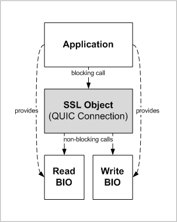

QUIC I/O Architecture
=====================

This document discusses possible implementation options for the I/O architecture
internal to the libssl QUIC implementation, discusses the underlying design
constraints driving this decision and introduces the resulting I/O architecture.
It also identifies potential hazards to existing applications, and identifies
how those hazards are mitigated.

Objectives
----------

The [requirements for QUIC](./quic-requirements.md) which have formed the basis
for implementation include the following requirements:

- The application must have the ability to be in control of the event loop
  without requiring callbacks to process the various events. An application must
  also have the ability to operate in “blocking” mode.

- High performance applications (primarily server based) using existing libssl
  APIs; using custom network interaction BIOs in order to get the best
  performance at a network level as well as OS interactions (IO handling, thread
  handling, using fibres). Would prefer to use the existing APIs - they don’t
  want to throw away what they’ve got. Where QUIC necessitates a change they
  would be willing to make minor changes.

As such, there are several objectives for the I/O architecture of the QUIC
implementation:

 - We want to support both blocking and non-blocking semantics
   for application use of the libssl APIs.

 - In the case of non-blocking applications, it must be possible
   for an application to do its own polling and make its own event
   loop.

 - We want to support custom BIOs on the network side and to the extent
   feasible, minimise the level of adaptation needed for any custom BIOs already
   in use on the network side. More generally, the integrity of the BIO
   abstraction layer should be preserved.

QUIC-Related Requirements
-------------------------

Note that implementation of QUIC will require that the underlying network BIO
passed to the QUIC implementation be configured to support datagram semantics
instead of bytestream semantics as has been the case with traditional TLS
over TCP. This will require applications using custom BIOs on the network side
to make substantial changes to the implementation of those custom BIOs to model
datagram semantics. These changes are not minor, but there is no way around this
requirement.

It should also be noted that implementation of QUIC requires handling of timer
events as well as the circumstances where a network socket becomes readable or
writable. In many cases we need to handle these events simultaneously (e.g. wait
until a socket becomes readable, or writable, or a timeout expires, whichever
comes first).

Note that the discussion in this document primarily concerns usage of blocking
vs. non-blocking I/O in the interface between the QUIC implementation and an
underlying BIO provided to the QUIC implementation to provide it access to the
network. This is independent of and orthogonal to the application interface to
libssl, which will support both blocking and non-blocking I/O.

Blocking vs. Non-Blocking Modes in Underlying Network BIOs
----------------------------------------------------------

The above constraints make it effectively a requirement that non-blocking I/O be
used for the calls to the underlying network BIOs. To illustrate this point, we
first consider how QUIC might be implemented using blocking network I/O
internally.

To function correctly and provide blocking semantics at the application level,
our QUIC implementation must be able to block such that it can respond to any of
the following events for the underlying network read and write BIOs immediately:

- The underlying network write BIO becomes writeable;
- The underlying network read BIO becomes readable;
- A timeout expires.

### Blocking sockets and select(3)

Firstly, consider how this might be accomplished using the Berkeley sockets API.
Blocking on all three wakeup conditions listed above would require use of an API
such as select(3) or poll(3), regardless of whether the network socket is
configured in blocking mode or not.

While in principle APIs such as select(3) can be used with a socket in blocking
mode, this is not an advisable usage mode. If a socket is in blocking mode,
calls to send(3) or recv(3) may block for some arbitrary period of time, meaning
that our QUIC implementation cannot handle incoming data (if we are blocked on
send), send outgoing data (if we are blocked on receive), or handle timeout
events.

Though it can be argued that a select(3) call indicating readability or
writeability should guarantee that a subsequent send(3) or recv(3) call will not
block, there are several reasons why this is an extremely undesirable solution:

- It is quite likely that there are buggy OSes out there which perform spurious
  wakeups from select(3).

- The fact that a socket is writeable does not necessarily mean that a datagram
  of the size we wish to send is writeable, so a send(3) call could block
  anyway.

- This usage pattern precludes multithreaded use barring some locking scheme
  due to the possibility of other threads racing between the call to select(3)
  and the subsequent I/O call. This undermines our intentions to support
  multi-threaded network I/O on the backend.

Moreover, our QUIC implementation will not drive the Berkeley sockets API
directly but uses the BIO abstraction to access the network, so these issues are
then compounded by the limitations of our existing BIO interfaces. We do not
have a BIO interface which provides for select(3)-like functionality or which
can implement the required semantics above.

Moreover, even if we used select(3) directly, select(3) only gives us a
guarantee (under a non-buggy OS) that a single syscall will not block, however
we have no guarantee in the API contract for BIO_read(3) or BIO_write(3) that
any given BIO implementation has such a BIO call correspond to only a single
system call (or any system call), so this does not work either. Therefore,
trying to implement QUIC on top of blocking I/O in this way would require
violating the BIO abstraction layer, and would not work with custom BIOs (even
if the poll descriptor concept discussed below were adopted).

### Blocking sockets and threads

Another conceptual possibility is that blocking calls could be kept ongoing in
parallel threads. Under this model, there would be three threads:

- a thread which exists solely to execute blocking calls to the `BIO_write` of
  an underlying network BIO,
- a thread which exists solely to execute blocking calls to the `BIO_read` of an
  underlying network BIO,
- a thread which exists solely to wait for and dispatch timeout events.

This could potentially be reduced to two threads if it is assumed that
`BIO_write` calls do not take an excessive amount of time.

The premise here is that the front-end I/O API (`SSL_read`, `SSL_write`, etc.)
would coordinate and synchronise with these background worker threads via
threading primitives such as conditional variables, etc.

This has a large number of disadvantages:

- There is a hard requirement for threading functionality in order to be
  able to support blocking semantics at the application level. Applications
  which require blocking semantics would only be able to function in thread
  assisted mode. In environments where threading support is not available or
  desired, our APIs would only be usable in a non-blocking fashion.

- Several threads are spawned which the application is not in control of.
  This undermines our general approach of providing the application with control
  over OpenSSL's use of resources, such as allowing the application to do its
  own polling or provide its own allocators.

  At a minimum for a client, there must be two threads per connection. This
  means if an application opens many outgoing connections, there will need
  to be `2n` extra threads spawned.

- By blocking in `BIO_write` calls, this precludes correct implementation of
  QUIC. Unlike any analogue in TLS, QUIC packets are time sensitive and intended
  to be transmitted as soon as they are generated. QUIC packets contain fields
  such as the ACK Delay value, which is intended to describe the time between a
  packet being received and a return packet being generated. Correct calculation
  of this field is necessary to correct calculation of connection RTT. It is
  therefore important to only generate packets when they are ready to be sent,
  otherwise suboptimal performance will result. This is a usage model which
  aligns optimally to non-blocking I/O and which cannot be accommodated
  by blocking I/O.

- Since existing custom BIOs will not be expecting concurrent `BIO_read` and
  `BIO_write` calls, they will need to be adapted to support this, which is
  likely to require substantial rework of those custom BIOs (trivial locking of
  calls obviously does not work since both of these calls must be able to block
  on network I/O simultaneously).

Moreover, this does not appear to be a realistically implementable approach:

- The question is posed of how to handle connection teardown, which does not
  seem to be solvable. If parallel threads are blocked in blocking `BIO_read`
  and `BIO_write` calls on some underlying network BIO, there needs to be some
  way to force these calls to return once `SSL_free` is called and we need to
  tear down the connection. However, the BIO interface does not provide
  any way to do this. *At best* we might assume the BIO is a `BIO_s_dgram`
  (but cannot assume this in the general case), but even then we can only
  accomplish teardown by violating the BIO abstraction and closing the
  underlying socket.

  This is the only portable way to ensure that a recv(3) call to the same socket
  returns. This obviously is a highly application-visible change (and is likely
  to be far more disruptive than configuring the socket into non-blocking mode).

  Moreover, it is not workable anyway because it only works for a socket-based
  BIO and violates the BIO abstraction. For BIOs in general, there does not
  appear to be any viable solution to the teardown issue.

Even if this approach were successfully implemented, applications will still
need to change to using network BIOs with datagram semantics. For applications
using custom BIOs, this is likely to require substantial rework of those BIOs.
There is no possible way around this. Thus, even if this solution were adopted
(notwithstanding the issues which preclude this noted above) for the purposes of
accommodating applications using custom network BIOs in a blocking mode, these
applications would still have to completely rework their implementation of those
BIOs. In any case, it is expected to be comparatively rare that sophisticated
applications implementing their own custom BIOs will do so in a blocking mode.

### Use of non-blocking I/O

By comparison, use of non-blocking I/O and select(3) or similar APIs on the
network side makes satisfying our requirements for QUIC easy, and also allows
our internal approach to I/O to be flexibly adapted in the future as
requirements may evolve.

This is also the approach used by all other known QUIC implementations; it is
highly unlikely that any QUIC implementations exist which use blocking network
I/O, as (as mentioned above) it would lead to suboptimal performance due to the
ACK delay issue.

Note that this is orthogonal to whether we provide blocking I/O semantics to the
application. We can use blocking I/O internally while using this to provide
either blocking or non-blocking semantics to the application, based on what the
application requests.

This approach in general requires that a network socket be configured in
non-blocking mode. Though some OSes support a `MSG_DONTWAIT` flag which allows a
single I/O operation to be made non-blocking, not all OSes support this (e.g.
Windows), thus this cannot be relied on. As such, we need to configure any
socket FD we use into non-blocking mode.

Of the approaches outlined in this document, the use of non-blocking I/O has the
fewest disadvantages and is the only approach which appears to actually be
implementable in practice. Moreover, most of the disadvantages can be readily
mitigated:

  - We rely on having a select(3) or poll(3) like function available from the
    OS.

    However:

    - Firstly, we already rely on select(3) in our code, at least in
      non-`no-sock` builds, so this does not appear to raise any portability
      issues;

    - Secondly, we have the option of providing a custom poller interface which
      allows an application to provide its own implementation of a
      select(3)-like function. In fact, this has the potential to be quite
      powerful and would allow the application to implement its own pollable
      BIOs, and therefore perform blocking I/O on top of any custom BIO.

      For example, while historically none of our own memory-based BIOs have
      supported blocking semantics, a sophisticated application could if it
      wished choose to implement a custom blocking memory BIO and implement a
      custom poller which synchronises using a custom poll descriptor based
      around condition variables rather than sockets. Thus this scheme is
      highly flexible.

      (It is worth noting also that the implementation of blocking semantics at
      the application level also does not rely on any privileged access to the
      internals of the QUIC implementation and an application could if it wished
      build blocking semantics out of a non-blocking QUIC instance; this is not
      particularly difficult, though providing custom pollers here would mean
      there should be no need for an application to do so.)

  - Configuring a socket into non-blocking mode might confuse an application.

    However:

    - Applications will already have to make changes to any network-side BIOs,
      for example switching from a `BIO_s_socket` to a `BIO_s_dgram`, or from a
      BIO pair to a `BIO_s_dgram_pair`. Custom BIOs will need to be
      substantially reworked to switch from bytestream semantics to datagram
      semantics. Such applications will already need substantial changes, and
      this is unavoidable.

      Of course, application impacts and migration guidance can (and will) all
      be documented.

    - In order for an application to be confused by us putting a socket into
      non-blocking mode, it would need to be trying to use the socket in some
      way. But it is not possible for an application to pass a socket to our
      QUIC implementation, and also try to use the socket directly, and have
      QUIC still work. Using QUIC necessarily requires that an application not
      also be trying to make use of the same socket.

    - There are some circumstances where an application might want to multiplex
      other protocols onto the same UDP socket, for example with protocols like
      RTP/RTCP or STUN; this can be facilitated using the QUIC fixed bit.
      However, these use cases cannot be supported without explicit assistance
      from a QUIC implementation and this use case cannot be facilitated by
      simply sharing a network socket, as incoming datagrams will not be routed
      correctly. (We may offer some functionality in future to allow this to be
      coordinated but this is not for MVP.) Thus this also is not a concern.
      Moreover, it is extremely unlikely that any such applications are using
      sockets in blocking mode anyway.

   - The poll descriptor interface adds complexity to the BIO interface.

Advantages:

  - An application retains full control of its event loop in non-blocking mode.

    When using libssl in application-level blocking mode, via a custom poller
    interface, the application would actually be able to exercise more control
    over I/O than it actually is at present when using libssl in blocking mode.

  - Feasible to implement and already working in tests.
    Minimises further development needed to ship.

  - Does not rely on creating threads and can support blocking I/O at the
    application level without relying on thread assisted mode.

  - Does not require an application-provided network-side custom BIO to be
    reworked to support concurrent calls to it.

  - The poll descriptor interface will allow applications to implement custom
    modes of polling in the future (e.g. an application could even building
    blocking application-level I/O on top of a on a custom memory-based BIO
    using condition variables, if it wished). This is actually more flexible
    than the current TLS stack, which cannot be used in blocking mode when used
    with a memory-based BIO.

  - Allows performance-optimal implementation of QUIC RFC requirements.

  - Ensures our internal I/O architecture remains flexible for future evolution
    without breaking compatibility in the future.

Use of Internal Non-Blocking I/O
--------------------------------

Based on the above evaluation, implementation has been undertaken using
non-blocking I/O internally. Applications can use blocking or non-blocking I/O
at the libssl API level. Network-level BIOs must operate in a non-blocking mode
or be configurable by QUIC to this end.



### Support of arbitrary BIOs

We need to support not just socket FDs but arbitrary BIOs as the basis for the
use of QUIC. The use of QUIC with e.g. `BIO_s_dgram_pair`, a bidirectional
memory buffer with datagram semantics, is to be supported as part of MVP. This
must be reconciled with the desire to support application-managed event loops.

Broadly, the intention so far has been to enable the use of QUIC with an
application event loop in application-level non-blocking mode by exposing an
appropriate OS-level synchronisation primitive to the application. On \*NIX
platforms, this essentially means we provide the application with:

  - An FD which should be polled for readability, writability, or both; and
  - A deadline (if any is currently applicable).

Once either of these conditions is met, the QUIC state machine can be
(potentially) advanced meaningfully, and the application is expected to reenter
the QUIC state machine by calling `SSL_tick()` (or `SSL_read()` or
`SSL_write()`).

This model is readily supported when the read and write BIOs we are provided
with are socket BIOs:

  - The read-pollable FD is the FD of the read BIO.
  - The write-pollable FD is the FD of the write BIO.

However, things become more complex when we are dealing with memory-based BIOs
such as `BIO_dgram_pair` which do not naturally correspond to any OS primitive
which can be used for synchronisation, or when we are dealing with an
application-provided custom BIO.

### Pollable and Non-Pollable BIOs

In order to accommodate these various cases, we draw a distinction between
pollable and non-pollable BIOs.

  - A pollable BIO is a BIO which can provide some kind of OS-level
    synchronisation primitive, which can be used to determine when
    the BIO might be able to do useful work once more.

  - A non-pollable BIO has no naturally associated OS-level synchronisation
    primitive, but its state only changes in response to calls made to it (or to
    a related BIO, such as the other end of a pair).

#### Supporting Pollable BIOs

“OS-level synchronisation primitive” is deliberately vague. Most modern OSes use
unified handle spaces (UNIX, Windows) though it is likely there are more obscure
APIs on these platforms which have other handle spaces. However, this
unification is not necessarily significant.

For example, Windows sockets are kernel handles and thus like any other object
they can be used with the generic Win32 `WaitForSingleObject()` API, but not in
a useful manner; the generic readiness mechanism for WIndows handles is not
plumbed in for socket handles, and so sockets are simply never considered ready
for the purposes of this API, which will never return. Instead, the
WinSock-specific `select()` call must be used. On the other hand, other kinds of
synchronisation primitive like a Win32 Event must use `WaitForSingleObject()`.

Thus while in theory most modern operating systems have unified handle spaces in
practice there are substantial usage differences between different handle types.
As such, an API to expose a synchronisation primitive should be of a tagged
union design supporting possible variation.

A BIO object will provide methods to retrieve a pollable OS-level
synchronisation primitive which can be used to determine when the QUIC state
machine can (potentially) do more work. This maintains the integrity of the BIO
abstraction layer. Equivalent SSL object API calls which forward to the
equivalent calls of the underlying network BIO will also be provided.

The core mechanic is as follows:

```c
#define BIO_POLL_DESCRIPTOR_TYPE_NONE        0
#define BIO_POLL_DESCRIPTOR_TYPE_SOCK_FD     1
#define BIO_POLL_DESCRIPTOR_CUSTOM_START     8192

#define BIO_POLL_DESCRIPTOR_NUM_CUSTOM       4

typedef struct bio_poll_descriptor_st {
    int type;
    union {
        int fd;
        union {
            void        *ptr;
            uint64_t    u64;
        } custom[BIO_POLL_DESCRIPTOR_NUM_CUSTOM];
    } value;
} BIO_POLL_DESCRIPTOR;

int BIO_get_rpoll_descriptor(BIO *ssl, BIO_POLL_DESCRIPTOR *desc);
int BIO_get_wpoll_descriptor(BIO *ssl, BIO_POLL_DESCRIPTOR *desc);

int SSL_get_rpoll_descriptor(SSL *ssl, BIO_POLL_DESCRIPTOR *desc);
int SSL_get_wpoll_descriptor(SSL *ssl, BIO_POLL_DESCRIPTOR *desc);
```

Currently only a single descriptor type is defined, which is a FD on \*NIX and a
Winsock socket handle on Windows. These use the same type to minimise code
changes needed on different platforms in the common case of an OS network
socket. (Use of an `int` here is strictly incorrect for Windows; however, this
style of usage is prevalent in the OpenSSL codebase, so for consistency we
continue the pattern here.)

Poll descriptor types at or above `BIO_POLL_DESCRIPTOR_CUSTOM_START` are
reserved for application-defined use. The `value.custom` field of the
`BIO_POLL_DESCRIPTOR` structure is provided for applications to store values of
their choice in. An application is free to define the semantics.

libssl will not know how to poll custom poll descriptors itself, thus these are
only useful when the application will provide a custom poller function, which
performs polling on behalf of libssl and which implements support for those
custom poll descriptors.

For `BIO_s_ssl`, the `BIO_get_[rw]poll_descriptor` functions are equivalent to
the `SSL_get_[rw]poll_descriptor` functions. The `SSL_get_[rw]poll_descriptor`
functions are equivalent to calling `BIO_get_[rw]poll_descriptor` on the
underlying BIOs provided to the SSL object. For a socket BIO, this will likely
just yield the socket's FD. For memory-based BIOs, see below.

#### Supporting Non-Pollable BIOs

Where we are provided with a non-pollable BIO, we cannot provide the application
with any primitive used for synchronisation and it is assumed that the
application will handle its own network I/O, for example via a
`BIO_s_dgram_pair`.

When libssl calls `BIO_get_[rw]poll_descriptor` on the underlying BIO, the call
fails, indicating that a non-pollable BIO is being used. Thus, if an application
calls `SSL_get_[rw]poll_descriptor`, that call also fails.

There are various circumstances which need to be handled:

  - The QUIC implementation wants to write data to the network but
    is currently unable to (e.g. `BIO_s_dgram_pair` is full).

    This is not hard as our internal TX record layer allows arbitrary buffering.
    The only limit comes when QUIC flow control (which only applies to
    application stream data) applies a limit; then calls to e.g. `SSL_write` we
    must fail with `SSL_ERROR_WANT_WRITE`.

  - The QUIC implementation wants to read data from the network
    but is currently unable to (e.g. `BIO_s_dgram_pair` is empty).

    Here calls like `SSL_read` need to fail with `SSL_ERROR_WANT_READ`; we
    thereby support libssl's classic nonblocking I/O interface.

It is worth noting that theoretically a memory-based BIO could be implemented
which is pollable, for example using condition variables. An application could
implement a custom BIO, custom poll descriptor and custom poller to facilitate
this.

### Configuration of Blocking vs. Non-Blocking Mode

Traditionally an SSL object has operated either in blocking mode or non-blocking
mode without requiring explicit configuration; if a socket returns EWOULDBLOCK
or similar, it is handled appropriately, and if a socket call blocks, there is
no issue. Since the QUIC implementation is building on non-blocking I/O, this
implicit configuration of non-blocking mode is not feasible.

Note that Windows does not have an API for determining whether a socket is in
blocking mode, so it is not possible to use the initial state of an underlying
socket to determine if the application wants to use non-blocking I/O or not.
Moreover this would undermine the BIO abstraction.

As such, an explicit call is introduced to configure an SSL (QUIC) object into
non-blocking mode:

```c
int SSL_set_blocking_mode(SSL *s, int blocking);
int SSL_get_blocking_mode(SSL *s);
```

Applications desiring non-blocking operation will need to call this API to
configure a new QUIC connection accordingly. Blocking mode is chosen as the
default for parity with traditional Berkeley sockets APIs and to make things
simpler for blocking applications, which are likely to be seeking a simpler
solution. However, blocking mode cannot be supported with a non-pollable BIO,
and thus blocking mode defaults to off when used with such a BIO.

A method is also needed for the QUIC implementation to inform an underlying BIO
that it must not block. The SSL object will call this function when it is
provided with an underlying BIO. For a socket BIO this can set the socket as
non-blocking; for a memory-based BIO it is a no-op; for `BIO_s_ssl` it is
equivalent to a call to `SSL_set_blocking_mode()`.

### Internal Polling

When blocking mode is configured, the QUIC implementation will call
`BIO_get_[rw]poll_descriptor` on the underlying BIOs and use a suitable OS
function (e.g. `select()`) or, if configured, custom poller function, to block.
This will be implemented by an internal function which can accept up to two poll
descriptors (one for the read BIO, one for the write BIO), which might be
identical.

Blocking mode cannot be used with a non-pollable underlying BIO. If
`BIO_get[rw]poll_descriptor` is not implemented for either of the underlying
read and write BIOs, blocking mode cannot be enabled and blocking mode defaults
to off.
