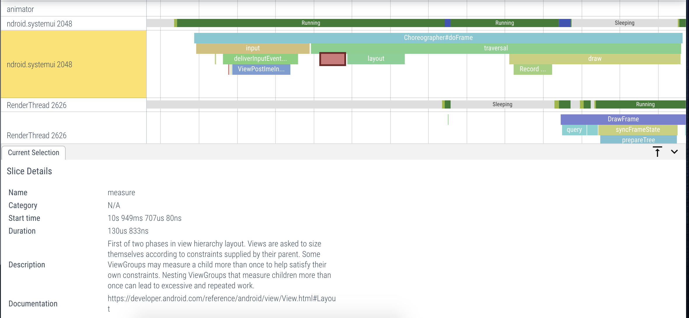
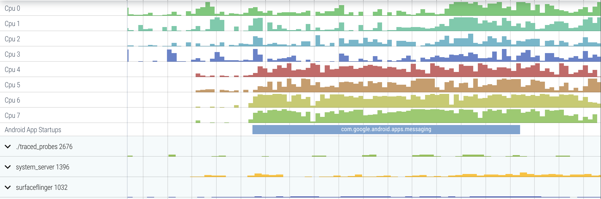
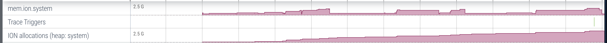

# Trace analysis

Trace analysis refers to a set of features built into the Perfetto
[trace processor](trace-processor.md) and Perfetto UI which enrich a trace with
extra information synthesized during the import of a trace. There are three
features which currently part of this project:

- [Adding descriptions of slices](#descriptions)
- [Annotating the trace with new events](#annotations)
- [Alerts](#alerts)

## <a name="descriptions"></a>Adding descriptions to slices


**<p align="center">Description for the measure slice</p>**

### Background

Descriptions attach a human-readable description to a slice in the trace. This
can include information like the source of a slice, why a slice is important and
links to documentation where the viewer can learn more about the slice. In
essence, descriptions act as if an expert was telling the user what the slice
means.

For example, consider the `inflate` slice which occurs during view inflation in
Android. We can add the following description and link:

```
Description: Constructing a View hierarchy from pre-processed XML via LayoutInflater#layout. This includes constructing all of the View objects in the hierarchy, and applying styled attributes.

Link: https://developer.android.com/reference/android/view/layoutinflater#inflate(int,%20android.view.viewgroup)
```

### Adding descriptions to a slice

Adding a new event just requires a self-contained change to the
[`DescribeSlice`](../src/trace_processor/analysis/describe_slice.h) function.
The inputs are the table containing all the slices from the trace and the id of
the slice which an embedder (e.g. the UI) is requesting a description for. The
output is a `SliceDescription` which is simply a `pair<description, doc link>`.

Currently, all implemented descriptions are based on only the name of the slice
itself. However, it is straightforward to extend this to also consider the
ancestor slices and other similar properties of the slice and we plan on doing
this in the future.

### Using descriptions as a trace processor embedder

The `DescribeSlice` function is exposed to SQL through the `describe_slice`
table. This table has the following schema:

| Name        | Type   | Meaning                                                                      |
| :---------- | ------ | ---------------------------------------------------------------------------- |
| description | string | Provides the description for the given slice                                 |
| doc_link    | string | Provides a hyperlink to documentation which gives more context for the slice |

The table also has a hidden column `slice_id` which need to be set equal to the
id of the slice that you want to obtain the description from. For example, to
get the description and doc link for slice with id `5`:

```sqlite
select description, doc_link
from describe_slice
where slice_id = 5
```

You can also _join_ the `describe_slice` table with the slice table to obtain
descriptions for more than one slice. For example, to get the ts, duration and
description for all `measure` slices:

```sqlite
select ts, dur, description
from slice s
join desribe_slice d on s.id = d.slice_id
where name = 'measure'
```

## <a name="annotations"></a>Annotating the trace with new events


**<p align="center">Annotation slice track containing app startups</p>**


**<p align="center">Annotation counter track added to measure ION
allocations</p>**

### Background

The annotations feature allows creation of new events (slices and counters) from
the data in the trace. These events can then be displayed in the UI tracks as if
they were part of the trace itself.

This feature is useful as often the data in the trace is very low-level. While
this low level information is important to expose for experts to perform deep
debugging, often the user is looking to get a high level overview without
needing to piece together events from multiple places in the trace.

For example, an app startup in Android spans multiple components including
`ActivityManager`, `system_server` and the newly created app process derived
from `zygote`. Most users do not need startup broken down to this level of
detail; instead they are simply interested in a single slice spanning the whole
startup duration.

The annotations feature is tied very closely to [metrics subsystem](metrics.md);
Often the SQL-based metrics often need to create higher-level abstractions from
raw slices as intermediate artifacts. From previous example, the
[startup metric](../src/trace_processor/metrics/android/android_startup.sql), it
creates the exact `launching` slice we want to display in the UI.

The other benefit of aligning the two is that changes in metrics are
automatically kept in sync with what the user sees in the UI.

### Adding annotations to a new or existing metric

As annotations depend on metrics, the initial steps are same as that of
[developing a metric](metrics.md). In summary:

- Create a new proto message for your metric and add it to the
  [`TraceMetrics`](../protos/perfetto/metrics/metrics.proto) proto
- Write a new SQL metric file in the [metrics](../src/trace_processor/metrics)
  folder. Good examples to follow are
  [ion](../src/trace_processor/metrics/android/android_ion.sql) and
  [startup](../src/trace_processor/metrics/android/android_startup.sql) metrics

**Note**: the metric can be just an empty proto message during prototyping or if
you think that no summarisation is necessary. However, generally if an event is
important enough to display in the UI, it should also be tracked in benchmarks
as a metric.

To extend a metric with annotations, a new table or view with the name
`<metric name>_annotations` needs to be created (the trailing `_annotations`
suffix in the table name is important). For example, for the
[`android_startup`]() metric, we create a view named
`android_startup_annotations`.

The schema of this table/view is as follows:

| Name         | Type     | Presence                              | Meaning                                       |
| :----------- | -------- | ------------------------------------- | --------------------------------------------- |
| `track_type` | `string` | Mandatory                             | 'slice' for slices, 'counter' for counters    |
| `track_name` | `string` | Mandatory                             | Name of the track to display in the UI        |
| `ts`         | `int64`  | Mandatory                             | The timestamp of the event (slice or counter) |
| `dur`        | `int64`  | Mandatory for slice, NULL for counter | The duration of the slice                     |
| `slice_name` | `string` | Mandatory for slice, NULL for counter | The name of the slice                         |
| `value`      | `double` | Mandatory for counter, NULL for slice | The value of the counter                      |

**Note:** `track_name` acts as the track identifier i.e. all events with the
same `track_name` are placed onto the same track.

Currently, there are a few limitations to what can be displayed with
annotations:

- Nested slices within the same track are not supported. We plan to support this
  once we have a concrete usecase.
- Tracks are always created in the global scope. We plan to extend this to
  threads and processes in the near future with additional contexts added as
  necessary.
- Instant events are currently not supported in the UI but this will be
  implemented in the near future. In trace processor, instants are always `0`
  duration slices with special rendering on the UI side.
- There is no way to tie newly added events back to the source events in the
  trace which were used to generate them. This is not currently a priority but
  something we may add in the future.

### Using annotations as a trace processor embedder

As annotations are tied to the metrics subsystem, the `ComputeMetrics` function
in the trace processor API should be called with the appropriate metrics. This
will create the `<metric_name>_annotations` table/view which can then be queried
using the `ExectueQuery` function.

**Note**: We plan at some point to have an API which does not create and return
the full metrics proto but instead just executes the queries in the metric.

## <a name="alerts"></a>Alerts

### Background

Alerts are used to draw the attention of the user to interesting parts of the
trace; this are usually warnings or errors about anomalies which occured in the
trace.

### Current status

Currently, alerts are not implemented in the trace processor but the annotations
feature was designed with them in mind. We plan on adding another column
`alert_type` (name to be finalized) to the annotations table which can have the
value `warning`, `error` or `null`. Depending on this value, the Perfetto UI
will flag these events to the user.

**Note**: we do not plan on supporting case where alerts need to be added to
existing events. Instead, new events should be created using annotations and
alerts added on these instead; this is because the trace processor storage is
append-only.
