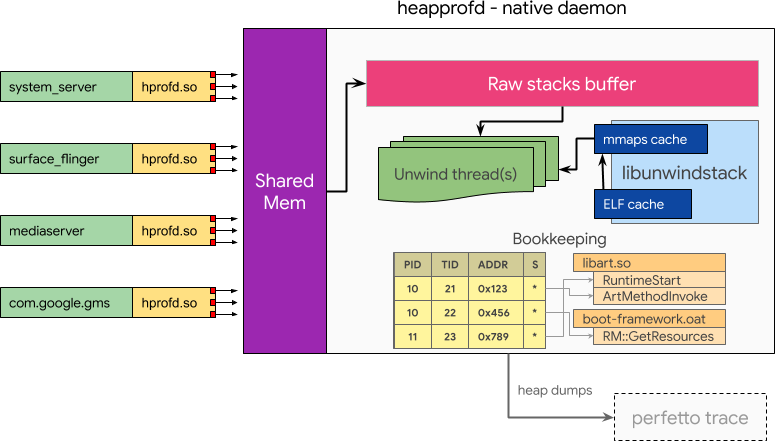
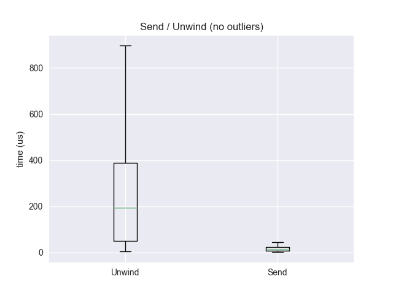
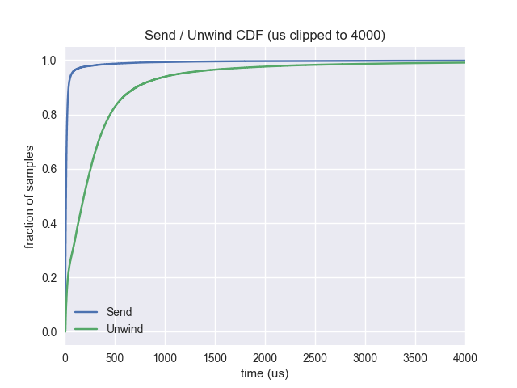
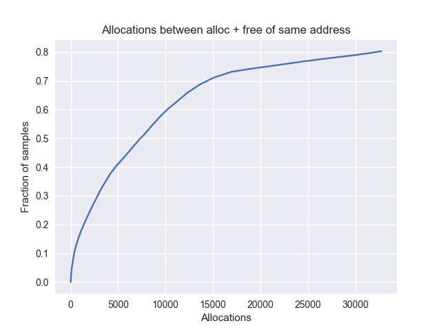
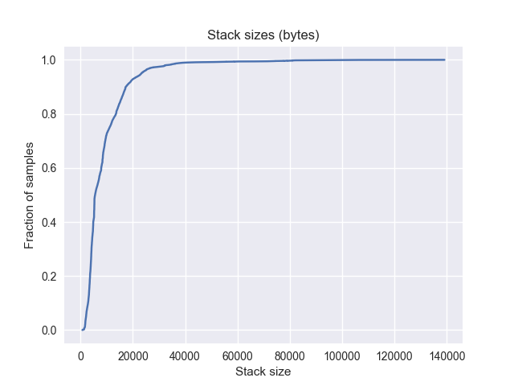

# heapprofd: Android Heap Profiler

_**Status:** COMPLETED **·** fmayer, primiano **·** 2018-06-15_  
_**Updated:** 2020-04-20_

## Objective
Provide a low-overhead native heap profiling mechanism, with C++ and Java callstack attribution, usable by all processes on an Android system. This includes Java and native services. The mechanism is capable of exporting heap dumps into traces in order to be able to correlate heap information with other activity on the system. This feature was added in the Android 10 release.

## Overview


Implement an out-of-process heap profiler. Do the minimal amount of processing in-line of malloc, and then delegate to a central component for further processing. This introduces a new daemon _heapprofd_.

When tracing is enabled, either via a system property or a signal delivered to an existing process, a given percentage of malloc calls copies the current call stack into a shared memory buffer that is received by heapprofd. heapprofd uses libunwindstack asynchronously for stack unwinding and symbolization. This information is used to build bookkeeping tables to track live allocations and is ultimately dumped into the Perfetto trace.

All data referenced in this design document was collected on a Pixel 2 on Android P.


### Requirements
These are the properties that must be fulfilled by a heap profiler for Android:

**No setup:** A heap profile can be taken with a single command.

**Profile running apps:** The system can be used to enable profiling of already running apps to get information of memory usage _since the profiling was enabled_ without requiring a restart. This can be useful to track down memory leaks.

**Attribute to Java methods:** The system can be used to track the native memory usage of Java applications. Allocations on the Java heap are outside of the scope of this work.

**Zero overhead when disabled:** the system must not incur a performance overhead when it is not enabled.

**Profile whole system:** the system must be capable of handling the load of profiling all processes running. The sample rate is adjusted to limit the amount of data.

**Negligible in-process memory overhead:** the system must not hold bookkeeping data in the process in order not to inflate higher-level metrics like PSS.

**Bounded performance impact:** the device must still be useable for all use-cases.


## Detailed Design

### Enabling profiling

#### Use case 1: profiling future allocations from a running process
One of the real-time signals ([`BIONIC_SIGNAL_PROFILER`](https://cs.android.com/android/platform/superproject/+/master:bionic/libc/platform/bionic/reserved_signals.h?q=symbol:BIONIC_SIGNAL_PROFILER)) is reserved in libc as a triggering mechanism. In this scenario:

*   heapprofd sends a RT signal to the target process
*   Upon receival of the signal, bionic reacts by installing a temporary malloc hook, which in turn spawns a thread to dynamically load libheapprofd.so in the process context. This means heapprofd will not work for statically linked binaries, as they lack the abilitity to `dlopen`. We can not spawn the thread directly from the signal handler, as `pthread_create` is not async-safe.
*   The initializer in libheapprofd.so is called to take care of the rest (see [client operation](#client-operation-and-in-process-hooks) below)


#### Use case 2: profiling a single process from startup
*   heapprofd sets a property of the form libc.debug.heapprofd.argv0 (argv0 being the first argument in `/proc/self/cmdline`, up to the first ":")
*   Native processes: when bionic is initialized checks for the presence of the property and, if found and matches the process name, loads the libheapprofd.so.
*   Managed java processes: zygote calls `mallopt(M_SET_ZYGOTE_CHILD, ...)` in `PreApplicationInit`. In this, Bionic checks for the presence of the property and, if found and matches the process name, loads the libheapprofd.so and continues as above.

#### Use case 3: profiling the whole system
A system property `libc.heapprofd.enable` can be set to enable heap profiling on startup. When this property is set every process on startup will load the libheapprofd.so library. The rest is identical to the case above.


### Disabling profiling
Disabling profiling happens simply by virtue of shutting down the sockets from the heapprofd end. Upon send() failure the client will uninstall the hooks (see appendix: thread-safe hooks setup / teardown)


### Client operation and in process hooks
Upon initialization of libheapprofd.so:

*   The client establishes a connection to the heapprofd daemon through a connected UNIX socket.
*   Upon connection, the daemon will send a packet to the client specifying the profiling configuration (sampling rate; sample all threads / only specific threads; tuning of sampling heuristics). It will also send an FD for the SharedMemoryBuffer used to send samples  (see [wire protocol](heapprofd-wire-protocol.md)).
*   The malloc hooks are installed.

Upon each `*alloc()/posix_memalign()` call, the client library will perform some minimal bookkeeping. If the sampling	 rate is hit, it will copy the raw stack, together with a header specifying register state, tid, a global sequence number of the operation, and size of the allocation to the shared memory buffer. It will then send on a control socket to wake up the service.

Upon each `free()` call, the client will append the freed address into a global (process-wide) append-only buffer (the buffer is to avoid the overhead of a send() for each free). This buffer of free()s is sent to the heapprofd daemon when the fixed-size buffer is full or after a preset number of operations. This also includes a global sequence number for the operation.

If the send() fails because the heapprofd has shut down the socket, voluntarily (graceful disabling) or involuntarily (has crashed) the client will teardown the hooks and disabling any profiling operation.


### Service operation


The unwinder thread read the client's shared memory buffers and handle the samples received. The result of the unwinding is then enqueued using a PostTask for the main thread to do the accounting. A queue-based model between the threads is chosen because it makes synchronization easier. No synchronization is needed at all in the main thread, as the bookkeeping data will only be accessed by it.

If the sample is a malloc, the stack is unwound and the resulting data is handled in the main thread. The main thread ignores mallocs with sequence numbers lower than the one already processed for this address. If the sample is a free, it is added to a buffer. As soon as all mallocs with a sequence number lower than the free have been handled, it is processed.


#### Unwinding
libunwindstack is used for unwinding. A new Memory class is implemented that overlays the copied stack over the process memory (which is accessed using FDMemory). FDMemory uses read on `/proc/self/mem` file descriptors sent by the target application.

```
class StackMemory : public unwindstack::MemoryRemote {
 public:
  ...
  size_t Read(uint64_t addr, void* dst, size_t size) override {
    if (addr >= sp_ && addr + size <= stack_end_ && addr + size > sp_) {
      size_t offset = static_cast<size_t>(addr - sp_);
      memcpy(dst, stack_ + offset, size);
      return size;
    }

    return mem_->Read(addr, dst, size);
  }

 private:
  uint64_t sp_;
  uint8_t* stack_;
  size_t size_;
};
```

This allows unwinding to work both for native code and all three execution modes of ART. Native libraries are mapped into the process memory, and ephemeral debug information written by ART is also accessible through the process memory. There is a chance that ART will garbage collect the information before the unwinding is done, in which case we will miss stack frames. As this is a sampling approach anyway, that loss of accuracy is acceptable.

Remote unwinding also enables us to use _global caching_ (`Elf::SetCachingEnabled(true)`) in libunwindstack. This prevents debug information being used by different processes to be loaded and decompressed multiple times.

We add an `FDMaps` objects to parse maps from `/proc/self/maps` sent by the target process. We keep `FDMaps` object cached per process that is being profiled. This both saves the overhead of text-parsing `/proc/[pid]/maps` as well as keeps various objects needed for unwinding (e.g. decompressed minidebuginfo). In case an unwind fails with `ERROR_INVALID_MAP` we reparse the maps object. We will  do changes to libunwindstack to create a more general version of [`LocalUpdatableMaps`](https://cs.android.com/android/platform/superproject/+/master:system/core/libunwindstack/Maps.cpp?q=symbol:LocalUpdatableMaps) that is also applicable for remote processes.


#### Advantages of remote unwinding

**Crash-proofness:** Crashing bugs in the bookkeeping logic or libunwindstack do not result in user-visible crashes but only lack of profiling data. It will result in the connections to heapprofd being broken and profiling gracefully stopping on the client-side.

**Performance:** copying the stack has much more consistent and higher performance than unwinding, which can take multiple milliseconds. See graph above.

**Does not inflate higher-level metrics:** higher-level metrics such as PSS are not inflated by the book-keeping cost.

**Compression:** bookkeeping of unwound frames can be more efficient if it is shared between multiple processes. E.g. common sequences of frames (in libc, ART, etc) can be deduped.


#### Disadvantages of remote unwinding
**Complexity:** the system has higher complexity than unwinding and symbolizing synchronously.

#### Bookkeeping
The data is stored as a tree where each element has a back-pointer to its parent. This deduplicates repeated stack frames.  String interning is applied for method names and library names.

Details will change to adapt to data collected during the implementation.


### Wire protocol
In early versions of heapprofd, we used a `SOCK_STREAM` socket to send callstacks to the service. We now use a shared memory based [wire protocol](heapprofd-wire-protocol.md) described in detail separately.

### Failure modes
**heapprofd unwinding cannot keep up:** The shared memory buffer will reject new samples. If `block_client` is set, the client will retry until there is space in the shared memory buffer.

**heapprofd crashes:** Writing on the control socket will fail, and the client will be torn down.

**Writing in client fails:** If the write fails with any error code except `EINTR`, the connection is closed, and profiling is torn down.


### Fork handling
After a process forks, we need to clean up the state that was initialized by the parent process and uninstall the malloc hooks. We do not intend to currently support following forks, see [Alternatives Considered](#alternatives-considered) for possible implementation thereof.

## Performance considerations

### Remote unwinding
_**Note:** This data was collected when heapprofd used a socket to communicate from client to service. We now use a shared-memory buffer, so we should be even lower overhead._

Remote unwinding is used to reduce the performance impact on the applications that are being profiled. After the stack has been sent, the application can resume its operation while the remote daemon unwinds the stack and does unwinding. As sending the stack is, on average, a faster operation than unwinding the stack, this results in a performance gain.


<table>
  <tr>
   <td>



   </td>
   <td>



   </td>
  </tr>
</table>

**Mean unwind:** 413us  
**Mean send:** 50us  
**Median unwind:** 193us  
**Median send:** 14us  
**90 percentile unwind:** 715us  
**90 percentile send:** 40us


### Sampling
Unwinding the stack on every `malloc` call has a high cost that is not always worth paying. Thus malloc calls are sampled client-side using Poisson sampling with a probability proportional to their allocation size (i.e. larger allocations are more likely to be considered than small ones). All memory allocated since the last malloc considered is attributed to this allocation.

The sampling rate is configurable as part of the initial handshake. A sampling rate == 1 will degenerate into the fully-accurate high-overhead mode.

Prior art: [crbug.com/812262](http://crbug.com/812262), [crbug.com/803276](http://crbug.com/803276).

## Implementation Plan
### Implement prototype [done]
Implement a prototype of the system described above that works with SELinux `setenforce 0` and running as root on walleye.

### Implement Benchmark [done]
Implement a program that executes malloc / free calls from ground truth data. Profile this program using heapprofd, then compare results to ground truth data. Use this to iterate on sampling heuristics.

### Productionize [done]
Do security changes required to run heapprofd with `setenforce 1` and as non-root.


## Testing Plan

* Employ fuzzing on the shared memory buffer. [done]
* Unit-tests for components. [done]
* CTS. [done]


## Background

### ART modes of execution
ART (Android RunTime, the Android Java Runtime) has three different modes of execution.

**Interpreted:** Java byte-code is interpreted during execution. Instrumentation in ART allows to get dexpc (~offset from dex file) for the code being executed.

**JIT-compiled:** Java byte-code is compiled to native code during run-time. Both the code and the ELF information only live in process memory. The debug information is stored in a global variable, currently only if the app is debuggable or a global system property (`dalvik.vm.minidebuginfo`) is set. This is because the current implementation incurs a memory overhead that is too high to default enable.

**AOT (ahead of time) compiled:** Java code is compiled into native code before run-time. This produces an .oat file, which is essentially an .so. Both code and ELF information is stored on disk. During execution, like shared native libraries, it is memory mapped into process memory.

### Stack Unwinding
Stack unwinding is the process of determining the chain of return addresses from the raw bytes of the stack. These are the addresses we want to attribute the allocated memory to.

The most efficient way of stack unwinding is using frame pointers. This is unreliable on Android as we do not control build parameters for vendor libraries or OEM builds and due to issues on ARM32. Thus, our stack unwinding relies on libunwindstack which uses DWARF information from the library ELF files to determine return addresses. This can significantly slower, with unwinding of a stack taking between 100μs and ~100 ms ([data from simpleperf](https://gist.github.com/segfaulthunter/a3a5a352196f9037f34241f8fb09004d)).

[libunwindstack](https://cs.android.com/android/platform/superproject/+/master:system/core/libunwindstack/) is Android's replacement for [libunwind](https://www.nongnu.org/libunwind/). It has a modern C++ object-oriented API surface and support for Android specific features allowing it to unwind mixed native and Java applications using information emitted by ART depending on execution mode. It also supports symbolization for native code and all three execution modes or ART.

### Symbolization
Symbolization is the process of determining function name and line number from a code address. For builds by Google, we can get symbolized binaries (i.e. binaries with an ELF section that can be used for symbolization) from go/ab or https://ci.android.com (e.g. https://ci.android.com/builds/submitted/6410994/aosp_cf_x86_phone-userdebug/latest/aosp_cf_x86_phone-symbols-6410994.zip).

For other builds, symbolization requires debug info contained within the binary. This information is often compressed. Symbolization of JIT-ed code requires information contained in process memory.

### Perfetto
[Perfetto](https://perfetto.dev) is an open-source, highly efficient and expandable platform-wide tracing system that allows collection of performance data from kernel, apps and services. It aims to become the next-gen performance tracing mechanism for both Android and Chrome.


## Related Work

### simpleperf
Even though [simpleperf](https://cs.android.com/android/platform/superproject/+/master:system/extras/simpleperf/doc/README.md) is a CPU rather than memory profiler, it is similar in nature to the work proposed here in that it supports offline unwinding. The kernel is asked to provide copies of stack traces at regular intervals, which are dumped onto disk. The dumped information is then used to unwind the stacks after the profiling is complete.


### malloc-debug
[malloc-debug](https://cs.android.com/android/platform/superproject/+/master:bionic/libc/malloc_debug/) instruments bionic's allocation functions to detect common memory problems like buffer overflows, double frees, etc. This is similar to the project described in this document as it uses the same mechanism to instrument the libc allocation functions. Unlike heapprofd, it does not provide the user with heap dumps.


### Feature Matrix
|              | use after free detection | Java object graph attribution | native memory attribution | Android | out-of-process |
|--------------|--------------------------|-------------------------------|---------------------------|---------|----------------|
| heapprofd    | no                       | no                            | yes                       | yes     | yes            |
| malloc-debug | yes                      | no                            | yes                       | yes     | no             |

## Alternatives Considered

### Copy-on-write stack
The lower frames of the stack are unlikely to change between the client sending and the server unwinding the stack information. We wanted to exploit this fact by marking the stack pages as copy-on-write by [`vmsplice(2)`](http://man7.org/linux/man-pages/man2/vmsplice.2.html)-ing them into a pipe. Unfortunately, the vmsplice system call does not mark pages as copy-on-write, but is conceptually a mmap into the pipe buffer, which causes the daemon to see changes to the stack that happen after the vmsplice and hence corrupt the unwinder.


### Profiling across fork(2)
If we want to enable profiling for the newly forked process, we need to establish new connections to heapprofd and create a new connection pool. This is to prevent messages from the parent and child process from being interleaved.

For non-zygote processes, we could use [`pthread_atfork(3)`](http://man7.org/linux/man-pages/man3/pthread_atfork.3.html) to establish new connections.

For zygote processes, [`FileDescriptorInfo::ReopenOrDetach`](https://cs.android.com/android/platform/superproject/+/master:frameworks/base/core/jni/fd_utils.cpp?q=%22void%20FileDescriptorInfo::ReopenOrDetach%22), which is called after `fork(2)`– and thus after the `pthread_atfork` handlers – detaches all sockets, i.e. replaces them with file descriptors to `/dev/null`. If the socket is not contained within [`kPathWhiteList`](https://cs.android.com/android/platform/superproject/+/master:frameworks/base/core/jni/fd_utils.cpp?q=symbol:kPathWhitelist), zygote crashes instead. Thus using only a `pthread_atfork` handler is not feasible, as the connections established within will immediately get disconnected in zygote children.

After forking, zygote calls [`PreApplicationInit`](https://cs.android.com/android/platform/superproject/+/master:frameworks/base/core/jni/com_android_internal_os_Zygote.cpp?q=symbol:PreApplicationInit), which is currently used by malloc\_debug to detect whether it is in the root zygote or in a child process by setting `gMallocLeakZygoteChild`. It also calls [Java callbacks](https://cs.android.com/android/platform/superproject/+/master:frameworks/base/core/jni/com_android_internal_os_Zygote.cpp?q=CallStaticVoidMethod.*gCallPostForkChildHooks), but there does not seem to currently exist a way to dynamically register native callbacks.

Naive lazy initialization (i.e. closing the socket in the atfork handler, and then reconnecting on the first call to malloc) is problematic, as the code in zygote between fork and `ReopenOrDetach` might call `malloc`, thus leading to the connection to be established, which then gets closed by `ReopenOrDetach` again.

To solve this, we can take an approach similar to `gMallocLeakZygoteChild`. Before forking, zygote will be modified to set `gheapprofdInZygoteFork` to true, and after the fork handling is finished it will be set to false. This way we can make sure we delay the lazy initialization until the fork is fully complete. `pthread_atfork` is used to close the file descriptors after fork in the child.


### Profiling app from startup by externally detecting startup
This option relies on the ability of the tracing system to detect app startup (which we'll need regardless for perf profiling).

**Advantages**
*   one case fewer to handle from the libc viewpoint

**Disadvantages**
*   less accurate, will miss the first X ms of startup
*   a mechanism that watches ftrace events to detect startup is non-trivial.

### Delayed Unwinding
Anticipating that many allocations are short-lived, we can delay the unwinding of stacks by a fixed time. This is a memory vs CPU usage trade-off, as these stacks have to be held in memory until they are either unwound or freed.

This graph shows that 20 % of allocations are freed within 900 sampled allocations (at 1 %, so 500000 total) from the same process.


<table>
  <tr>
   <td>



<p>
<strong>Mean:</strong> 7000 allocations
   </td>
   <td>



<p>
<strong>Mean:</strong> 8950 bytes
   </td>
  </tr>
</table>


So, at 1 % sampling rate, for at a cost of ~8 megabytes (900 \* 8950) per process, we can reduce the number of unwinds by around 20 %. This will not allow us to get an accurate number of "allocated space", so this idea was rejected.
