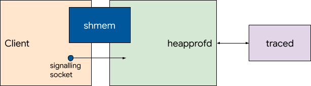
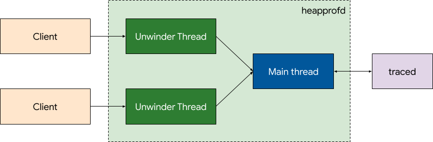
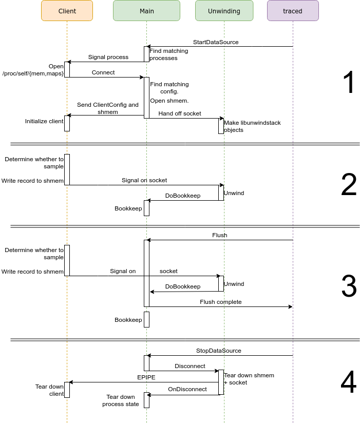

# heapprofd: Shared Memory

_**Status**: Implemented_  
_**Authors**: fmayer_  
_**Reviewers**: rsavitski, primiano_  
_**Last Updated**: 2019-02-11_

## Objective
Restructure heapprofd to make use of the <code>[SharedRingBuffer](https://cs.android.com/android/platform/superproject/+/master:external/perfetto/src/profiling/memory/shared_ring_buffer.cc)</code>.

## Overview
Instead of using a socket pool for sending callstacks and frees to heapprofd, we use a single shared memory buffer and signaling socket. The client writes the record describing mallocs or frees into the shared memory buffer, and then sends a single byte on the signalling socket to wake up the service.

## High-level design
Using a shared memory buffer between the client and heapprofd removes the need to drain the socket as fast as possible in the service, which we needed previously to make sure we do not block the client's malloc calls. This allows us to simplify the threading design of heapprofd.

The _Main Thread_ has the Perfetto producer connection to traced, and handles incoming client connections for `/dev/socket/heapprofd`. It executes the logic for finding processes matching an incoming TraceConfig, matching processes to client configurations, and does the handshake with the clients. During this handshake the shared memory buffer is created by the service. After the handshake is done, the socket for a client is handed off to a particular _Unwinder Thread_.

After the handshake is completed, the sockets are handled by the assigned _Unwinder Thread's_ eventloop. The unwinder thread owns the metadata required for unwinding (the `/proc/pid/{mem,maps}` FDs, derived libunwindstack objects and the shared memory buffer). When data is received on the signaling socket, the _Unwinding Thread_ unwinds the callstack provided by the client and posts a task to the _Main Thread_ to apply to bookkeeping. This is repeated until no more records are pending in the buffer.

To shut down a tracing session, the _Main Thread_ posts a task on the corresponding _Unwinding Thread_ to shut down the connection. When the client has disconnected, the _Unwinding Thread_ posts a task on the _Main Thread_ to inform it about the disconnect. The same happens for unexpected disconnects.

### Ownership
At every point in time, every object is owned by exactly one thread. No references or pointers are shared between different threads.

**_Main Thread:_**

*   Signalling sockets before handshake was completed.
*   Bookkeeping data.
*   Set of connected processes and TraceConfigs (in `ProcessMatcher` class).

**_Unwinder Thread, for each process:_**

*   Signalling sockets after handshake was completed.
*   libunwindstack objects for `/proc/pid/{mem,maps}`.
*   Shared memory buffer.

## Detailed design
Refer to the following phases in the sequence diagram below:

### 1. Handshake
The _Main Thread_ receives a `TracingConfig` from traced containing a `HeapprofdConfig`. It adds the processes expected to connect, and their `ClientConfiguration` to the `ProcessMatcher`. It then finds matching processes (by PID or cmdline) and sends the heapprofd RT signal to trigger initialization.

The processes receiving this configuration connect to `/dev/socket/heapprofd` and sends `/proc/self/{map,mem}` fds. The _Main Thread_ finds the matching configuration in the `ProcessMatcher`, creates a new shared memory buffer, and sends the two over the signalling socket. The client uses those to finish initializing its internal state. The _Main Thread_ hands off (`RemoveFiledescriptorWatch` + `AddFiledescriptorWatch`) the signalling socket to an _Unwinding Thread_. It also hands off the `ScopedFile`s for the `/proc` fds. These are used to create `UnwindingMetadata`.

### 2. Sampling
Now that the handshake is done, all communication is between the _Client_ and its corresponding _Unwinder Thread_.

For every malloc, the client decides whether to sample the allocation, and if it should, write the `AllocMetadata` + raw stack onto the shared memory buffer, and then sends a byte over the signalling socket to wake up the _Unwinder Thread_. The _Unwinder Thread_ uses `DoUnwind` to get an `AllocRecord` (metadata like size, address, etc + a vector of frames).  It then posts a task to the _Main Thread_ to apply this to the bookkeeping.

### 3. Dump / concurrent sampling
A dump request can be triggered by two cases:

*   a continuous dump
*   a flush request from traced

Both of these cases are handled the same way. The _Main Thread_ dumps the relevant processes' bookkeeping and flushes the buffers to traced.

In general, _Unwinder Threads_ will receive concurrent records from clients. They will continue unwinding and posting tasks for bookkeeping to be applied. The bookkeeping will be applied after the dump is done, as the bookkeeping data cannot be concurrently modified.

### 4. Disconnect
traced sends a `StopDataSource` IPC. The _Main Thread_ posts a task to the _Unwinder Thread_ to ask it to disconnect from the client. It unmaps the shared memory, closes the memfd, and then closes the signalling socket.

The client receives an `EPIPE` on the next attempt to send data over that socket, and then tears down the client.

## Changes to client
The client will no longer need a socket pool, as all operations are done on the same shared memory buffer and the single signalling socket. Instead, the data is written to the shared memory buffer, and then a single byte is sent on the signalling socket in nonblocking mode.

We need to be careful about which operation we use to copy the callstack to the shared memory buffer, as `memcpy(3)` can crash on the stack frame guards due to source hardening.

## Advantages over current design
*   Clear ownership semantics between threads.
*   No references or pointers are passed between threads.
*   More efficient client using fewer locks.

## Disadvantages over current design
*   Inflates target process PSS / RSS with the shared memory buffer.
*   TaskRunners are unbounded queues. This has the potential of enqueueing a lot of bookkeeping work for a pathologically behaving process. As applying the bookkeeping information is a relatively cheap operation, we accept that risk.
