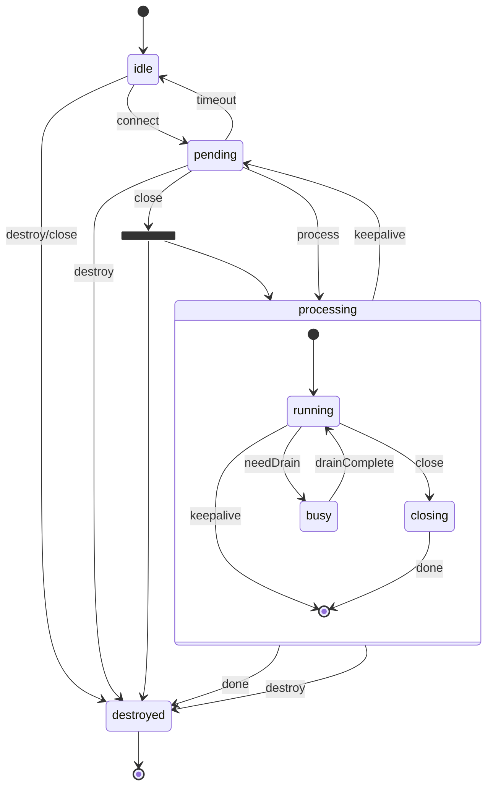

# Client Lifecycle

<!--type=misc-->

A {Client} can be understood as a state machine. As requests are dispatched,
processed, and drained, the client moves through a well-defined set of states
until it is eventually destroyed. This document describes those states and the
transitions between them.

The {Client} class is not literally implemented as a state machine, so the
actual execution may deviate slightly from what is described here. Treat this
guide as a conceptual model for reasoning about a client's behavior rather than
as a formal specification.

## State transition overview

* A {Client} begins in the **idle** state with no socket connection and no
  queued requests.
  * The *connect* transition moves the {Client} to the **pending** state, where
    requests can be queued before they are processed.
  * Calling [`client.close()`][] or [`client.destroy()`][] moves the {Client}
    to the **destroyed** state. Because there are no queued requests in this
    state, *close* transitions straight to **destroyed**.
* The **pending** state indicates that the underlying socket connection has been
  established and that requests are queueing.
  * The *process* transition moves the {Client} to the **processing** state,
    where requests are processed.
  * If requests are queued, *close* transitions to **processing**; otherwise it
    transitions to **destroyed**.
  * The *destroy* transition moves the {Client} to **destroyed**.
* The **processing** state initializes to the **processing.running** sub-state.
  * If the current request body requires draining, *needDrain* moves the
    {Client} into the **processing.busy** sub-state, which returns to
    **processing.running** once *drainComplete* fires.
  * After all queued requests complete, *keepalive* moves the {Client} back to
    the **pending** state. If no requests are queued before the socket times
    out, the {Client} transitions to **idle**.
  * If *close* is fired while the {Client} still has queued requests, the
    {Client} transitions to **processing.closing**, where it completes all
    outstanding requests before firing *done*.
  * The *done* transition moves the {Client} gracefully to **destroyed**.
  * At any time, *destroy* moves the {Client} from **processing** to
    **destroyed**, aborting any queued requests.
* The **destroyed** state is final; the {Client} is no longer functional.

A state diagram representing a {Client} instance:

```mermaid
stateDiagram-v2
  [*] --> idle
  idle --> pending : connect
  idle --> destroyed : destroy/close

  pending --> idle : timeout
  pending --> destroyed : destroy

  state close_fork <<fork>>
  pending --> close_fork : close
  close_fork --> processing
  close_fork --> destroyed

  pending --> processing : process

  processing --> pending : keepalive
  processing --> destroyed : done
  processing --> destroyed : destroy

  destroyed --> [*]

  state processing {
      [*] --> running
      running --> closing : close
      running --> busy : needDrain
      busy --> running : drainComplete
      running --> [*] : keepalive
      closing --> [*] : done
  }
```

## State details

### idle

**idle** is the initial state of a {Client} instance. Although an `origin` is
required to construct a {Client}, the underlying socket connection is not
established until a request is queued through [`client.dispatch()`][]. Calling
`client.dispatch()` directly, or through one of its higher-level wrappers
([`client.connect()`][], [`client.pipeline()`][], [`client.request()`][],
[`client.stream()`][], or [`client.upgrade()`][]), moves the {Client} from
**idle** to **pending**, and then usually directly on to **processing**.

Calling [`client.close()`][] or [`client.destroy()`][] in this state moves the
{Client} straight to **destroyed**, since there are no queued requests.

### pending

**pending** signifies a connected but non-processing {Client}. On entering this
state, the {Client} establishes a socket connection and emits the
[`'connect'`][] event, signalling that a connection to the `origin` supplied at
construction time has been established. The internal queue starts empty, and
requests can begin queueing.

Calling [`client.close()`][] with queued requests moves the {Client} to the
**processing** state; without queued requests it moves to **destroyed**.

Calling [`client.destroy()`][] moves the {Client} directly to **destroyed**,
regardless of any queued requests.

### processing

**processing** is itself a sub-state machine that initializes to the
**processing.running** sub-state. [`client.dispatch()`][], [`client.close()`][],
and [`client.destroy()`][] can all be called while the {Client} is in this
state. `client.dispatch()` queues additional requests while existing ones
continue to be processed, `client.close()` moves the {Client} to the
**processing.closing** sub-state, and `client.destroy()` moves it to
**destroyed**.

#### running

In **processing.running**, queued requests are processed in FIFO order. If a
request body requires draining, *needDrain* moves the {Client} to the
**processing.busy** sub-state. The *close* transition moves the {Client} to the
**processing.closing** sub-state. When all queued requests have completed and
neither [`client.close()`][] nor [`client.destroy()`][] has been called, the
*keepalive* transition moves the {Client} back to the **pending** state. There
the {Client} waits for the socket connection to time out; once it does, the
{Client} returns to the **idle** state.

#### busy

This sub-state is entered only when a request body is a {stream.Readable} that
requires draining. The {Client} cannot process additional requests while in
this state and waits until the current request body has been fully drained
before returning to **processing.running**.

#### closing

This sub-state is entered only when a {Client} has queued requests and
[`client.close()`][] is called. The {Client} continues to process requests as
usual, except that no additional requests may be queued. Once all queued
requests have been processed, *done* fires and the {Client} moves gracefully to
**destroyed** without an error.

### destroyed

**destroyed** is the final state of a {Client} instance. Once in this state, the
{Client} is no longer functional, and calling any further {Client} method
rejects or fails with a {ClientDestroyedError}.

[`'connect'`]: Client.md#event-connect
[`client.close()`]: Client.md#clientclosecallback
[`client.connect()`]: Client.md#clientconnectoptions-callback
[`client.destroy()`]: Client.md#clientdestroyerror-callback
[`client.dispatch()`]: Client.md#clientdispatchoptions-handlers
[`client.pipeline()`]: Client.md#clientpipelineoptions-handler
[`client.request()`]: Client.md#clientrequestoptions-callback
[`client.stream()`]: Client.md#clientstreamoptions-factory-callback
[`client.upgrade()`]: Client.md#clientupgradeoptions-callback
