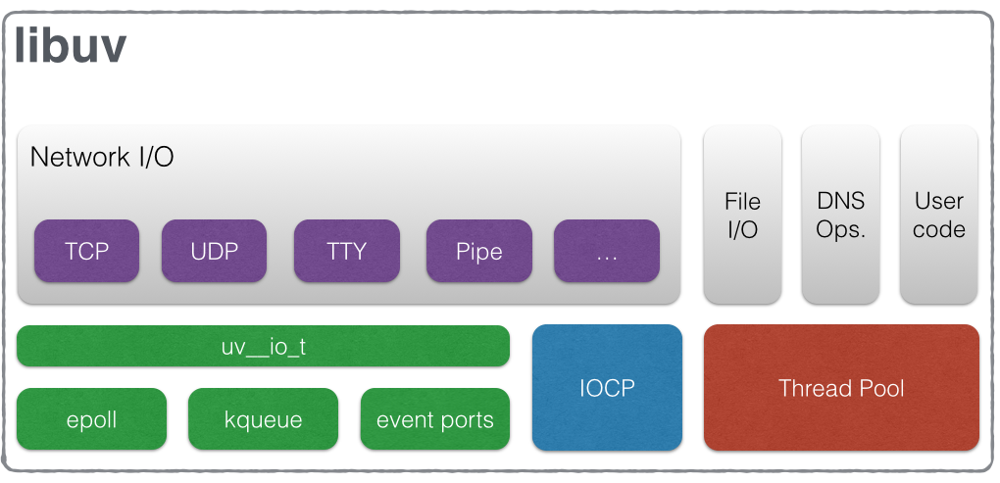
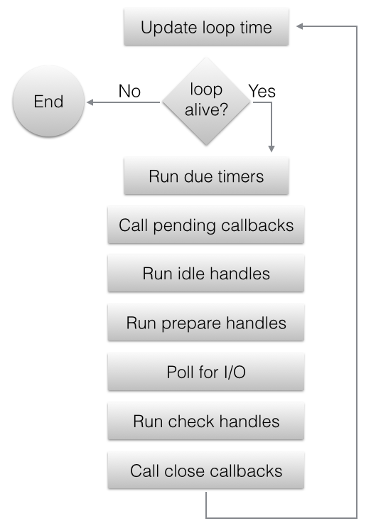

.. _design:

Design overview
===============

libuv is cross-platform support library which was originally written for NodeJS. It's designed
around the event-driven asynchronous I/O model.

The library provides much more than a simple abstraction over different I/O polling mechanisms:
'handles' and 'streams' provide a high level abstraction for sockets and other entities;
cross-platform file I/O and threading functionality is also provided, amongst other things.

Here is a diagram illustrating the different parts that compose libuv and what subsystem they
relate to:

Handles and requests
^^^^^^^^^^^^^^^^^^^^

libuv provides users with 2 abstractions to work with, in combination with the event loop:
handles and requests.

Handles represent long-lived objects capable of performing certain operations while active. Some examples:

- A prepare handle gets its callback called once every loop iteration when active.
- A TCP server handle that gets its connection callback called every time there is a new connection.

Requests represent (typically) short-lived operations. These operations can be performed over a
handle: write requests are used to write data on a handle; or standalone: getaddrinfo requests
don't need a handle they run directly on the loop.

The I/O loop
^^^^^^^^^^^^

The I/O (or event) loop is the central part of libuv. It establishes the content for all I/O
operations, and it's meant to be tied to a single thread. One can run multiple event loops
as long as each runs in a different thread. The libuv event loop (or any other API involving
the loop or handles, for that matter) **is not thread-safe** except where stated otherwise.

The event loop follows the rather usual single threaded asynchronous I/O approach: all (network)
I/O is performed on non-blocking sockets which are polled using the best mechanism available
on the given platform: epoll on Linux, kqueue on OSX and other BSDs, event ports on SunOS and IOCP
on Windows. As part of a loop iteration the loop will block waiting for I/O activity on sockets
which have been added to the poller and callbacks will be fired indicating socket conditions
(readable, writable hangup) so handles can read, write or perform the desired I/O operation.

In order to better understand how the event loop operates, the following diagram illustrates all
stages of a loop iteration:

#. The loop concept of 'now' is updated. The event loop caches the current time at the start of
   the event loop tick in order to reduce the number of time-related system calls.

#. If the loop is *alive*  an iteration is started, otherwise the loop will exit immediately. So,
   when is a loop considered to be *alive*? If a loop has active and ref'd handles, active
   requests or closing handles it's considered to be *alive*.

#. Due timers are run. All active timers scheduled for a time before the loop's concept of *now*
   get their callbacks called.

#. Pending callbacks are called. All I/O callbacks are called right after polling for I/O, for the
   most part. There are cases, however, in which calling such a callback is deferred for the next
   loop iteration. If the previous iteration deferred any I/O callback it will be run at this point.

#. Idle handle callbacks are called. Despite the unfortunate name, idle handles are run on every
   loop iteration, if they are active.

#. Prepare handle callbacks are called. Prepare handles get their callbacks called right before
   the loop will block for I/O.

#. Poll timeout is calculated. Before blocking for I/O the loop calculates for how long it should
   block. These are the rules when calculating the timeout:

        * If the loop was run with the ``UV_RUN_NOWAIT`` flag, the timeout is 0.
        * If the loop is going to be stopped (:c:func:`uv_stop` was called), the timeout is 0.
        * If there are no active handles or requests, the timeout is 0.
        * If there are any idle handles active, the timeout is 0.
        * If there are any handles pending to be closed, the timeout is 0.
        * If none of the above cases matches, the timeout of the closest timer is taken, or
          if there are no active timers, infinity.

#. The loop blocks for I/O. At this point the loop will block for I/O for the duration calculated
   in the previous step. All I/O related handles that were monitoring a given file descriptor
   for a read or write operation get their callbacks called at this point.

#. Check handle callbacks are called. Check handles get their callbacks called right after the
   loop has blocked for I/O. Check handles are essentially the counterpart of prepare handles.

#. Close callbacks are called. If a handle was closed by calling :c:func:`uv_close` it will
   get the close callback called.

#. Special case in case the loop was run with ``UV_RUN_ONCE``, as it implies forward progress.
   It's possible that no I/O callbacks were fired after blocking for I/O, but some time has passed
   so there might be timers which are due, those timers get their callbacks called.

#. Iteration ends. If the loop was run with ``UV_RUN_NOWAIT`` or ``UV_RUN_ONCE`` modes the
   iteration ends and :c:func:`uv_run` will return. If the loop was run with ``UV_RUN_DEFAULT``
   it will continue from the start if it's still *alive*, otherwise it will also end.

.. important::
    libuv uses a thread pool to make asynchronous file I/O operations possible, but
    network I/O is **always** performed in a single thread, each loop's thread.

.. note::
    While the polling mechanism is different, libuv makes the execution model consistent
    across Unix systems and Windows.

File I/O
^^^^^^^^

Unlike network I/O, there are no platform-specific file I/O primitives libuv could rely on,
so the current approach is to run blocking file I/O operations in a thread pool.

For a thorough explanation of the cross-platform file I/O landscape, checkout
`this post <http://blog.libtorrent.org/2012/10/asynchronous-disk-io/>`_.

libuv currently uses a global thread pool on which all loops can queue work on. 3 types of
operations are currently run on this pool:

    * File system operations
    * DNS functions (getaddrinfo and getnameinfo)
    * User specified code via :c:func:`uv_queue_work`

.. warning::
    See the :c:ref:`threadpool` section for more details, but keep in mind the thread pool size
    is quite limited.
