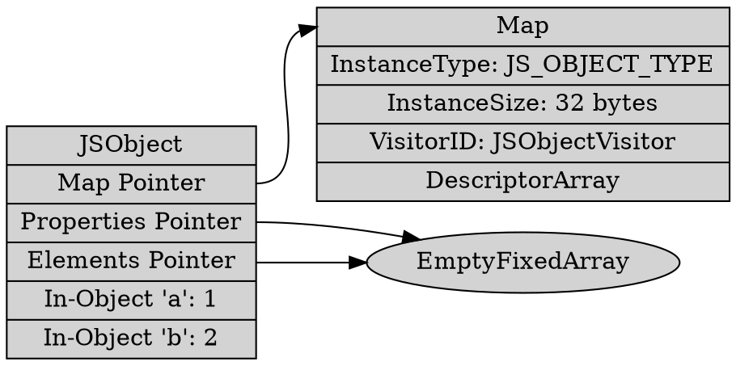

# Heap Overview in V8

V8 manages its own heap memory, organized into several "spaces" to optimize allocation and garbage collection.

## Paged Space

Most spaces in the V8 heap are divided into **Pages** (typically 256KB or 512KB depending on architecture).
*   **Allocation**: Objects are allocated linearly within a page (bump-pointer allocation) until the page is full, after which a new page is acquired.
*   **Management**: Pages are managed by the `MemoryAllocator` and belong to specific spaces.

## Heap Objects and Maps

Every object allocated on the V8 heap (a `HeapObject`) has a common header structure. The very first word of every `HeapObject` is a tagged pointer to a **Map** (also known as a hidden class or shape).

### The Role of the Map

The Map is crucial because it contains metadata that allows V8 to understand the object's structure without inspecting the object itself:
1.  **Type**: The `InstanceType` (e.g., `JS_OBJECT_TYPE`, `STRING_TYPE`, `FIXED_ARRAY_TYPE`) identifies what kind of object it is.
2.  **Size**: The `instance_size` tells V8 how many bytes the object occupies.
3.  **Iteration**: The `visitor_id` tells the garbage collector how to iterate over the pointers contained within the object body (e.g., which fields are tagged pointers vs raw data).
    *   **BodyDescriptors**: V8 uses `BodyDescriptor` classes (e.g., `JSObject::BodyDescriptor`) to provide a static way to iterate over object bodies. The `visitor_id` maps to these descriptors to guide the GC without needing virtual calls for every object.

### Example and Diagram

Consider a simple JavaScript object:
```javascript
const obj = { a: 1, b: 2 };
```

In the heap, this `JSObject` might look like this:



Every heap access starts by reading the Map to know how to handle the rest of the object!

## Spaces in the Heap
V8 divides the heap into several spaces:
*   **New Space**: For young objects (nursery). Uses Cheney's copy algorithm.
*   **Old Space**: For objects that survived New Space.
*   **Read-Only Space**: For shared, immutable objects.
*   **Large Object Space**: For objects larger than a page.
*   **Code Space**: For executable instructions.
*   **Trusted Space**: For objects that must be protected from corruption (when Sandbox is enabled).
