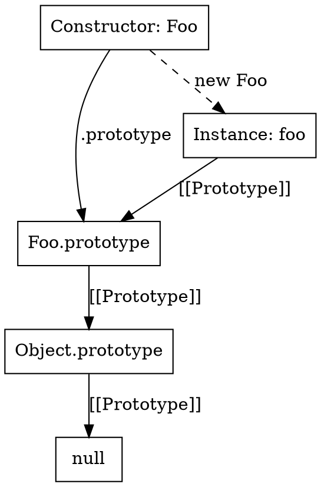

# JavaScript Overview for V8 Developers

This document provides a high-level overview of how JavaScript works, focusing on concepts that are relevant for understanding V8's implementation.

## Primitives vs. Objects

JavaScript has two main categories of values:

### 1. Primitives
Immutable values that are passed by value.
*   `undefined`, `null`, `boolean` (`true`/`false`), `number`, `string`, `bigint`, `symbol`. (Spec names are capitalized, but JS `typeof` returns lowercase strings).
*   In V8, small integers (Smis) are stored directly in the pointer word, while other primitives are allocated on the heap (e.g., `HeapNumber`, `String`).

### 2. Objects
Mutable collections of properties, passed by reference.
*   Any value that is not a primitive is an object (including arrays and functions).
*   In V8, objects are represented by `JSObject` and its subclasses.
*   **Note**: JS also has primitive wrapper objects (e.g., `new String('foo')`), which are actual objects and not primitives. Be careful not to confuse them with the primitive values!

## How V8 implements prototypes

JavaScript uses a **prototypal inheritance** model. Every object has a hidden link to another object called its **prototype** (internal `[[Prototype]]`).

### Prototype Chain
*   When you access a property on an object, JavaScript first looks for it on the object itself.
*   If not found, it looks at the object's prototype, and then the prototype's prototype, forming a **prototype chain**.
*   The chain ends when it reaches `null` (typically `Object.prototype.__proto__` is `null`).

### `Foo.prototype` vs `foo.__proto__`
*   `Foo.prototype` is a property of the **constructor function** `Foo`. It is the object that will be used as the prototype for instances created with `new Foo()`.
*   `foo.__proto__` is a property of the **instance** `foo`. It points to the prototype object that `foo` inherited from.
*   If `foo = new Foo()`, then `foo.__proto__ === Foo.prototype`.



### `__proto__` and V8 Implementation
*   `__proto__` is an accessor property (getter/setter) on `Object.prototype` that exposes the internal prototype link.
*   Modern JavaScript recommends using `Object.getPrototypeOf()` and `Object.setPrototypeOf()` instead of `__proto__`.
*   In V8, the prototype is stored in the `Map` of the object. Changing the prototype of an object changes its map!

## ES6 Classes

ES6 classes are primarily **syntactic sugar** over JavaScript's existing prototype-based inheritance.

```javascript
class Animal {
  constructor(name) {
    this.name = name;
  }
  speak() {
    console.log(`${this.name} makes a noise.`);
  }
}

class Dog extends Animal {
  speak() {
    console.log(`${this.name} barks.`);
  }
}
```

Under the hood, this is equivalent to:

```javascript
function Animal(name) {
  this.name = name;
}
Animal.prototype.speak = function() {
  console.log(this.name + ' makes a noise.');
};

function Dog(name) {
  Animal.call(this, name);
}
Dog.prototype = Object.create(Animal.prototype);
Dog.prototype.constructor = Dog;
Dog.prototype.speak = function() {
  console.log(this.name + ' barks.');
};
```


## File Structure
*   `src/objects/js-objects.h`: Definitions for JavaScript objects.
*   `src/objects/map.h`: Definitions for Maps (hidden classes) which store prototype links.
