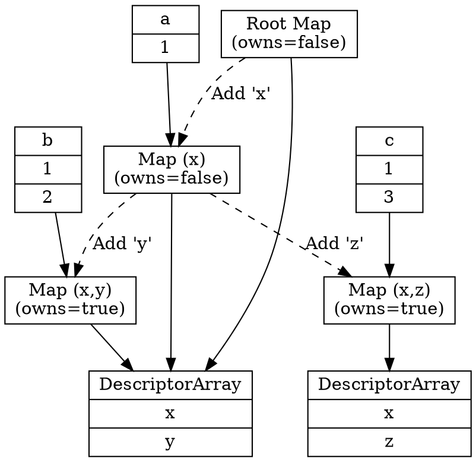

# Descriptor and Transition Arrays in V8

To save memory and enable fast property access, V8 shares structural information between objects. This is achieved using `DescriptorArray` and `TransitionArray`, which are linked from an object's `Map`.

## Descriptor Array Sharing and Ownership

A `DescriptorArray` holds the property descriptors for a `Map`. It describes the names, attributes, and locations of properties.

### Layout
`DescriptorArray` is a custom array-like structure (inheriting from `HeapObject`). It does not use a standard `FixedArray` for its entries to optimize for performance and memory.

Each entry in the array consists of 3 fields, making the entry size 3:
*   **Key** (Index 0): The property name (a `Name`).
*   **Details** (Index 1): Property details encoded as a `Smi`. This includes property attributes (e.g., ReadOnly, DontEnum), kind (Data or Accessor), and location (Field or Descriptor). It also contains a pointer used for sorting.
*   **Value** (Index 2): This holds either:
    *   A `FieldType` (wrapped as a `MaybeObject`) if the property is stored in a field.
    *   The constant value if it is a constant property.
    *   An accessor object if it is an accessor.

### Sharing Mechanism
Instead of every `Map` having its own `DescriptorArray`, maps that are part of the same transition tree share a single `DescriptorArray`.

*   **Prefix Sharing**: A `Map` only "sees" a prefix of the shared `DescriptorArray`. The number of properties valid for a specific map is determined by its `NumberOfOwnDescriptors()`.
*   **Example**:
    *   `Map A` has property `x`. `NumberOfOwnDescriptors() = 1`.
    *   `Map B` (transitioned from A) adds property `y`. `NumberOfOwnDescriptors() = 2`.
    *   Both `Map A` and `Map B` point to the *same* `DescriptorArray` containing `[x, y]`. `Map A` only looks at the first element, while `Map B` looks at both.

### Ownership (`owns_descriptors`)
To manage memory and avoid conflicting modifications, only one `Map` in a sharing group "owns" the `DescriptorArray`. This is tracked by the `owns_descriptors` bit in the `Map`.

*   Usually, the most specific map (the leaf in the transition tree) owns the array.
*   When a new property is added, creating a new map, ownership is typically transferred to the new map.

### Splitting the Array
If a map needs to be modified in a way that doesn't fit the linear transition model (e.g., an elements kind transition or a prototype transition), V8 may need to **split** the descriptor array:
*   If the map does *not* own the descriptors, it cannot modify them in place.
*   V8 will create a *copy* of the `DescriptorArray` up to the map's `NumberOfOwnDescriptors()`.
*   The new map will own this new copy, detaching it from the original sharing group.

## Transition Arrays

A `TransitionArray` holds transitions from one `Map` to another, forming the edges of the transition tree.

### Purpose
When a property is added or attributes change, V8 searches the current map's `TransitionArray` for a matching transition. If found, the object takes the target map. If not, a new map is created and a new transition is inserted.

### Layout
`TransitionArray` is a `WeakFixedArray`.
*   **Header**: Contains:
    *   `[0]`: Pointer to prototype transitions (or Smi 0).
    *   `[1]`: Pointer to side-step transitions (or Smi 0).
    *   `[2]`: Number of transitions (as a Smi).
*   **Elements**: Pairs of `[Key, TargetMap]`. The `TargetMap` is a **weak reference**, allowing the GC to collect maps that are no longer reachable, automatically pruning the transition tree.

### Side-Step Transitions
Side-step transitions are special edges in the transition tree used for operations that bypass standard property addition, such as `Object.assign()` or object cloning. They allow V8 to quickly find the target map for these operations if they have been performed before.

## Detaching from the Transition Tree

Not all maps are connected to a transition tree. A map can be **detached**.

### What is a Detached Map?
A map is considered detached if it is not reachable via transitions from a root map.
In V8, `Map::IsDetached()` returns true if:
1.  It is a **prototype map**. Prototype maps are often isolated to prevent pollution of the main transition tree.
2.  It is a standard `JS_OBJECT_TYPE` map that has properties (`NumberOfOwnDescriptors() > 0`) but its back pointer is `Undefined`.

### When does detaching happen?
*   **OMIT_TRANSITION**: When copying a map, V8 can be instructed to omit creating a transition. The new map will have no back pointer and will be detached.
*   **Immutable Prototypes**: Maps for objects with immutable prototypes (like the global object) are not cached in the transition tree to save memory.
*   **Forced Splits**: As mentioned in descriptor sharing, when a non-leaf map needs a new descriptor array, it creates a detached copy.
*   **GC Pruning**: Since transitions are weak, if a target map is only reachable through the transition array and no objects use it, the GC will clear the transition, effectively detaching the subtree.

## Summary Diagram

```javascript
var a = {};
a.x = 1;

var b = {};
b.x = 1;
b.y = 2;

var c = {};
c.x = 1;
c.z = 3;
```




## See Also
-   [Objects and Maps](../heap/objects-and-maps.md)
