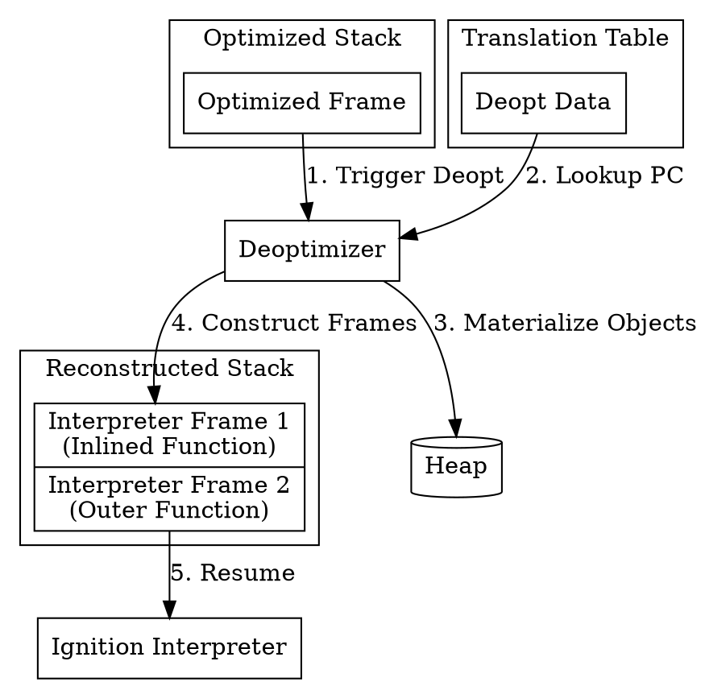

# Deoptimization in V8

Deoptimization (often called "deopt") is the process of moving execution from optimized code (generated by TurboFan or Maglev) back to unoptimized code (Ignition interpreter). This is necessary because optimized code makes optimistic assumptions about types and shapes of objects that may be violated at runtime.

V8 has three types of deoptimization (defined by `DeoptimizeKind` in `src/common/globals.h`): **Eager**, **Lazy**, and **LazyAfterFastCall** (a specialized variant of lazy deoptimization used for direct calls to C++).

## Eager Deoptimization

Eager deoptimization occurs immediately when a check in the optimized code fails.

### How it works:
1.  **Speculative Optimization**: When TurboFan/Maglev generates code, it inserts checks (guards) based on feedback collected by Ignition. For example, it assumes a variable is always a Smi.
2.  **Check Failure**: If execution reaches a point where the assumption is violated (e.g., a Smi becomes a HeapNumber), the guard fails.
3.  **Immediate Exit**: The code executes a jump to a dedicated deoptimization exit point. These exits are small stubs generated at the end of the optimized function.
4.  **State Reconstruction**: The deoptimizer takes over, reads the current register and stack state, and reconstructs the equivalent interpreter frame(s).

Eager deopts are synchronous and happen at the exact instruction that failed the check.

## Lazy Deoptimization

Lazy deoptimization occurs when an assumption made by optimized code is invalidated by an external event, rather than a check failure within the code itself.

### How it works:
1.  **Invalidation**: An event occurs that invalidates optimized code. Examples include:
    *   A prototype chain changes.
    *   A function is redefined.
    *   A map transition changes.
2.  **Marking**: V8 marks the dependent optimized code as invalid (using `code->set_marked_for_deoptimization`).
3.  **Execution Continues**: The optimized code may still be running on the stack. It is not immediately interrupted.
4.  **Return Trigger**: The next time execution returns to the marked optimized frame (or calls another function from it that triggers a stack check), V8 detects that the code is invalid.
5.  **Deferred Exit**: V8 patches the return address to point to a lazy deoptimization builtin, which then enters the deoptimizer.

Lazy deopts are asynchronous relative to the code execution and are checked at specific safepoints or return sites.

## Frame Translation (Recreating the Frame)

The most complex part of deoptimization is reconstructing the interpreter frame(s) from the optimized frame state. This is handled by `TranslatedState` (defined in `src/deoptimizer/translated-state.h`).

### The Problem
Optimized code may have:
-   Inlined functions (one optimized frame represents multiple source frames).
-   Eliminated operations (dead code elimination).
-   Variables stored in registers instead of the stack.
-   Objects allocated only in registers (Escape Analysis).

### The Solution: Translation Data
During compilation, TurboFan/Maglev generates **Deoptimization Data** (specifically a `DeoptimizationFrameTranslation`). This is a compact bytecode stream that describes how to reconstruct the unoptimized state for every point where a deopt can occur.

### Translation Opcodes
The translation data uses opcodes (defined in `src/deoptimizer/translation-opcode.h`) to instruct the deoptimizer on how to fill the slots of the reconstructed interpreter frame:
-   **LITERAL**: Use a constant from the literal pool.
-   **TAGGED_STACK_SLOT**, **INT32_STACK_SLOT**, **DOUBLE_STACK_SLOT**, etc.: Read a value of a specific type from a slot in the optimized frame.
-   **REGISTER**, **INT32_REGISTER**, **DOUBLE_REGISTER**, etc.: Read a value of a specific type from a CPU register.
-   **DUPLICATED_OBJECT**: Reference an object that has already been materialized.
-   **CAPTURED_OBJECT**: Reconstruct an object that was optimized away by escape analysis.

### Reconstruction Process
1.  **Read Translation**: The deoptimizer reads the translation data for the current PC (Program Counter).
2.  **Build `TranslatedState`**: It creates a `TranslatedState` object containing a list of `TranslatedFrame`s. Each `TranslatedFrame` corresponds to one interpreter frame (including inlined ones).
3.  **Materialize Objects**: If the translation references captured objects, the deoptimizer allocates them on the heap and fills their fields.
4.  **Fill Stack Frames**: The deoptimizer allocates a new set of stack frames for the interpreter and fills them with the values resolved from registers, stack slots, and literals.
5.  **Set Accumulator**: The interpreter's accumulator is set to the result of the last operation (if applicable).
6.  **Resume Ignition**: Execution is transferred to the Ignition interpreter at the appropriate bytecode offset.

### Visualizing Frame Translation

## Builtin Continuations

When deoptimization occurs while execution is inside a builtin function (e.g., a builtin written in CodeStubAssembler or Torque), V8 cannot simply resume at a bytecode offset in the interpreter, because the builtin execution was not driven by bytecode.

To handle this, V8 uses **Builtin Continuations**.

### How they work:
1.  **Special Frames**: During frame translation, the deoptimizer may create special continuation frames (e.g., `BUILTIN_CONTINUATION_FRAME`, `JAVASCRIPT_BUILTIN_CONTINUATION_FRAME`).
2.  **State Setup**: These frames are set up with a specific return address pointing to a continuation builtin (e.g., `ContinueToCodeStubBuiltin` or `ContinueToJavaScriptBuiltin`).
3.  **Resuming**: When execution resumes, these continuation builtins are executed. They are responsible for taking the result of the operation (or the exception) and either returning it to the caller or continuing execution in the interpreter at the appropriate place.

### Completing Inlined Builtins
Continuation builtins can do more than just return; they can **complete the execution of an inlined builtin** before resuming the bytecode.
*   **Example**: If `Array.prototype.forEach` is inlined by TurboFan and a deopt occurs inside the callback, V8 cannot just jump back to the interpreter's `Call` bytecode (which invoked `forEach`) because we might be in the middle of the loop.
*   **Solution**: V8 generates specialized continuation builtins like `ArrayForEachLoopLazyDeoptContinuation` (defined in `src/builtins/array-foreach.tq`). This continuation knows how to resume the loop from the current index (`initialK`) and complete the remaining iterations before finally returning to the interpreter.

Continuations ensure that even if we deoptimize in the middle of a complex native operation, we don't lose the result and can safely transition back to interpreted JavaScript.

---

## See Also
-   [Ignition](../interpreter/interpreter-ignition.md)
-   [TurboFan](../compiler/turbofan/compiler-turbofan.md)
