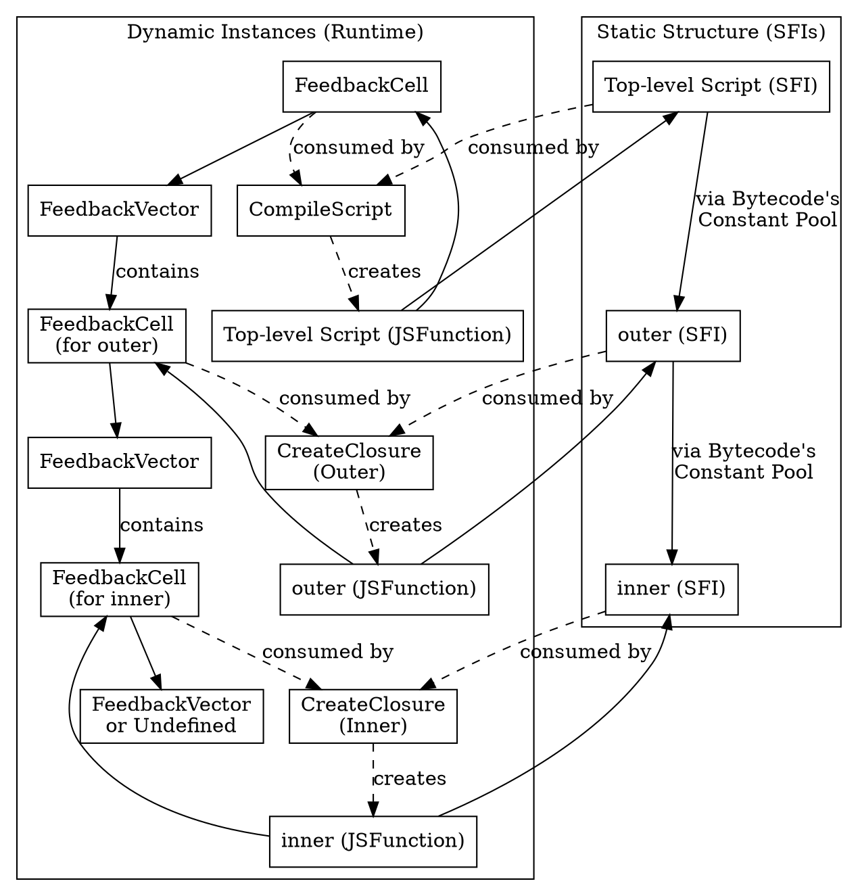

# Function Architecture in V8

To execute JavaScript functions efficiently, V8 splits function data into **context-independent** and **context-dependent** parts. This separation allows sharing of heavy assets (like bytecode) while allowing specific instances (closures) to maintain their own state and feedback.

This document describes this architecture and how functions are chained together both statically and dynamically.

## Context-Independent Data: `SharedFunctionInfo`

Data that does not change regardless of where or how many times a function is instantiated is stored in the `SharedFunctionInfo` (SFI).

*   **Purpose**: To save memory by sharing read-only information across all instances of the function, even across different `NativeContext`s.
*   **Key Contents**:
    *   **Bytecode**: The executable bytecode generated by Ignition.
    *   **`ScopeInfo`**: The lexical structure of the scope (see [Scopes and ScopeInfos](scopes-and-scope-infos.md)).
    *   **Source Positions**: Mapping bytecode to source code lines.
    *   **`FeedbackMetadata`**: Describes the shape and size of the `FeedbackVector` that needs to be allocated for this function.

### SFI Chaining via Bytecode
`SharedFunctionInfo` objects do not form a direct linked list. Instead, they form a tree structure embedded within the bytecode.
When a function contains a nested function definition, the outer function's `BytecodeArray` is responsible for creating the closure for the inner function.
1.  **Inner SFI in Constant Pool**: The SFI for the inner function is created during parsing/compilation of the outer function and is placed in the **Constant Pool** of the outer function's `BytecodeArray`.
2.  **`CreateClosure` Bytecode**: The outer function's bytecode contains a `CreateClosure` instruction at the point where the inner function is defined/created.
3.  **Reference**: The `CreateClosure` bytecode takes an operand that is the index of the inner SFI in the constant pool.

## Context-Dependent Data

Data that depends on the specific execution context or function instance is stored in objects linked from the `JSFunction`.

### `JSFunction`
A `JSFunction` represents an actual JavaScript function object available to the user code (a closure).
*   **Purpose**: To represent a specific instance of a function with its own scope chain and execution state.
*   **Key Contents**:
    *   **Link to `SharedFunctionInfo`**: Points to the shared data.
    *   **`Context`**: Points to the execution context (lexical environment) where the function was created. This is what makes it a closure.
    *   **`FeedbackCell`**: Points to a cell that holds the `FeedbackVector`.
    *   **`JSDispatchHandle`**: In modern V8, this is a 32-bit index into the `JSDispatchTable`, used to find the executable code, enabling efficient tiering.

### `FeedbackCell`
The `FeedbackCell` acts as a level of indirection between the `JSFunction` and the `FeedbackVector`.
*   **Purpose**:
    *   **Tiering Control**: It stores the `interrupt_budget`, which is decremented on function entry and backward branches. When it reaches zero, it triggers a tiering request.
    *   **Lazy Allocation**: It allows V8 to delay the allocation of the full `FeedbackVector` until the function becomes "hot".
    *   **Sharing**: In some cases, multiple closures can share the same `FeedbackCell` if they are guaranteed to have the same feedback behavior.

### `FeedbackVector`
The `FeedbackVector` holds the runtime feedback (Inline Caches) used by the optimizing compilers.
*   **Purpose**: To collect data about the types and shapes of objects the function operates on.
*   **Key Contents**:
    *   **Slots**: Array of slots, each corresponding to an operation in the bytecode.
    *   **`ClosureFeedbackCellArray`**: Holds `FeedbackCell`s for inner closures.
*   **Context Dependency**: Feedback is highly dependent on the types encountered in a specific context. Sharing feedback across different contexts with different types would lead to polymorphism and deoptimizations.

## FeedbackVector Chaining via `CreateClosure` Slots

The dynamic chaining happens through the feedback system, specifically to allow inner functions to have their own feedback vectors when they become hot.

1.  **`ClosureFeedbackCellArray`**: Every `FeedbackVector` (and also uncompiled `FeedbackCell`s that are preparing for vector allocation) contains a `ClosureFeedbackCellArray`.
2.  **Slot per Closure**: For every `CreateClosure` bytecode in a function, there is a corresponding slot in its `ClosureFeedbackCellArray`.
3.  **Pre-allocated FeedbackCells**: This array is populated with `FeedbackCell`s *before* the closures are actually created.
4.  **Passing the Cell**: When `CreateClosure` is executed, it looks up the pre-allocated `FeedbackCell` from the outer function's `ClosureFeedbackCellArray` and links it to the new `JSFunction`.

This creates a runtime chain:
`Outer JSFunction` -> `Outer FeedbackVector` -> `ClosureFeedbackCellArray` -> `Inner FeedbackCell` -> `Inner FeedbackVector` (once allocated).

## Modern V8 Features

### Sharing of `JSDispatchHandle`
1.  **Initialization**: Each `FeedbackCell` in `ClosureFeedbackCellArray` is allocated a `JSDispatchHandle` (initially pointing to `CompileLazy`).
2.  **Closure Creation**: `CreateClosure` copies the `JSDispatchHandle` from the `FeedbackCell` into the new `JSFunction`.
3.  **Shared Dispatch**: Closures created from the same site share the same `JSDispatchTable` entry.
4.  **Efficient Tiering**: Updating the code pointer in the table entry updates all sharing closures immediately.

### `FeedbackCell` State Transitions
V8 tracks the number of closures created from a site using the `Map` of the `FeedbackCell`:
*   `NoClosuresCellMap` -> `OneClosureCellMap` -> `ManyClosuresCellMap`
These help decide when to allocate a `FeedbackVector` and manage specialized code.

## Concrete Example

Consider the following code:

```javascript
// Top-level script
function outer() {
  function inner() {
    return 42;
  }
  return inner;
}

outer(); // Call to outer
```

### Object Graph

Here is what the object graph looks like after the top-level script has been executed and `outer()` has been called, but before `inner()` is called.



### Scope and Context Graph

This graph shows how `ScopeInfo` (static) and `Context` (dynamic) are linked.

```dot
digraph G {
    rankdir=TB;
    newrank=true;
    node [shape=record];
    edge [];

    subgraph cluster_static {
        label="Static Structure (Scopes)";
        TL_SFI [label="Top-level Script (SFI)"];
        TL_SI [label="Top-level ScopeInfo"];
        Outer_SFI [label="outer (SFI)"];
        Outer_SI [label="outer ScopeInfo"];
        Inner_SFI [label="inner (SFI)"];
        Inner_SI [label="inner ScopeInfo"];

        TL_SFI -> TL_SI;
        Outer_SFI -> Outer_SI [constraint=false];
        Inner_SFI -> Inner_SI [constraint=false];
        
        Inner_SI -> Outer_SI -> TL_SI [label="parent"];
    }

    subgraph cluster_dynamic {
        label="Dynamic Instances (Contexts)";
        TL_JSF [label="Top-level Script (JSFunction)"];
        TL_Ctx [label="Top-level Context"];
        Outer_JSF [label="outer (JSFunction)"];
        Outer_Ctx [label="outer Context"];
        Inner_JSF [label="inner (JSFunction)"];
        Inner_Ctx [label="inner Context"];

        TL_JSF -> TL_Ctx;
        Outer_JSF -> Outer_Ctx [constraint=false];
        Inner_JSF -> Inner_Ctx [constraint=false];
        
        Inner_Ctx -> Outer_Ctx -> TL_Ctx [label="parent"];
    }

    TL_Ctx -> TL_SI [constraint=false];
    Outer_Ctx -> Outer_SI [constraint=false];
    Inner_Ctx -> Inner_SI [constraint=false];

    TL_JSF -> TL_SFI [constraint=false];
    Outer_JSF -> Outer_SFI [constraint=false];
    Inner_JSF -> Inner_SFI [constraint=false];

    TL_SFI -> Outer_SFI -> Inner_SFI [style=invis];
    TL_JSF -> Outer_JSF -> Inner_JSF [style=invis];
    TL_SI -> Outer_SI -> Inner_SI [style=invis];
    TL_Ctx -> Outer_Ctx -> Inner_Ctx [style=invis];
}
```

## Developer Guide: Tracing JSFunction Initialization

### Key Entry Points
*   `JSFunction::CreateAndAttachFeedbackVector`
*   `JSFunction::EnsureClosureFeedbackCellArray`
*   `FastNewClosure` (Builtin)

---

## See Also
-   [Hidden Classes and Inline Caches](hidden-classes-and-ics.md)
-   [Scopes and ScopeInfos](scopes-and-scope-infos.md)
