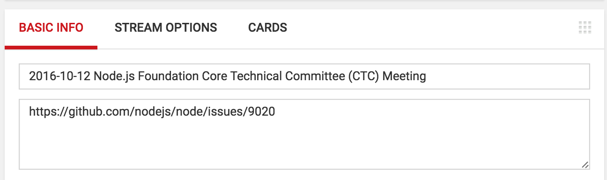
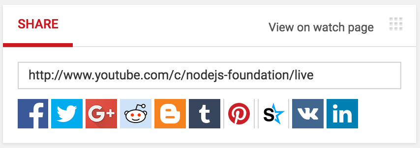
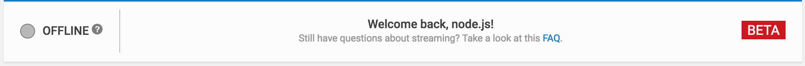
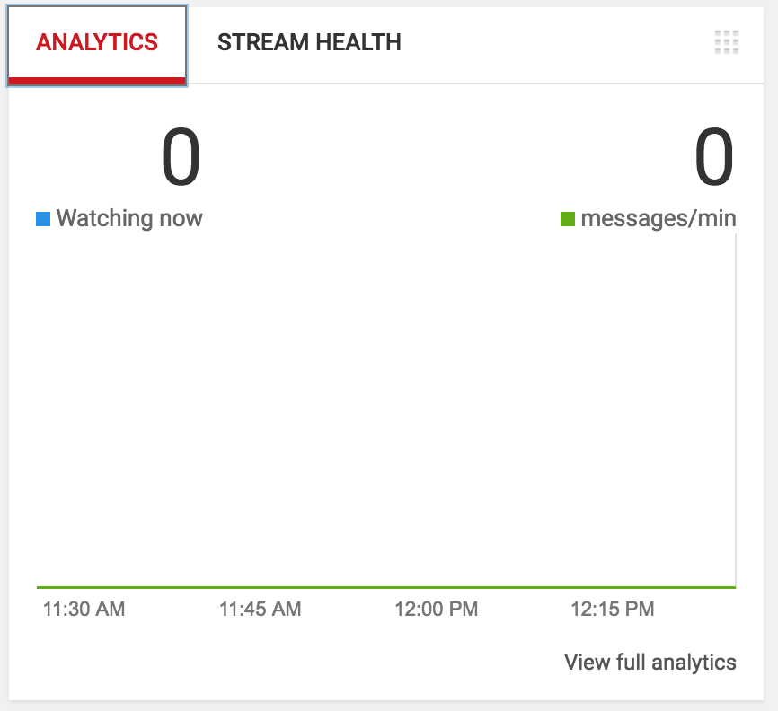

# Streaming Meetings to Youtube

We publicly live stream our meetings to YouTube using [Zoom](https://zoom.us/).

## Getting Access

You need the Foundation login credentials for Zoom in order to host the meeting.
The userid and password is shared through 1password.

Your YouTube Account must be a manager of the
[Node.js YouTube account](https://www.youtube.com/channel/UCQPYJluYC_sn_Qz_XE-YbTQ).

To request access open an issue in the Node.js
[admin](https://github.com/nodejs/admin) repository with the title being
`Zoom and Youtube access for X` where X is the GitHub id and
the YouTube ID of the person for which access is being requested.
Include a short reason why access is needed(for example streaming
a team meeting etc.).

Unless there are objections the request is considered approved after 48 hours.

## Managing access

### Youtube

To add managers or verify an account is a manager:

1. Go to <https://youtube.com>
2. Click on the Node.js icon on the right top.
3. Select settings, select "Add or remove managers", select "Manage permissions"
4. On that page you can use the +people at the top right of the popup to add
   people. It also lists all current managers.

### Zoom

To share the Zoom password log into 1password, select the settings gear for
the`zoom-creds` vault and  then use `Share Vault` to share the vault with the
new user. Use the gear to set the permissions to include only `View Items` and
`View and Copy passwords`.

When adding access for a user also ask them to create a PR adding themselves
to the `zoom-nodejs` group in the
[iojs.org/aliases.json](https://github.com/nodejs/email/blob/main/iojs.org/aliases.json)
file [nodejs/email](https://github.com/nodejs/email/)

## Live streaming a meeting

### Start and Stop the stream

1. Login to <https://zoom.us> using the Foundation credentials.
2. Go to <https://zoom.us/webinar/list>, find the meeting.
3. Press "Start", it should open the meeting in the Zoom application.
4. Go to "Participants" panel, check Attendees, promote them to panelists.
5. Go to "... More" in toolbar, choose "Live on YouTube", it will open in
   browser.
6. Choose to login to <https://youtube.com> with Node.js account, accept
   Zoom usage agreement (on first use)
7. On the Streaming page, edit the webinar title to include the meeting date,
   then press the red "Go Live!" button. Troubleshooting note: at least one
   person has found that "Go Live!" errored with a message "Please grant
   necessary privilege for live streaming". Copying the link from the default
   browser to a different browser may work around this issue.

Every participant can choose whether to participate with or without video.

YouTube records the live stream. Recordings are made available on the
[Node.js channel](https://www.youtube.com/channel/UCQPYJluYC_sn_Qz_XE-YbTQ/videos).

The stream title is set automatically from the information in Zoom. We usually
set it to `YYYY-MM-DD - Meeting Name` for example
`2022-11-02 - Technical Steering Community Meeting`.

The description should be a link to the meeting issue.

You can edit title and description on YouTube at a later time if needed.



### Share the meeting once you've gone live

The meeting link should be `http://www.youtube.com/c/nodejs-foundation/live`.

Send it in a tweet such as:

```text
.@nodejs Technical Steering Committee meeting live now:
http://www.youtube.com/c/nodejs-foundation/live
```

Adjust the `Technical Steering Committee` part as necessary and remove the
`.@nodejs` if tweeting from the official twitter account.



## Check stream status

This should say online when you are streaming, and usually be green.

However, it may turn yellow and issue a warning in a "stream health"
section below.  Since we usually stream with static images for the
video, there will often be warnings that the video bitrate is low.
This is a not a problem and should almost always be ignored.



## Check how many people are watching



## Moderate the chat and solicit questions

Moderation follows the [Moderation Policy](https://github.com/nodejs/admin/blob/main/Moderation-Policy.md).
Messages can be moderated right-clicking and selecting the necessary action,
such as `remove`.

If you participate in the chat while logged in as Node.js, it's good
practice to append your initials to your messages.
