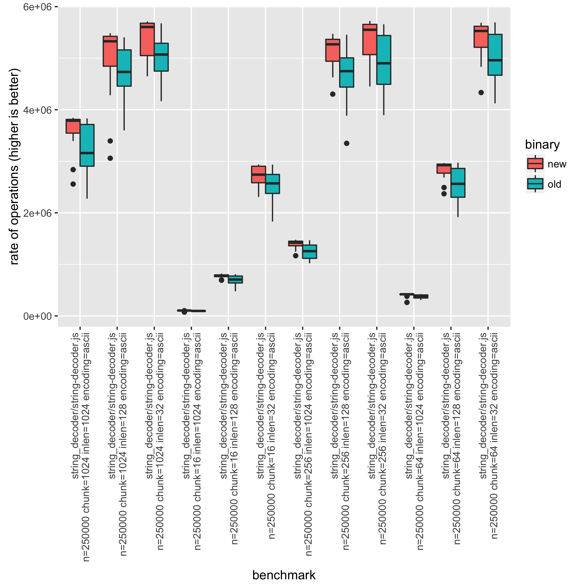

# How to write and run benchmarks in Node.js core

## Table of contents

* [Prerequisites](#prerequisites)
  * [HTTP benchmark requirements](#http-benchmark-requirements)
  * [HTTPS benchmark requirements](#https-benchmark-requirements)
  * [HTTP/2 benchmark requirements](#http2-benchmark-requirements)
  * [Benchmark analysis requirements](#benchmark-analysis-requirements)
* [Running benchmarks](#running-benchmarks)
  * [Running individual benchmarks](#running-individual-benchmarks)
  * [Running all benchmarks](#running-all-benchmarks)
  * [Specifying CPU Cores for Benchmarks with run.js](#specifying-cpu-cores-for-benchmarks-with-runjs)
  * [Filtering benchmarks](#filtering-benchmarks)
  * [Comparing Node.js versions](#comparing-nodejs-versions)
  * [Comparing parameters](#comparing-parameters)
  * [Running benchmarks on the CI](#running-benchmarks-on-the-ci)
* [Creating a benchmark](#creating-a-benchmark)
  * [Basics of a benchmark](#basics-of-a-benchmark)
  * [Creating an HTTP benchmark](#creating-an-http-benchmark)

## Prerequisites

Basic Unix tools are required for some benchmarks.
[Git for Windows][git-for-windows] includes Git Bash and the necessary tools,
which need to be included in the global Windows `PATH`.

### HTTP benchmark requirements

Most of the HTTP benchmarks require a benchmarker to be installed. This can be
either [`wrk`][wrk] or [`autocannon`][autocannon].

`Autocannon` is a Node.js script that can be installed using
`npm install -g autocannon`. It will use the Node.js executable that is in the
path. In order to compare two HTTP benchmark runs, make sure that the
Node.js version in the path is not altered.

`wrk` may be available through one of the available package managers. If not,
it can be easily built [from source][wrk] via `make`.

By default, `wrk` will be used as the benchmarker. If it is not available,
`autocannon` will be used in its place. When creating an HTTP benchmark, the
benchmarker to be used should be specified by providing it as an argument:

`node benchmark/run.js --set benchmarker=autocannon http`

`node benchmark/http/simple.js benchmarker=autocannon`

#### HTTPS benchmark requirements

To run the `https` benchmarks, one of `autocannon` or `wrk` benchmarkers must
be used.

`node benchmark/https/simple.js benchmarker=autocannon`

#### HTTP/2 benchmark requirements

To run the `http2` benchmarks, the `h2load` benchmarker must be used. The
`h2load` tool is a component of the `nghttp2` project and may be installed
from [nghttp2.org][] or built from source.

`node benchmark/http2/simple.js benchmarker=h2load`

### Benchmark analysis requirements

To analyze the results statistically, you can use either the
[node-benchmark-compare][] tool or the R script `benchmark/compare.R`.

[node-benchmark-compare][] is a Node.js script that can be installed with
`npm install -g node-benchmark-compare`.

To draw comparison plots when analyzing the results, `R` must be installed.
Use one of the available package managers or download it from
<https://www.r-project.org/>.

The R packages `ggplot2` and `plyr` are also used and can be installed using
the R REPL.

```console
$ R
install.packages("ggplot2")
install.packages("plyr")
```

If a message states that a CRAN mirror must be selected first, specify a mirror
with the `repo` parameter.

```r
install.packages("ggplot2", repo="http://cran.us.r-project.org")
```

Of course, use an appropriate mirror based on location.
A list of mirrors is [located here](https://cran.r-project.org/mirrors.html).

## Running benchmarks

### Setting CPU Frequency scaling governor to "performance"

It is recommended to set the CPU frequency to `performance` before running
benchmarks. This increases the likelihood of each benchmark achieving peak performance
according to the hardware. Therefore, run:

```console
$ ./benchmark/cpu.sh fast
```

### Running individual benchmarks

This can be useful for debugging a benchmark or doing a quick performance
measure. But it does not provide the statistical information to make any
conclusions about the performance.

Individual benchmarks can be executed by simply executing the benchmark script
with node.

```console
$ node benchmark/buffers/buffer-tostring.js

buffers/buffer-tostring.js n=10000000 len=0 arg=true: 62710590.393305704
buffers/buffer-tostring.js n=10000000 len=1 arg=true: 9178624.591787899
buffers/buffer-tostring.js n=10000000 len=64 arg=true: 7658962.8891432695
buffers/buffer-tostring.js n=10000000 len=1024 arg=true: 4136904.4060201733
buffers/buffer-tostring.js n=10000000 len=0 arg=false: 22974354.231509723
buffers/buffer-tostring.js n=10000000 len=1 arg=false: 11485945.656765845
buffers/buffer-tostring.js n=10000000 len=64 arg=false: 8718280.70650129
buffers/buffer-tostring.js n=10000000 len=1024 arg=false: 4103857.0726124765
```

Each line represents a single benchmark with parameters specified as
`${variable}=${value}`. Each configuration combination is executed in a separate
process. This ensures that benchmark results aren't affected by the execution
order due to V8 optimizations. **The last number is the rate of operations
measured in ops/sec (higher is better).**

Furthermore a subset of the configurations can be specified, by setting them in
the process arguments:

```console
$ node benchmark/buffers/buffer-tostring.js len=1024

buffers/buffer-tostring.js n=10000000 len=1024 arg=true: 3498295.68561504
buffers/buffer-tostring.js n=10000000 len=1024 arg=false: 3783071.1678948295
```

### Running all benchmarks

Similar to running individual benchmarks, a group of benchmarks can be executed
by using the `run.js` tool. To see how to use this script,
run `node benchmark/run.js`. Again this does not provide the statistical
information to make any conclusions.

```console
$ node benchmark/run.js assert

assert/deepequal-buffer.js
assert/deepequal-buffer.js method="deepEqual" strict=0 len=100 n=20000: 773,200.4995493788
assert/deepequal-buffer.js method="notDeepEqual" strict=0 len=100 n=20000: 964,411.712953848
...

assert/deepequal-map.js
assert/deepequal-map.js method="deepEqual_primitiveOnly" strict=0 len=500 n=500: 20,445.06368453332
assert/deepequal-map.js method="deepEqual_objectOnly" strict=0 len=500 n=500: 1,393.3481642240833
...

assert/deepequal-object.js
assert/deepequal-object.js method="deepEqual" strict=0 size=100 n=5000: 1,053.1950937538475
assert/deepequal-object.js method="notDeepEqual" strict=0 size=100 n=5000: 9,734.193251965213
...
```

It is possible to execute more groups by adding extra process arguments.

```bash
node benchmark/run.js assert async_hooks
```

It's also possible to execute the benchmark more than once using the
`--runs` flag.

```bash
node benchmark/run.js --runs 10 assert async_hooks
```

This command will run the benchmark files in `benchmark/assert` and `benchmark/async_hooks`
10 times each.

#### Specifying CPU Cores for Benchmarks with run.js

When using `run.js` to execute a group of benchmarks,
you can specify on which CPU cores the
benchmarks should execute
by using the `--set CPUSET=value` option.
This controls the CPU core
affinity for the benchmark process,
potentially reducing
interference from other processes and allowing
for performance
testing under specific hardware configurations.

The `CPUSET` option utilizes the `taskset` command's format
for setting CPU affinity, where `value` can be a single core
number or a range of cores.

Examples:

* `node benchmark/run.js --set CPUSET=0` ... runs benchmarks on CPU core 0.
* `node benchmark/run.js --set CPUSET=0-2` ...
  specifies that benchmarks should run on CPU cores 0 to 2.

Note: This option is only applicable when using `run.js`.
Ensure the `taskset` command is available on your system
and the specified `CPUSET` format matches its requirements.

#### Filtering benchmarks

`benchmark/run.js` and `benchmark/compare.js` have `--filter pattern` and
`--exclude pattern` options, which can be used to run a subset of benchmarks or
to exclude specific benchmarks from the execution, respectively.

```console
$ node benchmark/run.js --filter "deepequal-b" assert

assert/deepequal-buffer.js
assert/deepequal-buffer.js method="deepEqual" strict=0 len=100 n=20000: 773,200.4995493788
assert/deepequal-buffer.js method="notDeepEqual" strict=0 len=100 n=20000: 964,411.712953848

$ node benchmark/run.js --exclude "deepequal-b" assert

assert/deepequal-map.js
assert/deepequal-map.js method="deepEqual_primitiveOnly" strict=0 len=500 n=500: 20,445.06368453332
assert/deepequal-map.js method="deepEqual_objectOnly" strict=0 len=500 n=500: 1,393.3481642240833
...

assert/deepequal-object.js
assert/deepequal-object.js method="deepEqual" strict=0 size=100 n=5000: 1,053.1950937538475
assert/deepequal-object.js method="notDeepEqual" strict=0 size=100 n=5000: 9,734.193251965213
...
```

`--filter` and `--exclude` can be repeated to provide multiple patterns.

```console
$ node benchmark/run.js --filter "deepequal-b" --filter "deepequal-m" assert

assert/deepequal-buffer.js
assert/deepequal-buffer.js method="deepEqual" strict=0 len=100 n=20000: 773,200.4995493788
assert/deepequal-buffer.js method="notDeepEqual" strict=0 len=100 n=20000: 964,411.712953848

assert/deepequal-map.js
assert/deepequal-map.js method="deepEqual_primitiveOnly" strict=0 len=500 n=500: 20,445.06368453332
assert/deepequal-map.js method="deepEqual_objectOnly" strict=0 len=500 n=500: 1,393.3481642240833

$ node benchmark/run.js --exclude "deepequal-b" --exclude "deepequal-m" assert

assert/deepequal-object.js
assert/deepequal-object.js method="deepEqual" strict=0 size=100 n=5000: 1,053.1950937538475
assert/deepequal-object.js method="notDeepEqual" strict=0 size=100 n=5000: 9,734.193251965213
...

assert/deepequal-prims-and-objs-big-array-set.js
assert/deepequal-prims-and-objs-big-array-set.js method="deepEqual_Array" strict=0 len=20000 n=25 primitive="string": 865.2977195251661
assert/deepequal-prims-and-objs-big-array-set.js method="notDeepEqual_Array" strict=0 len=20000 n=25 primitive="string": 827.8297281403861
assert/deepequal-prims-and-objs-big-array-set.js method="deepEqual_Set" strict=0 len=20000 n=25 primitive="string": 28,826.618268696366
...
```

If `--filter` and `--exclude` are used together, `--filter` is applied first,
and `--exclude` is applied on the result of `--filter`:

```console
$ node benchmark/run.js --filter "bench-" process

process/bench-env.js
process/bench-env.js operation="get" n=1000000: 2,356,946.0770617095
process/bench-env.js operation="set" n=1000000: 1,295,176.3266261867
process/bench-env.js operation="enumerate" n=1000000: 24,592.32231990992
process/bench-env.js operation="query" n=1000000: 3,625,787.2150573144
process/bench-env.js operation="delete" n=1000000: 1,521,131.5742806569

process/bench-hrtime.js
process/bench-hrtime.js type="raw" n=1000000: 13,178,002.113936031
process/bench-hrtime.js type="diff" n=1000000: 11,585,435.712423025
process/bench-hrtime.js type="bigint" n=1000000: 13,342,884.703919787

$ node benchmark/run.js --filter "bench-" --exclude "hrtime" process

process/bench-env.js
process/bench-env.js operation="get" n=1000000: 2,356,946.0770617095
process/bench-env.js operation="set" n=1000000: 1,295,176.3266261867
process/bench-env.js operation="enumerate" n=1000000: 24,592.32231990992
process/bench-env.js operation="query" n=1000000: 3,625,787.2150573144
process/bench-env.js operation="delete" n=1000000: 1,521,131.5742806569
```

#### Grouping benchmarks

Benchmarks can also have groups, giving the developer greater flexibility in differentiating between test cases
and also helping reduce the time to run the combination of benchmark parameters.

By default, all groups are executed when running the benchmark.
However, it is possible to specify individual groups by setting the
`NODE_RUN_BENCHMARK_GROUPS` environment variable when running `compare.js`:

```bash
NODE_RUN_BENCHMARK_GROUPS=fewHeaders,manyHeaders node http/headers.js
```

### Comparing Node.js versions

To compare the effect of a new Node.js version use the `compare.js` tool. This
will run each benchmark multiple times, making it possible to calculate
statistics on the performance measures. To see how to use this script,
run `node benchmark/compare.js`.

As an example on how to check for a possible performance improvement, the
[#5134](https://github.com/nodejs/node/pull/5134) pull request will be used as
an example. This pull request _claims_ to improve the performance of the
`node:string_decoder` module.

First build two versions of Node.js, one from the `main` branch (here called
`./node-main`) and another with the pull request applied (here called
`./node-pr-5134`).

To run multiple compiled versions in parallel you need to copy the output of the
build: `cp ./out/Release/node ./node-main`. Check out the following example:

```bash
git checkout main
./configure && make -j4
cp ./out/Release/node ./node-main

git checkout pr-5134
./configure && make -j4
cp ./out/Release/node ./node-pr-5134
```

The `compare.js` tool will then produce a csv file with the benchmark results.

```bash
node benchmark/compare.js --old ./node-main --new ./node-pr-5134 string_decoder > compare-pr-5134.csv
```

_Tips: there are some useful options of `benchmark/compare.js`. For example,
if you want to compare the benchmark of a single script instead of a whole
module, you can use the `--filter` option:_

```console
  --new      ./new-node-binary  new node binary (required)
  --old      ./old-node-binary  old node binary (required)
  --runs     30                 number of samples
  --filter   pattern            string to filter benchmark scripts
  --exclude  pattern            excludes scripts matching <pattern> (can be
                                repeated)
  --set      variable=value     set benchmark variable (can be repeated)
  --no-progress                 don't show benchmark progress indicator

    Examples:
    --set CPUSET=0            Runs benchmarks on CPU core 0.
    --set CPUSET=0-2          Specifies that benchmarks should run on CPU cores 0 to 2.

  Note: The CPUSET format should match the specifications of the 'taskset' command
```

For analyzing the benchmark results, use [node-benchmark-compare][] or the R
scripts:

* `benchmark/compare.R`
* `benchmark/bar.R`

```console
$ node-benchmark-compare compare-pr-5134.csv # or cat compare-pr-5134.csv | Rscript benchmark/compare.R

                                                                                             confidence improvement accuracy (*)    (**)   (***)
 string_decoder/string-decoder.js n=2500000 chunkLen=16 inLen=128 encoding='ascii'                  ***     -3.76 %       ±1.36%  ±1.82%  ±2.40%
 string_decoder/string-decoder.js n=2500000 chunkLen=16 inLen=128 encoding='utf8'                    **     -0.81 %       ±0.53%  ±0.71%  ±0.93%
 string_decoder/string-decoder.js n=2500000 chunkLen=16 inLen=32 encoding='ascii'                   ***     -2.70 %       ±0.83%  ±1.11%  ±1.45%
 string_decoder/string-decoder.js n=2500000 chunkLen=16 inLen=32 encoding='base64-ascii'            ***     -1.57 %       ±0.83%  ±1.11%  ±1.46%
...
```

In the output, _improvement_ is the relative improvement of the new version,
hopefully this is positive. _confidence_ tells if there is enough
statistical evidence to validate the _improvement_. If there is enough evidence
then there will be at least one star (`*`), more stars is just better. **However
if there are no stars, then don't make any conclusions based on the
_improvement_.** Sometimes this is fine, for example if no improvements are
expected, then there shouldn't be any stars.

**A word of caution:** Statistics is not a foolproof tool. If a benchmark shows
a statistical significant difference, there is a 5% risk that this
difference doesn't actually exist. For a single benchmark this is not an
issue. But when considering 20 benchmarks it's normal that one of them
will show significance, when it shouldn't. A possible solution is to instead
consider at least two stars (`**`) as the threshold, in that case the risk
is 1%. If three stars (`***`) is considered the risk is 0.1%. However this
may require more runs to obtain (can be set with `--runs`).

_For the statistically minded, the script performs an [independent/unpaired
2-group t-test][t-test], with the null hypothesis that the performance is the
same for both versions. The confidence field will show a star if the p-value
is less than `0.05`._

The `compare.R` tool can additionally produce a box plot by using the
`--plot filename` option. In this case there are 48 different benchmark
combinations, and there may be a need to filter the csv file. This can be done
while benchmarking using the `--set` parameter (e.g. `--set encoding=ascii`) or
by filtering results afterwards using tools such as `sed` or `grep`. In the
`sed` case be sure to keep the first line since that contains the header
information.

```console
$ cat compare-pr-5134.csv | sed '1p;/encoding='"'"ascii"'"'/!d' | Rscript benchmark/compare.R --plot compare-plot.png

                                                                                      confidence improvement accuracy (*)    (**)   (***)
 string_decoder/string-decoder.js n=2500000 chunkLen=16 inLen=128 encoding='ascii'           ***     -3.76 %       ±1.36%  ±1.82%  ±2.40%
 string_decoder/string-decoder.js n=2500000 chunkLen=16 inLen=32 encoding='ascii'            ***     -2.70 %       ±0.83%  ±1.11%  ±1.45%
 string_decoder/string-decoder.js n=2500000 chunkLen=16 inLen=4096 encoding='ascii'          ***     -4.06 %       ±0.31%  ±0.41%  ±0.54%
 string_decoder/string-decoder.js n=2500000 chunkLen=256 inLen=1024 encoding='ascii'         ***     -1.42 %       ±0.58%  ±0.77%  ±1.01%
...
```



### Comparing parameters

It can be useful to compare the performance for different parameters, for
example to analyze the time complexity.

To do this use the `scatter.js` tool, this will run a benchmark multiple times
and generate a csv with the results. To see how to use this script,
run `node benchmark/scatter.js`.

```bash
node benchmark/scatter.js benchmark/string_decoder/string-decoder.js > scatter.csv
```

After generating the csv, a comparison table can be created using the
`scatter.R` tool. Even more useful it creates an actual scatter plot when using
the `--plot filename` option.

```console
$ cat scatter.csv | Rscript benchmark/scatter.R --xaxis chunkLen --category encoding --plot scatter-plot.png --log

aggregating variable: inLen

chunkLen     encoding      rate confidence.interval
      16        ascii 1515855.1           334492.68
      16 base64-ascii  403527.2            89677.70
      16  base64-utf8  322352.8            70792.93
      16      utf16le 1714567.5           388439.81
      16         utf8 1100181.6           254141.32
      64        ascii 3550402.0           661277.65
      64 base64-ascii 1093660.3           229976.34
      64  base64-utf8  997804.8           227238.04
      64      utf16le 3372234.0           647274.88
      64         utf8 1731941.2           360854.04
     256        ascii 5033793.9           723354.30
     256 base64-ascii 1447962.1           236625.96
     256  base64-utf8 1357269.2           231045.70
     256      utf16le 4039581.5           655483.16
     256         utf8 1828672.9           360311.55
    1024        ascii 5677592.7           624771.56
    1024 base64-ascii 1494171.7           227302.34
    1024  base64-utf8 1399218.9           224584.79
    1024      utf16le 4157452.0           630416.28
    1024         utf8 1824266.6           359628.52
```

Because the scatter plot can only show two variables (in this case _chunkLen_
and _encoding_) the rest is aggregated. Sometimes aggregating is a problem, this
can be solved by filtering. This can be done while benchmarking using the
`--set` parameter (e.g. `--set encoding=ascii`) or by filtering results
afterwards using tools such as `sed` or `grep`. In the `sed` case be
sure to keep the first line since that contains the header information.

```console
$ cat scatter.csv | sed -E '1p;/([^,]+, ){3}128,/!d' | Rscript benchmark/scatter.R --xaxis chunkLen --category encoding --plot scatter-plot.png --log

chunkLen     encoding      rate confidence.interval
      16        ascii 1302078.5            71692.27
      16 base64-ascii  338669.1            15159.54
      16  base64-utf8  281904.2            20326.75
      16      utf16le 1381515.5            58533.61
      16         utf8  831183.2            33631.01
      64        ascii 4363402.8           224030.00
      64 base64-ascii 1036825.9            48644.72
      64  base64-utf8  780059.3            60994.98
      64      utf16le 3900749.5           158366.84
      64         utf8 1723710.6            80665.65
     256        ascii 8472896.1           511822.51
     256 base64-ascii 2215884.6           104347.53
     256  base64-utf8 1996230.3           131778.47
     256      utf16le 5824147.6           234550.82
     256         utf8 2019428.8           100913.36
    1024        ascii 8340189.4           598855.08
    1024 base64-ascii 2201316.2           111777.68
    1024  base64-utf8 2002272.9           128843.11
    1024      utf16le 5789281.7           240642.77
    1024         utf8 2025551.2            81770.69
```


### Running benchmarks on the CI

To see the performance impact of a pull request by running benchmarks on
the CI, check out [How to: Running core benchmarks on Node.js CI][benchmark-ci].

## Creating a benchmark

### Basics of a benchmark

All benchmarks use the `require('../common.js')` module. This contains the
`createBenchmark(main, configs[, options])` method which will setup the
benchmark.

The arguments of `createBenchmark` are:

* `main` {Function} The benchmark function,
  where the code running operations and controlling timers should go
* `configs` {Object} The benchmark parameters. `createBenchmark` will run all
  possible combinations of these parameters, unless specified otherwise.
  Each configuration is a property with an array of possible values.
  The configuration values can only be strings or numbers.
* `options` {Object} The benchmark options. Supported options:
  * `flags` {Array} Contains node-specific command line flags to pass to
    the child process.

  * `byGroups` {Boolean} option for processing `configs` by groups:
    ```js
    const bench = common.createBenchmark(main, {
      groupA: {
        source: ['array'],
        len: [10, 2048],
        n: [50],
      },
      groupB: {
        source: ['buffer', 'string'],
        len: [2048],
        n: [50, 2048],
      },
    }, { byGroups: true });
    ```

  * `combinationFilter` {Function} Has a single parameter which is an object
    containing a combination of benchmark parameters. It should return `true`
    or `false` to indicate whether the combination should be included or not.

`createBenchmark` returns a `bench` object, which is used for timing
the runtime of the benchmark. Run `bench.start()` after the initialization
and `bench.end(n)` when the benchmark is done. `n` is the number of operations
performed in the benchmark.

The benchmark script will be run twice:

The first pass will configure the benchmark with the combination of
parameters specified in `configs`, and WILL NOT run the `main` function.
In this pass, no flags except the ones directly passed via commands
when running the benchmarks will be used.

In the second pass, the `main` function will be run, and the process
will be launched with:

* The flags passed into `createBenchmark` (the third argument)
* The flags in the command passed when the benchmark was run

Beware that any code outside the `main` function will be run twice
in different processes. This could be troublesome if the code
outside the `main` function has side effects. In general, prefer putting
the code inside the `main` function if it's more than just declaration.

```js
'use strict';
const common = require('../common.js');
const { SlowBuffer } = require('node:buffer');

const configs = {
  // Number of operations, specified here so they show up in the report.
  // Most benchmarks just use one value for all runs.
  n: [1024],
  type: ['fast', 'slow'],  // Custom configurations
  size: [16, 128, 1024],  // Custom configurations
};

const options = {
  // Add --expose-internals in order to require internal modules in main
  flags: ['--zero-fill-buffers'],
};

// `main` and `configs` are required, `options` is optional.
const bench = common.createBenchmark(main, configs, options);

// Any code outside main will be run twice,
// in different processes, with different command line arguments.

function main(conf) {
  // Only flags that have been passed to createBenchmark
  // earlier when main is run will be in effect.
  // In order to benchmark the internal modules, require them here. For example:
  // const URL = require('internal/url').URL

  // Start the timer
  bench.start();

  // Do operations here
  const BufferConstructor = conf.type === 'fast' ? Buffer : SlowBuffer;

  for (let i = 0; i < conf.n; i++) {
    new BufferConstructor(conf.size);
  }

  // End the timer, pass in the number of operations
  bench.end(conf.n);
}
```

### Creating an HTTP benchmark

The `bench` object returned by `createBenchmark` implements
`http(options, callback)` method. It can be used to run external tool to
benchmark HTTP servers.

```js
'use strict';

const common = require('../common.js');

const bench = common.createBenchmark(main, {
  kb: [64, 128, 256, 1024],
  connections: [100, 500],
  duration: 5,
});

function main(conf) {
  const http = require('node:http');
  const len = conf.kb * 1024;
  const chunk = Buffer.alloc(len, 'x');
  const server = http.createServer((req, res) => {
    res.end(chunk);
  });

  server.listen(common.PORT, () => {
    bench.http({
      connections: conf.connections,
    }, () => {
      server.close();
    });
  });
}
```

Supported options keys are:

* `port` - defaults to `common.PORT`
* `path` - defaults to `/`
* `connections` - number of concurrent connections to use, defaults to 100
* `duration` - duration of the benchmark in seconds, defaults to 10
* `benchmarker` - benchmarker to use, defaults to the first available http
  benchmarker

[autocannon]: https://github.com/mcollina/autocannon
[benchmark-ci]: https://github.com/nodejs/benchmarking/blob/HEAD/docs/core_benchmarks.md
[git-for-windows]: https://git-scm.com/download/win
[nghttp2.org]: https://nghttp2.org
[node-benchmark-compare]: https://github.com/targos/node-benchmark-compare
[t-test]: https://en.wikipedia.org/wiki/Student%27s_t-test#Equal_or_unequal_sample_sizes%2C_unequal_variances_%28sX1_%3E_2sX2_or_sX2_%3E_2sX1%29
[wrk]: https://github.com/wg/wrk
