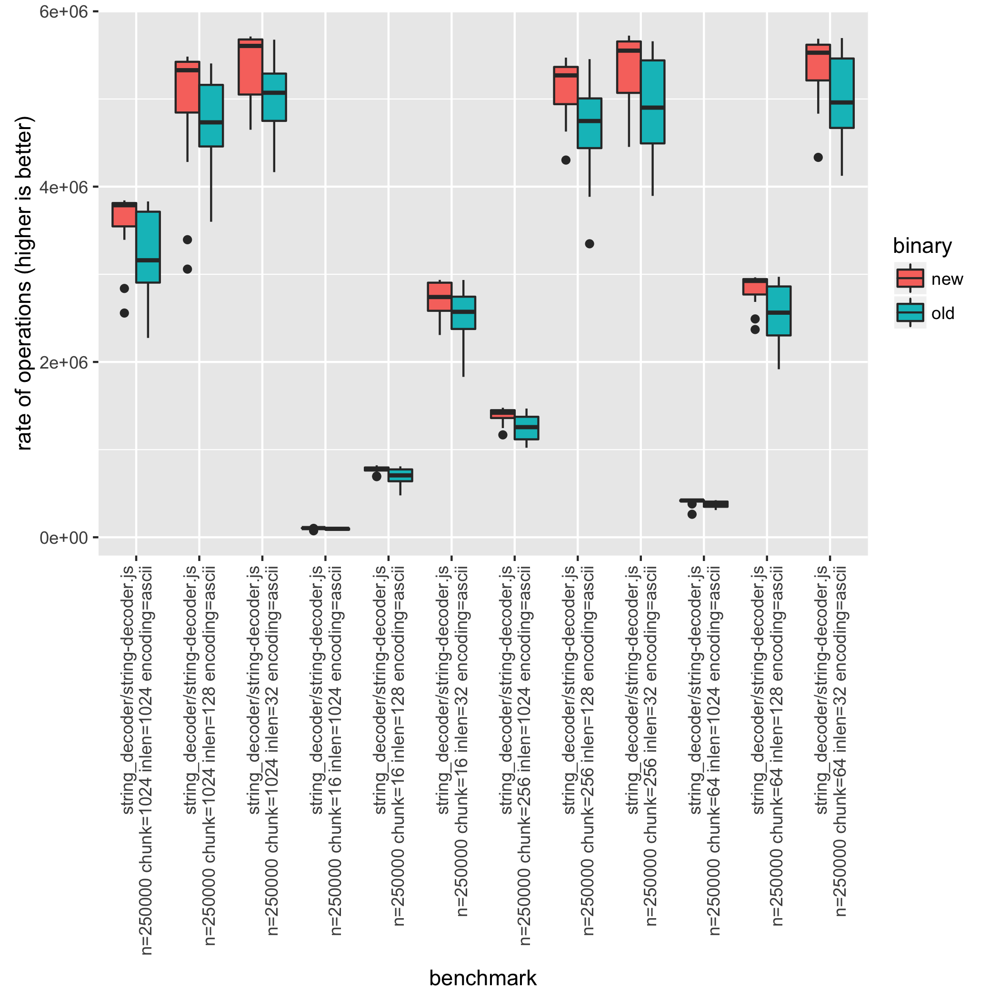
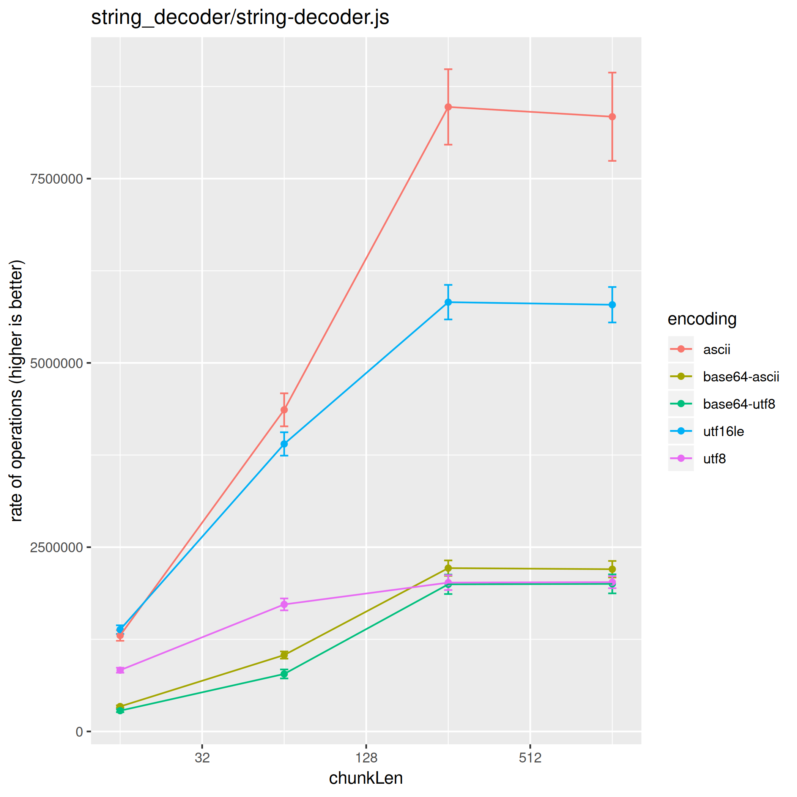

# How to Write and Run Benchmarks in Node.js Core

## Table of Contents

* [Prerequisites](#prerequisites)
  * [HTTP Benchmark Requirements](#http-benchmark-requirements)
  * [Benchmark Analysis Requirements](#benchmark-analysis-requirements)
* [Running benchmarks](#running-benchmarks)
  * [Running individual benchmarks](#running-individual-benchmarks)
  * [Running all benchmarks](#running-all-benchmarks)
  * [Comparing Node.js versions](#comparing-nodejs-versions)
  * [Comparing parameters](#comparing-parameters)
  * [Running Benchmarks on the CI](#running-benchmarks-on-the-ci)
* [Creating a benchmark](#creating-a-benchmark)
  * [Basics of a benchmark](#basics-of-a-benchmark)
  * [Creating an HTTP benchmark](#creating-an-http-benchmark)

## Prerequisites

Basic Unix tools are required for some benchmarks.
[Git for Windows][git-for-windows] includes Git Bash and the necessary tools,
which need to be included in the global Windows `PATH`.

### HTTP Benchmark Requirements

Most of the HTTP benchmarks require a benchmarker to be installed. This can be
either [`wrk`][wrk] or [`autocannon`][autocannon].

`Autocannon` is a Node.js script that can be installed using
`npm install -g autocannon`. It will use the Node.js executable that is in the
path. In order to compare two HTTP benchmark runs, make sure that the
Node.js version in the path is not altered.

`wrk` may be available through one of the available package managers. If not, it can
be easily built [from source][wrk] via `make`.

By default, `wrk` will be used as the benchmarker. If it is not available,
`autocannon` will be used in its place. When creating an HTTP benchmark, the
benchmarker to be used should be specified by providing it as an argument:

`node benchmark/run.js --set benchmarker=autocannon http`

`node benchmark/http/simple.js benchmarker=autocannon`

#### HTTP/2 Benchmark Requirements

To run the `http2` benchmarks, the `h2load` benchmarker must be used. The
`h2load` tool is a component of the `nghttp2` project and may be installed
from [nghttp2.org][] or built from source.

`node benchmark/http2/simple.js benchmarker=autocannon`

### Benchmark Analysis Requirements

To analyze the results, `R` should be installed. Use one of the available
package managers or download it from https://www.r-project.org/.

The R packages `ggplot2` and `plyr` are also used and can be installed using
the R REPL.

```R
$ R
install.packages("ggplot2")
install.packages("plyr")
```

In the event that a message is reported stating that a CRAN mirror must be
selected first, specify a mirror by adding in the repo parameter.

If we used the "http://cran.us.r-project.org" mirror, it could look something
like this:

```R
install.packages("ggplot2", repo="http://cran.us.r-project.org")
```

Of course, use an appropriate mirror based on location.
A list of mirrors is [located here](https://cran.r-project.org/mirrors.html).

## Running benchmarks

### Running individual benchmarks

This can be useful for debugging a benchmark or doing a quick performance
measure. But it does not provide the statistical information to make any
conclusions about the performance.

Individual benchmarks can be executed by simply executing the benchmark script
with node.

```console
$ node benchmark/buffers/buffer-tostring.js

buffers/buffer-tostring.js n=10000000 len=0 arg=true: 62710590.393305704
buffers/buffer-tostring.js n=10000000 len=1 arg=true: 9178624.591787899
buffers/buffer-tostring.js n=10000000 len=64 arg=true: 7658962.8891432695
buffers/buffer-tostring.js n=10000000 len=1024 arg=true: 4136904.4060201733
buffers/buffer-tostring.js n=10000000 len=0 arg=false: 22974354.231509723
buffers/buffer-tostring.js n=10000000 len=1 arg=false: 11485945.656765845
buffers/buffer-tostring.js n=10000000 len=64 arg=false: 8718280.70650129
buffers/buffer-tostring.js n=10000000 len=1024 arg=false: 4103857.0726124765
```

Each line represents a single benchmark with parameters specified as
`${variable}=${value}`. Each configuration combination is executed in a separate
process. This ensures that benchmark results aren't affected by the execution
order due to V8 optimizations. **The last number is the rate of operations
measured in ops/sec (higher is better).**

Furthermore a subset of the configurations can be specified, by setting them in
the process arguments:

```console
$ node benchmark/buffers/buffer-tostring.js len=1024

buffers/buffer-tostring.js n=10000000 len=1024 arg=true: 3498295.68561504
buffers/buffer-tostring.js n=10000000 len=1024 arg=false: 3783071.1678948295
```

### Running all benchmarks

Similar to running individual benchmarks, a group of benchmarks can be executed
by using the `run.js` tool. To see how to use this script,
run `node benchmark/run.js`. Again this does not provide the statistical
information to make any conclusions.

```console
$ node benchmark/run.js arrays

arrays/var-int.js
arrays/var-int.js n=25 type=Array: 71.90148040747789
arrays/var-int.js n=25 type=Buffer: 92.89648382795582
...

arrays/zero-float.js
arrays/zero-float.js n=25 type=Array: 75.46208316171496
arrays/zero-float.js n=25 type=Buffer: 101.62785630273159
...

arrays/zero-int.js
arrays/zero-int.js n=25 type=Array: 72.31023859816062
arrays/zero-int.js n=25 type=Buffer: 90.49906662339653
...
```

It is possible to execute more groups by adding extra process arguments.

```console
$ node benchmark/run.js arrays buffers
```

### Comparing Node.js versions

To compare the effect of a new Node.js version use the `compare.js` tool. This
will run each benchmark multiple times, making it possible to calculate
statistics on the performance measures. To see how to use this script,
run `node benchmark/compare.js`.

As an example on how to check for a possible performance improvement, the
[#5134](https://github.com/nodejs/node/pull/5134) pull request will be used as
an example. This pull request _claims_ to improve the performance of the
`string_decoder` module.

First build two versions of Node.js, one from the master branch (here called
`./node-master`) and another with the pull request applied (here called
`./node-pr-5134`).

To run multiple compiled versions in parallel you need to copy the output of the
build: `cp ./out/Release/node ./node-master`. Check out the following example:

```console
$ git checkout master
$ ./configure && make -j4
$ cp ./out/Release/node ./node-master

$ git checkout pr-5134
$ ./configure && make -j4
$ cp ./out/Release/node ./node-pr-5134
```

The `compare.js` tool will then produce a csv file with the benchmark results.

```console
$ node benchmark/compare.js --old ./node-master --new ./node-pr-5134 string_decoder > compare-pr-5134.csv
```

For analysing the benchmark results use the `compare.R` tool.

```console
$ cat compare-pr-5134.csv | Rscript benchmark/compare.R

                                                                                      improvement confidence      p.value
string_decoder/string-decoder.js n=250000 chunk=1024 inlen=1024 encoding=ascii           12.46 %         *** 1.165345e-04
string_decoder/string-decoder.js n=250000 chunk=1024 inlen=1024 encoding=base64-ascii    24.70 %         *** 1.820615e-15
string_decoder/string-decoder.js n=250000 chunk=1024 inlen=1024 encoding=base64-utf8     23.60 %         *** 2.105625e-12
string_decoder/string-decoder.js n=250000 chunk=1024 inlen=1024 encoding=utf8            14.04 %         *** 1.291105e-07
string_decoder/string-decoder.js n=250000 chunk=1024 inlen=128  encoding=ascii            6.70 %           * 2.928003e-02
...
```

In the output, _improvement_ is the relative improvement of the new version,
hopefully this is positive. _confidence_ tells if there is enough
statistical evidence to validate the _improvement_. If there is enough evidence
then there will be at least one star (`*`), more stars is just better. **However
if there are no stars, then don't make any conclusions based on the
_improvement_.** Sometimes this is fine, for example if no improvements are
expected, then there shouldn't be any stars.

**A word of caution:** Statistics is not a foolproof tool. If a benchmark shows
a statistical significant difference, there is a 5% risk that this
difference doesn't actually exist. For a single benchmark this is not an
issue. But when considering 20 benchmarks it's normal that one of them
will show significance, when it shouldn't. A possible solution is to instead
consider at least two stars (`**`) as the threshold, in that case the risk
is 1%. If three stars (`***`) is considered the risk is 0.1%. However this
may require more runs to obtain (can be set with `--runs`).

_For the statistically minded, the R script performs an [independent/unpaired
2-group t-test][t-test], with the null hypothesis that the performance is the
same for both versions. The confidence field will show a star if the p-value
is less than `0.05`._

The `compare.R` tool can also produce a box plot by using the `--plot filename`
option. In this case there are 48 different benchmark combinations, and there
may be a need to filter the csv file. This can be done while benchmarking
using the `--set` parameter (e.g. `--set encoding=ascii`) or by filtering results
afterwards using tools such as `sed` or `grep`. In the `sed` case be sure to
keep the first line since that contains the header information.

```console
$ cat compare-pr-5134.csv | sed '1p;/encoding=ascii/!d' | Rscript benchmark/compare.R --plot compare-plot.png

                                                                               improvement confidence      p.value
string_decoder/string-decoder.js n=250000 chunk=1024 inlen=1024 encoding=ascii    12.46 %         *** 1.165345e-04
string_decoder/string-decoder.js n=250000 chunk=1024 inlen=128 encoding=ascii      6.70 %           * 2.928003e-02
string_decoder/string-decoder.js n=250000 chunk=1024 inlen=32 encoding=ascii       7.47 %         *** 5.780583e-04
string_decoder/string-decoder.js n=250000 chunk=16 inlen=1024 encoding=ascii       8.94 %         *** 1.788579e-04
string_decoder/string-decoder.js n=250000 chunk=16 inlen=128 encoding=ascii       10.54 %         *** 4.016172e-05
...
```



### Comparing parameters

It can be useful to compare the performance for different parameters, for
example to analyze the time complexity.

To do this use the `scatter.js` tool, this will run a benchmark multiple times
and generate a csv with the results. To see how to use this script,
run `node benchmark/scatter.js`.

```console
$ node benchmark/scatter.js benchmark/string_decoder/string-decoder.js > scatter.csv
```

After generating the csv, a comparison table can be created using the
`scatter.R` tool. Even more useful it creates an actual scatter plot when using
the `--plot filename` option.

```console
$ cat scatter.csv | Rscript benchmark/scatter.R --xaxis chunk --category encoding --plot scatter-plot.png --log

aggregating variable: inlen

chunk     encoding      mean confidence.interval
   16        ascii 1111933.3           221502.48
   16 base64-ascii  167508.4            33116.09
   16  base64-utf8  122666.6            25037.65
   16         utf8  783254.8           159601.79
   64        ascii 2623462.9           399791.36
   64 base64-ascii  462008.3            85369.45
   64  base64-utf8  420108.4            85612.05
   64         utf8 1358327.5           235152.03
  256        ascii 3730343.4           371530.47
  256 base64-ascii  663281.2            80302.73
  256  base64-utf8  632911.7            81393.07
  256         utf8 1554216.9           236066.53
 1024        ascii 4399282.0           186436.46
 1024 base64-ascii  730426.6            63806.12
 1024  base64-utf8  680954.3            68076.33
 1024         utf8 1554832.5           237532.07
```

Because the scatter plot can only show two variables (in this case _chunk_ and
_encoding_) the rest is aggregated. Sometimes aggregating is a problem, this
can be solved by filtering. This can be done while benchmarking using the
`--set` parameter (e.g. `--set encoding=ascii`) or by filtering results
afterwards using tools such as `sed` or `grep`. In the `sed` case be
sure to keep the first line since that contains the header information.

```console
$ cat scatter.csv | sed -E '1p;/([^,]+, ){3}128,/!d' | Rscript benchmark/scatter.R --xaxis chunk --category encoding --plot scatter-plot.png --log

chunk     encoding       mean confidence.interval
   16        ascii  701285.96           21233.982
   16 base64-ascii  107719.07            3339.439
   16  base64-utf8   72966.95            2438.448
   16         utf8  475340.84           17685.450
   64        ascii 2554105.08           87067.132
   64 base64-ascii  330120.32            8551.707
   64  base64-utf8  249693.19            8990.493
   64         utf8 1128671.90           48433.862
  256        ascii 4841070.04          181620.768
  256 base64-ascii  849545.53           29931.656
  256  base64-utf8  809629.89           33773.496
  256         utf8 1489525.15           49616.334
 1024        ascii 4931512.12          165402.805
 1024 base64-ascii  863933.22           27766.982
 1024  base64-utf8  827093.97           24376.522
 1024         utf8 1487176.43           50128.721
```



### Running Benchmarks on the CI

To see the performance impact of a Pull Request by running benchmarks on
the CI, check out [How to: Running core benchmarks on Node.js CI][benchmark-ci].

## Creating a benchmark

### Basics of a benchmark

All benchmarks use the `require('../common.js')` module. This contains the
`createBenchmark(main, configs[, options])` method which will setup the
benchmark.

The arguments of `createBenchmark` are:

* `main` {Function} The benchmark function,
  where the code running operations and controlling timers should go
* `configs` {Object} The benchmark parameters. `createBenchmark` will run all
  possible combinations of these parameters, unless specified otherwise.
  Each configuration is a property with an array of possible values.
  Note that the configuration values can only be strings or numbers.
* `options` {Object} The benchmark options. At the moment only the `flags`
  option for specifying command line flags is supported.

`createBenchmark` returns a `bench` object, which is used for timing
the runtime of the benchmark. Run `bench.start()` after the initialization
and `bench.end(n)` when the benchmark is done. `n` is the number of operations
performed in the benchmark.

The benchmark script will be run twice:

The first pass will configure the benchmark with the combination of
parameters specified in `configs`, and WILL NOT run the `main` function.
In this pass, no flags except the ones directly passed via commands
when running the benchmarks will be used.

In the second pass, the `main` function will be run, and the process
will be launched with:

* The flags passed into `createBenchmark` (the third argument)
* The flags in the command passed when the benchmark was run

Beware that any code outside the `main` function will be run twice
in different processes. This could be troublesome if the code
outside the `main` function has side effects. In general, prefer putting
the code inside the `main` function if it's more than just declaration.

```js
'use strict';
const common = require('../common.js');
const { SlowBuffer } = require('buffer');

const configs = {
  // Number of operations, specified here so they show up in the report.
  // Most benchmarks just use one value for all runs.
  n: [1024],
  type: ['fast', 'slow'],  // Custom configurations
  size: [16, 128, 1024]  // Custom configurations
};

const options = {
  // Add --expose-internals in order to require internal modules in main
  flags: ['--zero-fill-buffers']
};

// main and configs are required, options is optional.
const bench = common.createBenchmark(main, configs, options);

// Note that any code outside main will be run twice,
// in different processes, with different command line arguments.

function main(conf) {
  // Only flags that have been passed to createBenchmark
  // earlier when main is run will be in effect.
  // In order to benchmark the internal modules, require them here. For example:
  // const URL = require('internal/url').URL

  // Start the timer
  bench.start();

  // Do operations here
  const BufferConstructor = conf.type === 'fast' ? Buffer : SlowBuffer;

  for (let i = 0; i < conf.n; i++) {
    new BufferConstructor(conf.size);
  }

  // End the timer, pass in the number of operations
  bench.end(conf.n);
}
```

### Creating an HTTP benchmark

The `bench` object returned by `createBenchmark` implements
`http(options, callback)` method. It can be used to run external tool to
benchmark HTTP servers.

```js
'use strict';

const common = require('../common.js');

const bench = common.createBenchmark(main, {
  kb: [64, 128, 256, 1024],
  connections: [100, 500]
});

function main(conf) {
  const http = require('http');
  const len = conf.kb * 1024;
  const chunk = Buffer.alloc(len, 'x');
  const server = http.createServer(function(req, res) {
    res.end(chunk);
  });

  server.listen(common.PORT, function() {
    bench.http({
      connections: conf.connections,
    }, function() {
      server.close();
    });
  });
}
```

Supported options keys are:

* `port` - defaults to `common.PORT`
* `path` - defaults to `/`
* `connections` - number of concurrent connections to use, defaults to 100
* `duration` - duration of the benchmark in seconds, defaults to 10
* `benchmarker` - benchmarker to use, defaults to
`common.default_http_benchmarker`

[autocannon]: https://github.com/mcollina/autocannon
[wrk]: https://github.com/wg/wrk
[t-test]: https://en.wikipedia.org/wiki/Student%27s_t-test#Equal_or_unequal_sample_sizes.2C_unequal_variances
[git-for-windows]: http://git-scm.com/download/win
[nghttp2.org]: http://nghttp2.org
[benchmark-ci]: https://github.com/nodejs/benchmarking/blob/master/docs/core_benchmarks.md
